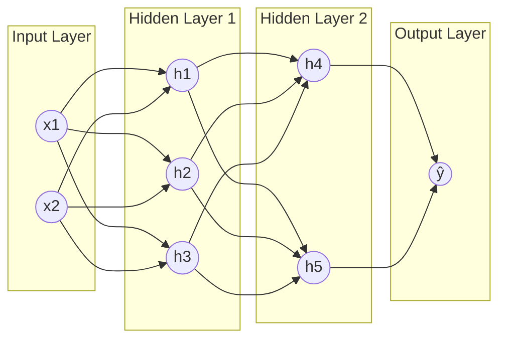
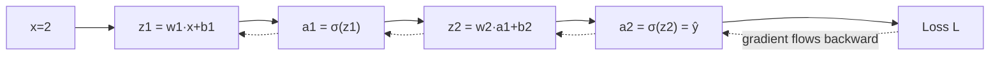
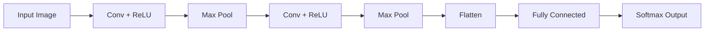

# Deep Learning — 4 Hour Crash Course Notes

> Target audience: BTech 2nd year students who have already completed the **4-hour Classical ML crash course** (Linear/Logistic Regression, Gradient Descent, Decision Trees, Evaluation Metrics, etc.). This course builds directly on those concepts rather than re-explaining them — if a term feels unfamiliar, it was likely covered there.
> Code demo (Hour 4) uses **PyTorch**.

---

## 📑 Table of Contents

- [Hour 1: Neural Network Foundations](#hour-1-neural-network-foundations)
- [Hour 2: How Neural Networks Learn](#hour-2-how-neural-networks-learn)
- [Hour 3: CNNs (Convolutional Neural Networks)](#hour-3-cnns-convolutional-neural-networks)
- [Hour 4: Sequence Models, Transformers & Practical](#hour-4-sequence-models-transformers--practical)

---

## Hour 1: Neural Network Foundations

### 1.1 From Logistic Regression to a Single Neuron

Recall from the ML course: **Logistic Regression** computes $z = w \cdot x + b$, then squashes it through sigmoid to get a probability.

A **single artificial neuron (perceptron)** does *exactly the same thing*:

$$\text{output} = f(w \cdot x + b)$$

where *f* is called an **activation function**. In other words — **logistic regression IS a single neuron.** A neural network is just many of these connected together in layers. That's the whole trick — nothing mysterious, just composition.

**Worked Numerical Example:** Inputs x = [1, 0, 1], weights w = [0.5, -0.3, 0.8], bias b = 0.1

$$z = (0.5)(1) + (-0.3)(0) + (0.8)(1) + 0.1 = 0.5 + 0 + 0.8 + 0.1 = 1.4$$

Apply sigmoid activation:
$$f(1.4) = \frac{1}{1+e^{-1.4}} = \frac{1}{1+0.2466} = \frac{1}{1.2466} \approx 0.802$$

This neuron "fires" with output 0.802 — that's it, one neuron computed.

---

### 1.2 Activation Functions

Without an activation function, a neuron is just linear regression. Activation functions introduce **non-linearity**, which is what lets networks learn complex patterns (more on why in section 1.5).

**Sigmoid:**
$$\sigma(z) = \frac{1}{1+e^{-z}} \quad \text{(range: 0 to 1)}$$

```
  1 ┤                    ╭──────
    │                ╭───╯
0.5 ┤            ╭───╯
    │        ╭───╯
  0 ┤────────╯
    └───────────────────────────
      -4  -2   0   2   4    z
```

**Tanh:**
$$\tanh(z) = \frac{e^z - e^{-z}}{e^z + e^{-z}} \quad \text{(range: -1 to 1)}$$

**Numerical example:** tanh(1) = $\frac{2.718 - 0.368}{2.718+0.368} = \frac{2.350}{3.086} \approx 0.761$

**ReLU (Rectified Linear Unit)** — the most-used activation in modern networks:
$$f(z) = \max(0, z)$$

**Numerical examples:** ReLU(-3) = 0, ReLU(5) = 5, ReLU(0) = 0

```
    │           ╱
    │         ╱
    │       ╱
  0 ┤─────╱
    └───────────────────
      -4  0   2   4    z
```

**Softmax** — used at the **output layer** for multi-class classification, converts raw scores into probabilities that sum to 1:
$$\text{softmax}(z_i) = \frac{e^{z_i}}{\sum_j e^{z_j}}$$

**Worked Numerical Example:** Raw output scores (called "logits") z = [2, 1, 0.1] for 3 classes (say, Cat, Dog, Bird):

$$e^2 = 7.389, \quad e^1 = 2.718, \quad e^{0.1} = 1.105$$
$$\text{Sum} = 7.389+2.718+1.105 = 11.212$$

$$P(Cat) = \frac{7.389}{11.212} \approx 0.659 \qquad P(Dog) = \frac{2.718}{11.212} \approx 0.242 \qquad P(Bird) = \frac{1.105}{11.212} \approx 0.099$$

Check: 0.659+0.242+0.099 = 1.0 ✅. Model is **65.9% confident** the image is a Cat.

**Why ReLU dominates over sigmoid/tanh in hidden layers:** Look at the sigmoid graph above — at large positive or negative z, the curve goes almost flat. That means its **gradient (slope) is nearly zero** there — a problem we revisit as "vanishing gradients" in Hour 2. ReLU's gradient is a constant 1 for any z>0, so gradients don't shrink to nothing as they flow backward through many layers. It's also just one comparison (`max(0,z)`) — computationally cheap.

---

### 1.3 Network Architecture



- **Input layer**: just the raw features (no computation) — e.g., pixel values, or the same tabular features from the ML course
- **Hidden layers**: layers of neurons doing weighted-sum + activation, learning increasingly abstract patterns
- **Output layer**: final prediction (sigmoid for binary classification, softmax for multi-class, linear/no activation for regression)

> **"Deep" learning simply means a network with multiple hidden layers** (as opposed to the single-layer perceptron above). There's no strict cutoff — but "deep" generally implies more than 1 hidden layer.

---

### 1.4 Forward Propagation — Full Worked Example

Let's push actual numbers through a tiny network: 2 inputs → 2 hidden neurons (ReLU) → 1 output neuron (sigmoid).

**Setup:**
- Input: x = [1, 2]
- Hidden neuron h1: weights = [0.5, -0.2], bias = 0.1
- Hidden neuron h2: weights = [0.3, 0.4], bias = -0.05
- Output neuron: weights = [0.6, -0.9], bias = 0.2

**Step 1 — compute hidden layer:**

$$z_{h1} = (0.5)(1)+(-0.2)(2)+0.1 = 0.5-0.4+0.1 = 0.2 \qquad a_{h1} = ReLU(0.2) = 0.2$$

$$z_{h2} = (0.3)(1)+(0.4)(2)+(-0.05) = 0.3+0.8-0.05 = 1.05 \qquad a_{h2} = ReLU(1.05) = 1.05$$

**Step 2 — compute output layer**, using [a_h1, a_h2] = [0.2, 1.05] as input:

$$z_{out} = (0.6)(0.2)+(-0.9)(1.05)+0.2 = 0.12 - 0.945 + 0.2 = -0.625$$

$$\hat{y} = \sigma(-0.625) = \frac{1}{1+e^{0.625}} = \frac{1}{1+1.868} = \frac{1}{2.868} \approx 0.349$$

**Final prediction: 0.349** (34.9% probability of the positive class). This entire calculation — input to output — is called **forward propagation**, and it's exactly what happens (at a much larger scale) every time any neural network makes a prediction.

---

### 1.5 Why We Need Non-Linear Activations

If every neuron used a plain **linear** activation (f(z) = z, no squashing), stacking layers would be pointless — algebraically, it collapses into a single linear function no matter how many layers you add.

**Numerical proof, kept simple (1D scalars):**

Layer 1: $a_1 = 2x + 1$

Layer 2 (feeding a1 in): $a_2 = 3a_1 - 2 = 3(2x+1) - 2 = 6x+3-2 = 6x+1$

Notice: $a_2 = 6x+1$ is **still just of the form** $mx+b$ — exactly like a single linear regression! No matter how many linear layers you stack, you always end up with some $mx+b$. **This is why activation functions like ReLU/sigmoid/tanh are non-negotiable** — they're what let deep networks actually learn anything a single-layer model couldn't.

---

## Hour 2: How Neural Networks Learn

### 2.1 Loss Functions Revisited

From the ML course: **MSE** for regression, **Cross-Entropy** for classification. Same formulas apply to neural networks — the only difference is *how many* predictions are being scored, since networks often output multiple classes at once.

**Categorical Cross-Entropy** (multi-class version):
$$\text{Loss} = -\sum_i y_i \log(p_i)$$

**Worked Numerical Example:** True label (one-hot) y = [1, 0, 0] ("it IS a cat"), model's softmax output p = [0.7, 0.2, 0.1]

$$\text{Loss} = -[1 \times \ln(0.7) + 0 \times \ln(0.2) + 0 \times \ln(0.1)] = -\ln(0.7) \approx 0.357$$

(Only the true class's predicted probability matters — the others get zeroed out by the one-hot label. A confident correct prediction, e.g. p=0.99, gives loss ≈ 0.01; a confident *wrong* prediction, e.g. true class predicted at p=0.05, gives loss ≈ 3.0 — cross-entropy punishes confident mistakes heavily.)

---

### 2.2 Backpropagation — The Chain Rule in Action

This is the algorithm that actually trains neural networks. **The whole idea:** figure out how much each weight contributed to the final error, by working *backward* from the output using the chain rule from calculus, then nudge each weight (via gradient descent — already familiar!) to reduce that error.

Let's do this **completely by hand** on the simplest possible network: 1 input → 1 hidden neuron → 1 output neuron.

**Setup:**
- Input x = 2, target y = 1
- Hidden neuron: $z_1 = w_1 x + b_1$, $a_1 = \sigma(z_1)$
- Output neuron: $z_2 = w_2 a_1 + b_2$, $a_2 = \sigma(z_2) = \hat{y}$
- Loss: $L = \frac{1}{2}(y-\hat{y})^2$
- Initial values: w1=0.5, b1=0, w2=0.5, b2=0

#### Forward Pass

$$z_1 = (0.5)(2)+0 = 1.0 \qquad a_1 = \sigma(1.0) = \frac{1}{1+e^{-1}} = \frac{1}{1.3679} \approx 0.7311$$

$$z_2 = (0.5)(0.7311)+0 = 0.3655 \qquad a_2 = \sigma(0.3655) = \frac{1}{1+e^{-0.3655}} = \frac{1}{1.6937} \approx 0.5905$$

$$L = \frac{1}{2}(1-0.5905)^2 = \frac{1}{2}(0.4095)^2 = \frac{1}{2}(0.1677) \approx 0.0838$$

Our network is currently wrong (predicted 0.59 instead of 1.0) — loss = 0.0838. Now we backpropagate to find out **how to adjust w1 and w2**.

#### Backward Pass (Chain Rule)

We want $\frac{\partial L}{\partial w_2}$ and $\frac{\partial L}{\partial w_1}$. The chain rule breaks each into a product of smaller, easy pieces:

$$\frac{\partial L}{\partial w_2} = \frac{\partial L}{\partial a_2} \times \frac{\partial a_2}{\partial z_2} \times \frac{\partial z_2}{\partial w_2}$$

Piece 1: $\frac{\partial L}{\partial a_2} = -(y-a_2) = -(1-0.5905) = -0.4095$

Piece 2 (sigmoid derivative is $\sigma(1-\sigma)$): $\frac{\partial a_2}{\partial z_2} = 0.5905 \times (1-0.5905) = 0.5905 \times 0.4095 \approx 0.2419$

Piece 3: $\frac{\partial z_2}{\partial w_2} = a_1 = 0.7311$

$$\frac{\partial L}{\partial w_2} = (-0.4095)(0.2419)(0.7311) \approx -0.0724$$

Now keep going **backward** into the hidden layer using the same chain, just extended by two more links:

$$\frac{\partial L}{\partial w_1} = \frac{\partial L}{\partial a_2} \times \frac{\partial a_2}{\partial z_2} \times \frac{\partial z_2}{\partial a_1} \times \frac{\partial a_1}{\partial z_1} \times \frac{\partial z_1}{\partial w_1}$$

We already have the first two pieces (-0.4095 and 0.2419). Continuing:

$$\frac{\partial z_2}{\partial a_1} = w_2 = 0.5 \qquad \frac{\partial a_1}{\partial z_1} = a_1(1-a_1) = 0.7311 \times 0.2689 \approx 0.1966 \qquad \frac{\partial z_1}{\partial w_1} = x = 2$$

$$\frac{\partial L}{\partial w_1} = (-0.4095)(0.2419)(0.5)(0.1966)(2) \approx -0.0195$$

#### Gradient Descent Update (learning rate α = 0.1)

$$w_2^{new} = 0.5 - (0.1)(-0.0724) = 0.5+0.00724 = 0.50724$$
$$w_1^{new} = 0.5 - (0.1)(-0.0195) = 0.5+0.00195 = 0.50195$$

**That's it — that's backpropagation.** Repeat this forward-pass → backward-pass → update cycle thousands of times, over thousands of examples, and the weights gradually converge to values that make good predictions. Real networks have millions of weights, but every single one is updated using this exact same chain-rule logic — just with more links in the chain.



---

### 2.3 Gradient Descent Variants

From the ML course, we saw plain gradient descent. A few practical upgrades used in deep learning:

- **Batch GD**: uses the *entire* dataset per update (accurate but slow)
- **Stochastic GD (SGD)**: uses just *one* example per update (fast but noisy/jumpy)
- **Mini-batch GD**: uses a small batch (e.g., 32 or 64 examples) — the practical middle ground almost everyone uses

**Momentum** — instead of jumping around noisily, accumulate a "velocity" that smooths updates, like a ball rolling downhill and building speed:

$$v_t = \beta v_{t-1} - \alpha \nabla L \qquad w_t = w_{t-1} + v_t$$

**Worked Numerical Example:** β=0.9, α=0.1, v₀=0

Step 1, gradient g₁=-0.07: $v_1 = (0.9)(0) - (0.1)(-0.07) = 0.007$

Step 2, gradient g₂=-0.05 (same direction as before): $v_2 = (0.9)(0.007) - (0.1)(-0.05) = 0.0063+0.005 = 0.0113$

Notice the update **grew** from 0.007 to 0.0113 even though the raw gradient shrank (0.07→0.05) — momentum is "remembering" the consistent direction and accelerating, which helps escape shallow flat regions and speeds up convergence.

**Adam** (Adaptive Moment Estimation) combines momentum with an *adaptive* per-parameter learning rate — it's the **default optimizer in most modern deep learning code** because it "just works" reasonably well with minimal tuning. You don't need its full formula memorized — just know: *Adam ≈ momentum + automatically adjusting step sizes per weight.*

---

### 2.4 Vanishing & Exploding Gradients

Remember from backprop above: gradients are a **product (chain)** of many small pieces. Sigmoid's derivative maxes out at just **0.25** (at z=0). In a deep network with, say, 10 layers all using sigmoid, the gradient reaching the earliest layer gets multiplied by roughly:

$$0.25^{10} \approx 0.00000095$$

That's a gradient of nearly **zero** — the earliest layers barely update at all, and effectively stop learning. This is the **vanishing gradient problem**, and it's *the* historical reason very deep networks were hard to train before ReLU became standard (ReLU's gradient is a constant 1 when active, so it doesn't shrink this way through many layers).

*(The opposite problem, exploding gradients, happens when values compound and grow uncontrollably instead of shrinking — usually fixed with gradient clipping or careful weight initialization.)*

---

### 2.5 Regularization for Neural Networks

Same overfitting concept from the ML course — here's how it's handled in deep learning specifically:

**Dropout:** During training, randomly "turn off" a fraction of neurons in a layer for each forward pass, forcing the network to not over-rely on any single neuron.

**Numerical example:** A layer with 4 neurons and dropout rate = 0.5 → on average, **2 of the 4 neurons** are randomly zeroed out on any given training step. Different neurons get dropped each time, so the network learns redundant, robust representations rather than depending heavily on any one path.

**Batch Normalization:** Normalizes each layer's inputs using the same standardization formula from the ML course ($x' = \frac{x-\mu}{\sigma}$), computed per mini-batch, then re-scales with learnable parameters. This keeps values in a stable range as they flow through many layers, which speeds up and stabilizes training.

**Early Stopping:** Exactly as in the ML course's bias-variance discussion (Hour 1) — monitor validation loss, and stop training the moment it starts climbing back up even though training loss keeps falling. That gap is overfitting starting to creep in.

---

### 2.6 Weight Initialization (Brief)

**Why not start all weights at zero?** If every weight in a layer starts identical, every neuron computes the *exact same* output and receives the *exact same* gradient during backprop — they never differentiate from each other, no matter how long you train ("symmetry problem"). Effectively, a layer of 100 identical neurons behaves like just 1 neuron.

**Fix:** Initialize weights **randomly** (small random values), so each neuron starts on a different path. Modern methods like **Xavier initialization** (for sigmoid/tanh) and **He initialization** (for ReLU) go a step further — they scale the randomness based on the number of inputs to a layer, keeping the *variance* of activations roughly stable as signals pass through many layers (avoiding vanishing/exploding right from the start).

---

## Hour 3: CNNs (Convolutional Neural Networks)

### 3.1 Why Fully-Connected Layers Don't Scale to Images

**Numerical reality check:** A modest 224×224 color image has $224 \times 224 \times 3 = 150{,}528$ pixel values. Connecting this to just **one** fully-connected hidden layer of 1000 neurons would require:

$$150{,}528 \times 1000 \approx 150 \text{ million weights} — \text{for a single layer!}$$

That's enormous, slow to train, and massively prone to overfitting. **Convolution** fixes this by using small filters that are **shared** (reused) across the entire image, instead of a unique weight for every pixel-neuron connection. A typical 3×3 filter on a 3-channel (RGB) image has only:

$$3 \times 3 \times 3 = 27 \text{ weights} + 1 \text{ bias} = 28 \text{ parameters total}$$

— reused at every location across the whole image. This is the core insight that makes CNNs practical for images.

---

### 3.2 The Convolution Operation

A filter (kernel) slides over the image, computing a dot product at each position to produce a **feature map**.

**Worked Numerical Example:** A 5×5 input image (simplified to 0s and 1s) and a 3×3 vertical-edge-detecting filter:

**Input:**
```
1 1 1 0 0
0 1 1 1 0
0 0 1 1 1
0 0 1 1 0
0 1 1 0 0
```

**Filter:**
```
 1  0 -1
 1  0 -1
 1  0 -1
```

**Computing output cell (0,0)** — take the top-left 3×3 patch of the input:
```
1 1 1
0 1 1
0 0 1
```
Element-wise multiply with the filter, then sum everything:
$$(1{\times}1)+(1{\times}0)+(1{\times}{-1}) + (0{\times}1)+(1{\times}0)+(1{\times}{-1}) + (0{\times}1)+(0{\times}0)+(1{\times}{-1})$$
$$= (1+0-1) + (0+0-1) + (0+0-1) = 0 - 1 - 1 = \mathbf{-2}$$

**Computing output cell (0,1)** — slide the filter one column right (stride=1):
```
1 1 0
1 1 1
0 1 1
```
$$(1{\times}1)+(1{\times}0)+(0{\times}{-1}) + (1{\times}1)+(1{\times}0)+(1{\times}{-1}) + (0{\times}1)+(1{\times}0)+(1{\times}{-1})$$
$$= (1+0+0)+(1+0-1)+(0+0-1) = 1+0-1 = \mathbf{0}$$

Repeating this across every valid position builds the full output **feature map** — large negative/positive values highlight where the filter's pattern (a vertical edge, in this case) is present in the image.

**Output size formula:**
$$\text{Output size} = \frac{N - F}{S} + 1$$

where N = input size, F = filter size, S = stride.

**Check our example:** N=5, F=3, S=1 → $\frac{5-3}{1}+1 = 3$ → a 3×3 output feature map. ✅

**With padding** (adding a border of zeros around the input, so edge pixels get equal treatment):
$$\text{Output size} = \frac{N - F + 2P}{S} + 1$$

**Numerical example (same padding):** N=5, F=3, P=1, S=1 → $\frac{5-3+2}{1}+1 = 5$ → output stays 5×5, same size as input.

---

### 3.3 Pooling Layers

Pooling **shrinks** the feature map (reducing computation and helping the network focus on the most important signals), using no learnable weights — just a fixed operation like max or average.

**Worked Numerical Example — Max Pooling, 2×2 window, stride 2:**

**Input feature map:**
```
1 3 2 4
5 6 1 2
0 1 8 3
2 4 1 0
```

Split into four non-overlapping 2×2 blocks and take the max of each:
- Top-left block [[1,3],[5,6]] → max = **6**
- Top-right block [[2,4],[1,2]] → max = **4**
- Bottom-left block [[0,1],[2,4]] → max = **4**
- Bottom-right block [[8,3],[1,0]] → max = **8**

**Output:**
```
6 4
4 8
```

A 4×4 map became a 2×2 map, keeping only the strongest activation in each region — this is where CNNs get some tolerance to small shifts/distortions in the image (the exact pixel position matters less; what matters is that "a strong edge was detected somewhere in this region").

---

### 3.4 Typical CNN Architecture



Early Conv layers learn simple patterns (edges, colors, textures); deeper Conv layers combine these into more complex shapes (eyes, wheels, faces); the final Fully Connected + Softmax layers turn those high-level features into an actual class prediction — exactly like the small networks from Hour 1, just fed with CNN-extracted features instead of raw pixels.

---

### 3.5 Famous Architectures (Name Recognition Only)

| Architecture | Year | Key Idea |
|---|---|---|
| **LeNet** | 1998 | First practical CNN — handwritten digit recognition |
| **AlexNet** | 2012 | Won ImageNet by a huge margin — kickstarted the deep learning boom |
| **VGG** | 2014 | Very deep, uniform 3×3 convolutions stacked repeatedly |
| **ResNet** | 2015 | Introduced **skip connections** — lets gradients bypass layers directly, solving the vanishing gradient problem (Hour 2!) even in networks 100+ layers deep |

You don't need to memorize their internals for this course — just recognize the names and the one key idea each contributed.

---

### 3.6 Applications

- **Image Classification**: one label per image (e.g., "cat") — what we've been discussing
- **Object Detection** (brief mention): finds *multiple* objects **and** their locations (bounding boxes) within one image — e.g., self-driving cars detecting pedestrians, traffic lights, and other cars simultaneously

---

## Hour 4: Sequence Models, Transformers & Practical

### 4.1 RNNs for Sequential Data

Images have no inherent "order," but text, speech, and time-series data do. A **Recurrent Neural Network (RNN)** processes a sequence one step at a time, carrying a **hidden state** forward as memory of everything seen so far:

$$h_t = \tanh(W_{hh}\, h_{t-1} + W_{xh}\, x_t + b)$$

**Worked Numerical Example** (scalars, for simplicity): $W_{hh}=0.5$, $W_{xh}=0.8$, $b=0.1$, initial hidden state $h_0=0$

**Time step 1**, input x₁=1:
$$h_1 = \tanh\big((0.5)(0)+(0.8)(1)+0.1\big) = \tanh(0.9) = \frac{2.460-0.407}{2.460+0.407} \approx 0.716$$

**Time step 2**, input x₂=0.5 (notice h₁ now feeds into this calculation — that's the "memory"):
$$h_2 = \tanh\big((0.5)(0.716)+(0.8)(0.5)+0.1\big) = \tanh(0.858) \approx 0.695$$

Each hidden state carries forward a compressed summary of everything the network has "read" so far in the sequence.

**Why RNNs struggle with long sequences:** Just like backprop through many *layers* caused vanishing gradients (Hour 2), backprop through many *time steps* has the exact same problem — the chain rule multiplies many small tanh-derivative terms together, and gradients from early time steps shrink to nearly zero by the time they're used to update weights. In practice, plain RNNs "forget" anything more than ~10-20 steps back.

---

### 4.2 LSTMs & GRUs — Fixing the Memory Problem

**LSTM (Long Short-Term Memory)** networks add a separate **cell state** (a "conveyor belt" of memory) plus **gates** — small neural networks (sigmoid outputs between 0 and 1) that control how much information flows through:

- **Forget gate**: how much of the old memory to keep
- **Input gate**: how much new information to add
- **Output gate**: how much of the memory to expose as output

Simplified cell state update:
$$C_t = (\text{forget gate}) \times C_{t-1} + (\text{input gate}) \times (\text{candidate new info})$$

**Worked Numerical Example:** Previous cell state $C_{t-1}=5$, forget gate = 0.8 (keep 80% of old memory), input gate = 0.3, candidate new info = 4

$$C_t = (0.8)(5) + (0.3)(4) = 4.0 + 1.2 = 5.2$$

A gate value of 0.8 means *"let 80% of this signal through"* — that's the whole intuition. Because this pathway is more direct (less repeated multiplication through activation derivatives at every single step), gradients survive much longer, letting LSTMs remember information across hundreds of steps. **GRU (Gated Recurrent Unit)** is a simplified variant with fewer gates, faster to train, similar performance in many tasks.

---

### 4.3 Attention & Transformers

RNNs/LSTMs process one step at a time — inherently sequential, which is slow (can't parallelize across time) and still struggles with very long-range dependencies. **Attention** solves this by letting the model directly look at, and weigh the relevance of, *every* position in the sequence at once — no step-by-step memory needed.

**Worked Numerical Example — Simplified Attention Calculation:** Suppose a query word is compared against 3 other words (keys) in a sentence, producing similarity scores: [2, 4, 1]

**Step 1 — softmax the scores** (same softmax from Hour 1!) to get attention weights:
$$e^2=7.389,\quad e^4=54.598,\quad e^1=2.718 \qquad \text{Sum}=64.705$$
$$w_1 = \frac{7.389}{64.705}\approx 0.114 \qquad w_2 = \frac{54.598}{64.705}\approx 0.844 \qquad w_3=\frac{2.718}{64.705}\approx 0.042$$

The model is paying **84.4% of its attention** to the second word — it's by far the most relevant to the query.

**Step 2 — weighted sum of "values"** (V=[10, 20, 30], just illustrative numbers) using these weights gives the final context vector:
$$\text{Output} = (0.114)(10)+(0.844)(20)+(0.042)(30) = 1.14+16.88+1.26 \approx 19.28$$

This weighted blend — dominated by whichever positions have the highest relevance — is the **entire core idea** behind attention. A **Transformer** is a network built almost entirely by stacking this attention mechanism (specifically "multi-head self-attention," running several of these weighing computations in parallel) together with simple feedforward layers — no recurrence at all. Removing the step-by-step bottleneck is what allows Transformers to be trained on massive datasets in parallel, and this exact architecture is the foundation behind modern LLMs (GPT, BERT, and similar models).

---

### 4.4 Transfer Learning

Training a large CNN or Transformer from scratch needs enormous data and compute. **Transfer learning** instead takes a model already pretrained on a huge dataset (e.g., ImageNet's ~1.2 million images), **freezes** its early layers (which have already learned general-purpose features like edges, textures, and shapes), and only retrains the final layers on your specific, much smaller dataset.

**Practical intuition:** A model trained from scratch might need hundreds of thousands of images per class to work well. With transfer learning, you can often get strong results on your specific task with as few as a few hundred to a couple thousand labeled images — because the network isn't relearning "what an edge is" from zero, only "how these already-known features map to my specific classes."

---

### 4.5 Code Walkthrough — CNN on Fashion-MNIST (PyTorch)

```python
import torch
import torch.nn as nn
import torch.optim as optim
from torchvision import datasets, transforms
from torch.utils.data import DataLoader

# 1. Load data (Fashion-MNIST: 10 clothing categories, 28x28 grayscale images)
transform = transforms.Compose([transforms.ToTensor()])
train_data = datasets.FashionMNIST(root="./data", train=True, download=True, transform=transform)
test_data = datasets.FashionMNIST(root="./data", train=False, download=True, transform=transform)

train_loader = DataLoader(train_data, batch_size=64, shuffle=True)   # mini-batch — Hour 2
test_loader = DataLoader(test_data, batch_size=64, shuffle=False)

# 2. Define a small CNN — Hour 3 architecture pattern: Conv -> Pool -> Conv -> Pool -> FC
class SimpleCNN(nn.Module):
    def __init__(self):
        super().__init__()
        self.conv1 = nn.Conv2d(1, 16, kernel_size=3, padding=1)  # section 3.2
        self.conv2 = nn.Conv2d(16, 32, kernel_size=3, padding=1)
        self.pool = nn.MaxPool2d(2, 2)                            # section 3.3
        self.fc1 = nn.Linear(32 * 7 * 7, 128)
        self.fc2 = nn.Linear(128, 10)                             # 10 output classes
        self.relu = nn.ReLU()                                     # section 1.2

    def forward(self, x):
        x = self.pool(self.relu(self.conv1(x)))
        x = self.pool(self.relu(self.conv2(x)))
        x = x.view(x.size(0), -1)      # flatten
        x = self.relu(self.fc1(x))
        return self.fc2(x)             # raw logits; softmax applied inside the loss below

model = SimpleCNN()

# 3. Loss + Optimizer — Hour 2 concepts
criterion = nn.CrossEntropyLoss()                    # section 2.1
optimizer = optim.Adam(model.parameters(), lr=0.001)  # section 2.3

# 4. Training loop — forward pass -> loss -> backward pass -> update (Hour 2, section 2.2)
for epoch in range(5):
    for images, labels in train_loader:
        optimizer.zero_grad()
        outputs = model(images)              # forward propagation
        loss = criterion(outputs, labels)    # compute loss
        loss.backward()                      # backpropagation (autograd does the chain rule for us!)
        optimizer.step()                     # gradient descent update
    print(f"Epoch {epoch+1}, Loss: {loss.item():.4f}")

# 5. Evaluate on test set
correct, total = 0, 0
with torch.no_grad():
    for images, labels in test_loader:
        outputs = model(images)
        predicted = torch.argmax(outputs, dim=1)
        correct += (predicted == labels).sum().item()
        total += labels.size(0)
print(f"Test Accuracy: {100 * correct / total:.2f}%")
```

Notice `loss.backward()` — this single line does **everything** we computed by hand in section 2.2, automatically, across every weight in the network. That's the magic of "autograd" in modern frameworks: the math you now understand manually is what's running under the hood.

---

### 4.6 Deep Learning Pitfalls

- **Data hunger**: deep networks (especially from scratch) typically need far more labeled data than classical ML models — use transfer learning when data is limited
- **Compute cost**: training large models needs GPUs/TPUs; even the small CNN above is slow on CPU-only machines
- **Interpretability**: unlike a decision tree (ML course, Hour 2) where you can trace exact splits, explaining *why* a deep network made a specific prediction is much harder — an active research area
- **Overfitting on small datasets**: with millions of parameters, deep networks can memorize small datasets easily — use dropout, data augmentation, and early stopping (Hour 2, section 2.5)

---

### 4.7 Next Steps & Resources

- **Courses:** Andrew Ng's *Deep Learning Specialization* (Coursera); [fast.ai](https://www.fast.ai) (very hands-on, code-first approach)
- **Framework docs:** [pytorch.org/tutorials](https://pytorch.org/tutorials)
- **Foundational papers (read for historical context, not required math):** *AlexNet* (2012), *ResNet* (2015), *"Attention Is All You Need"* (2017 — the Transformer paper)
- **Project idea to start with:** Train the CNN from section 4.5 yourself, then try swapping in transfer learning using a pretrained model (`torchvision.models.resnet18(pretrained=True)`) and compare results

---

## 🎯 Quick Recap — The Whole Course in One Table

| Hour | Core Idea | Key Formulas |
|---|---|---|
| 1 | A neuron = logistic regression; stacking layers + non-linear activations = a neural network | $f(w{\cdot}x+b)$, Sigmoid, ReLU, Softmax |
| 2 | Backpropagation = chain rule, used to compute gradients for gradient descent | Chain rule, Momentum, $0.25^n$ vanishing gradient intuition |
| 3 | Convolution + pooling let networks handle images efficiently via shared, local filters | Conv dot-product, Output size $\frac{N-F+2P}{S}+1$, Max Pooling |
| 4 | RNNs handle sequences via memory; Attention/Transformers handle them via direct weighted comparison instead | RNN hidden state, LSTM gates, Softmax-based Attention |
