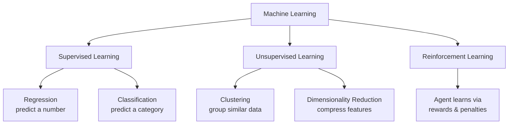
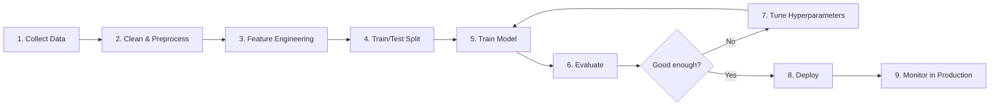
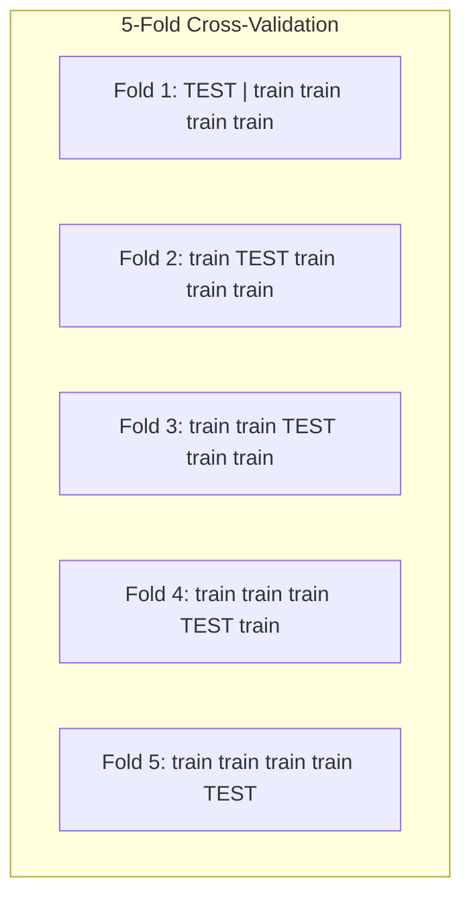
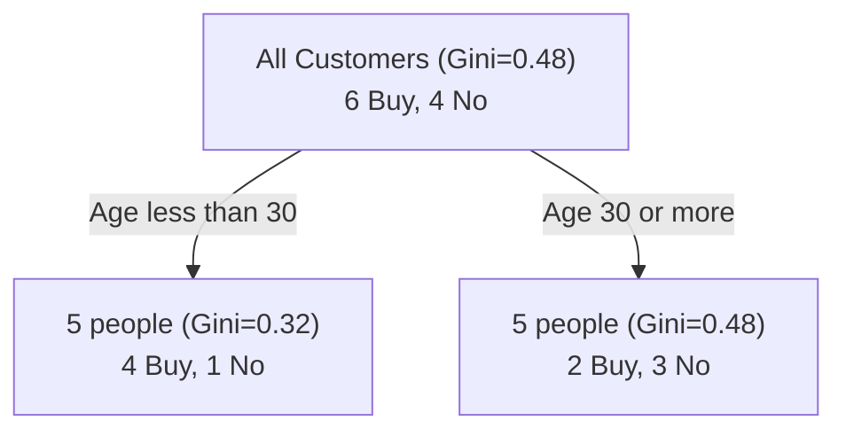
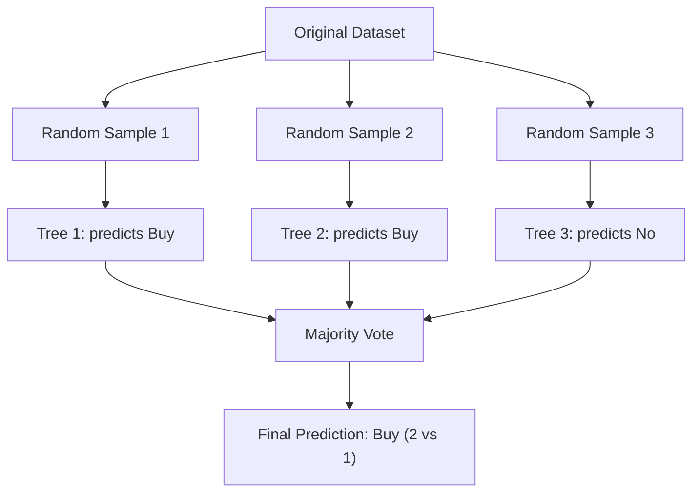
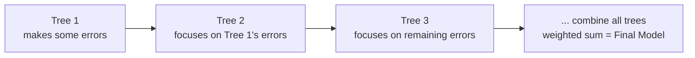

# Machine Learning — 4 Hour Crash Course Notes

> Target audience: BTech 2nd year students with basic programming + math background, no prior ML exposure.
> Note: Deep Learning (Neural Networks, CNNs, Transformers, etc.) is **not** covered here — it gets its own separate 4-hour block. This course focuses on classical/traditional Machine Learning.

---

## 📑 Table of Contents

- [Hour 1: Foundations & Statistical Thinking](#hour-1-foundations--statistical-thinking)
  - [1.1 What is Machine Learning?](#11-what-is-machine-learning)
  - [1.2 Types of Learning](#12-types-of-learning)
  - [1.3 The ML Workflow](#13-the-ml-workflow)
  - [1.4 Probability & Statistics Refresher](#14-probability--statistics-refresher)
  - [1.5 Bias-Variance Tradeoff](#15-bias-variance-tradeoff)
  - [1.6 Overfitting vs Underfitting](#16-overfitting-vs-underfitting)
  - [1.7 Train/Validation/Test Split & Cross-Validation](#17-trainvalidationtest-split--cross-validation)
- [Hour 2: Supervised Learning Deep Dive](#hour-2-supervised-learning-deep-dive)
- [Hour 3: Ensembles & Unsupervised Learning](#hour-3-ensembles--unsupervised-learning)
- [Hour 4: Practical ML Workflow & Hands-On](#hour-4-practical-ml-workflow--hands-on)

---

## Hour 1: Foundations & Statistical Thinking

### 1.1 What is Machine Learning?

**Traditional programming** works like this:

```
Rules (written by you)  +  Data  →  Output
```

Example: To flag spam emails traditionally, you write rules like *"if email contains 'FREE MONEY', mark as spam."* You have to think of every rule yourself.

**Machine Learning flips this around:**

```
Data  +  Output (examples/answers)  →  Rules (learned automatically)
```

You show the computer thousands of emails labeled "spam" or "not spam," and it *figures out the rules itself* — patterns of words, sender behavior, etc. — without you hand-coding them.

> **One-line definition:** Machine Learning is the field of building systems that improve their performance on a task by learning patterns from data, rather than being explicitly programmed with rules.

**Why now?** Three things came together in the last ~15 years:
1. **Data** — the internet generates massive amounts of it
2. **Compute** — GPUs/cloud computing made heavy calculations affordable
3. **Algorithms** — better math/techniques to actually learn from that data

---

### 1.2 Types of Learning



| Type | What it needs | What it does | Real Example |
|---|---|---|---|
| **Supervised** | Labeled data (input + correct answer) | Learns a mapping from input → output | Predicting house price from size, sq. ft., location |
| **Unsupervised** | Unlabeled data (only inputs) | Finds hidden structure/groups | Segmenting customers into groups for marketing, without pre-defined categories |
| **Reinforcement** | An environment + reward signal | Learns actions that maximize long-term reward | A robot learning to walk; an AI learning to play chess |

**Simple test to tell them apart:** Does your dataset have a "correct answer" column?
- Yes → Supervised
- No, but you want to find groups/patterns → Unsupervised
- There's no dataset at all, just an agent interacting with an environment → Reinforcement

We'll spend most of this course on **Supervised** (Hour 2) and **Unsupervised** (Hour 3), since they form the backbone of most real-world ML work.

---

### 1.3 The ML Workflow

Every ML project — no matter how fancy — follows roughly this pipeline:



Keep this diagram in your head — everything we learn today is a tool that fits into **one of these boxes**. For example:
- Linear Regression, Decision Trees, SVM → box 5 (models)
- Precision, Recall, F1 → box 6 (evaluate)
- Grid Search → box 7 (tuning)
- Scaling, Encoding → box 3 (feature engineering)

---

### 1.4 Probability & Statistics Refresher

ML is built on statistics. Let's refresh the essentials with actual numbers.

#### Mean, Variance, Standard Deviation

Given data: `[2, 4, 4, 4, 5, 5, 7, 9]`

**Mean (average):**
$$\bar{x} = \frac{\sum x_i}{n} = \frac{2+4+4+4+5+5+7+9}{8} = \frac{40}{8} = 5$$

**Variance (average squared distance from the mean — measures "spread"):**
$$\sigma^2 = \frac{\sum (x_i - \bar{x})^2}{n}$$

Working it out:
| xᵢ | xᵢ - mean | (xᵢ - mean)² |
|---|---|---|
| 2 | -3 | 9 |
| 4 | -1 | 1 |
| 4 | -1 | 1 |
| 4 | -1 | 1 |
| 5 | 0 | 0 |
| 5 | 0 | 0 |
| 7 | 2 | 4 |
| 9 | 4 | 16 |

Sum = 32 → Variance = 32/8 = **4**

**Standard Deviation** (just the square root of variance — brings it back to the original unit):
$$\sigma = \sqrt{4} = 2$$

**Why you care:** Variance/std deviation show up everywhere — normalizing features, understanding spread of errors, and directly inside the "variance" half of the bias-variance tradeoff (next section).

#### Bayes' Theorem (the most important formula in this hour)

$$P(A|B) = \frac{P(B|A) \cdot P(A)}{P(B)}$$

In plain English: *"the probability of A given that B happened, depends on how likely B is if A is true, how common A is overall, and how common B is overall."*

**Numerical Example — The Medical Test Paradox** (this is a classic, and it directly explains why "99% accurate" models can still be misleading — a theme we revisit in Hour 2's evaluation metrics):

- A disease affects **1%** of the population: P(Disease) = 0.01
- A test correctly detects the disease **99%** of the time (sensitivity): P(Positive | Disease) = 0.99
- The test gives a false positive **5%** of the time on healthy people: P(Positive | No Disease) = 0.05

**Question:** If someone tests positive, what's the actual probability they have the disease?

Step 1 — Find P(Positive) overall using the law of total probability:
$$P(Positive) = P(Positive|Disease)\cdot P(Disease) + P(Positive|NoDisease)\cdot P(NoDisease)$$
$$= (0.99)(0.01) + (0.05)(0.99) = 0.0099 + 0.0495 = 0.0594$$

Step 2 — Apply Bayes' Theorem:
$$P(Disease|Positive) = \frac{0.99 \times 0.01}{0.0594} = \frac{0.0099}{0.0594} \approx 0.167$$

**Result: only ~16.7%**, even though the test is "99% accurate"! This is because the disease is rare, so false positives from the huge healthy population outnumber true positives. This exact intuition is why we don't trust "accuracy" alone for imbalanced problems — remember this for Hour 2.

---

### 1.5 Bias-Variance Tradeoff

This is the single most important concept for understanding *why* models fail.

- **Bias** = error from a model being **too simple** — it makes strong assumptions and misses real patterns (**underfitting**)
- **Variance** = error from a model being **too complex** — it fits noise/randomness in training data instead of the real pattern (**overfitting**)

$$\text{Total Error} = \text{Bias}^2 + \text{Variance} + \text{Irreducible Error}$$

*(Irreducible error is just noise inherent to the data — no model can remove it.)*

**Numerical Example:** Suppose we fit a polynomial curve to some data, at different levels of complexity (polynomial degree):

| Model Complexity (Polynomial Degree) | Training Error | Test Error | What's happening |
|---|---|---|---|
| 1 (straight line) | 8.2 | 8.5 | High bias — too simple, underfitting |
| 3 | 3.1 | 3.4 | Reasonable fit |
| 6 | 1.2 | 2.0 | **Sweet spot** — low bias, low variance |
| 10 | 0.4 | 4.5 | Starting to overfit |
| 15 | 0.05 | 9.8 | High variance — memorized training data, fails on new data |

Notice: training error *keeps dropping* as complexity increases, but test error goes back **up** after a point. That gap between training and test error is the signature of overfitting.

**ASCII visualization of this relationship:**

```
 Error
   │
   │ ╲                                    ╱  ← Total Error (U-shaped)
   │  ╲                                  ╱
   │   ╲                                ╱
   │    ╲          Variance ↗         ╱
   │     ╲        (test error)      ╱
   │      ╲___                    ╱
   │  Bias  ╲___     ╱‾‾‾‾‾‾‾╲___╱
   │(train error) ╲_╱  (sweet spot)
   │
   └──────────────────────────────────────────→
     Low                                    High
                Model Complexity
```

**Rule of thumb:**
- Training error high, test error high → **underfitting** (high bias) → use a more complex model
- Training error low, test error high → **overfitting** (high variance) → simplify model, add regularization, get more data
- Both low and close together → 🎉 good model

---

### 1.6 Overfitting vs Underfitting

| | Underfitting | Good Fit | Overfitting |
|---|---|---|---|
| Training accuracy | Low | High | Very High |
| Test accuracy | Low | High | Low |
| Cause | Model too simple / not trained enough | Just right | Model too complex / trained too long / too little data |
| Fix | Add features, use complex model, train longer | — | Regularization, more data, simpler model, early stopping, cross-validation |

**Everyday analogy:** Underfitting is like a student who only skims the syllabus and fails to answer even easy questions — didn't learn enough patterns. Overfitting is like a student who **memorized last year's question paper word-for-word** — scores 100% on that exact paper (training data) but fails when the new exam has different phrasing (test data). They didn't learn the *concept*, just memorized specifics.

---

### 1.7 Train/Validation/Test Split & Cross-Validation

We never train and test on the same data — that's like grading a student using the exact questions they memorized answers to.

**Standard split:**

```
┌─────────────────────────────┬───────────────┬───────────────┐
│      Training Set (70%)     │  Validation    │   Test Set    │
│   used to fit the model     │   (15%)        │    (15%)      │
│                              │ tune hyper-    │  final, unseen│
│                              │ parameters     │  evaluation   │
└─────────────────────────────┴───────────────┴───────────────┘
```

- **Training set** → model learns patterns from this
- **Validation set** → used to tune settings (hyperparameters) and pick the best model version
- **Test set** → touched only ONCE, at the very end, to report final performance honestly

#### K-Fold Cross-Validation

Instead of a single validation split (which might be lucky/unlucky), we rotate through the data:



Train 5 separate models, each time holding out a different 1/5th of data as the test fold, then **average the 5 scores**:

$$CV_{score} = \frac{1}{k}\sum_{i=1}^{k} score_i$$

**Why bother?** A single train/test split might accidentally put all the "easy" examples in the test set, giving a falsely rosy (or harsh) score. Averaging over k folds gives a much more reliable estimate of real-world performance. Typical choice: **k = 5 or k = 10**.

---

## Hour 2: Supervised Learning Deep Dive

### 2.1 Linear Regression

**Formula (simplified):**
$$\hat{y} = mx + b$$

In plain words: *m* = slope (how much y changes per unit of x), *b* = intercept (value of y when x = 0), *ŷ* ("y-hat") = the model's prediction.

**Worked Numerical Example — Predicting House Price from Size**

| Size (sqft) | Price (₹ Lakhs) |
|---|---|
| 500 | 25 |
| 1000 | 45 |
| 1500 | 65 |
| 2000 | 85 |

Let's actually **solve for m and b by hand** using the least-squares formulas:

$$m = \frac{n\sum xy - \sum x \sum y}{n\sum x^2 - (\sum x)^2} \qquad b = \frac{\sum y - m\sum x}{n}$$

Step 1 — compute the pieces:
- n = 4
- Σx = 500+1000+1500+2000 = **5000**
- Σy = 25+45+65+85 = **220**
- Σxy = (500×25)+(1000×45)+(1500×65)+(2000×85) = 12500+45000+97500+170000 = **325000**
- Σx² = 500²+1000²+1500²+2000² = 250000+1000000+2250000+4000000 = **7500000**

Step 2 — plug into the formula for m:
$$m = \frac{4(325000) - (5000)(220)}{4(7500000) - (5000)^2} = \frac{1300000 - 1100000}{30000000 - 25000000} = \frac{200000}{5000000} = 0.04$$

Step 3 — solve for b:
$$b = \frac{220 - (0.04)(5000)}{4} = \frac{220-200}{4} = \frac{20}{4} = 5$$

**Final model: Price = 0.04 × Size + 5**

Check it: at 1500 sqft → 0.04×1500+5 = 60+5 = **65** ✅ matches the table.

#### The Cost Function — Mean Squared Error (MSE)

$$MSE = \frac{1}{n}\sum (y_i - \hat{y}_i)^2$$

This just measures "how wrong is the model, on average, squared." Let's see WHY we needed the correct m and b by testing a **bad guess**: suppose someone guessed Price = 0.05×Size + 2.

| Size | Actual y | Guess ŷ = 0.05x+2 | Error (y−ŷ) | Squared Error |
|---|---|---|---|---|
| 500 | 25 | 27 | -2 | 4 |
| 1000 | 45 | 52 | -7 | 49 |
| 1500 | 65 | 77 | -12 | 144 |
| 2000 | 85 | 102 | -17 | 289 |

$$MSE_{bad} = \frac{4+49+144+289}{4} = \frac{486}{4} = 121.5$$

Now check our fitted line (Price = 0.04x+5): every prediction matches exactly, so **MSE = 0**. This is the whole point of training — we're searching for the (m, b) that makes MSE as small as possible. That search process is called **Gradient Descent**.

---

### 2.2 Gradient Descent

**Idea:** Imagine standing on a hill (the cost function) in fog, and you want to reach the bottom (minimum error). You feel the slope under your feet and take a small step downhill. Repeat.

**Update rule (simplified):**
$$w_{new} = w_{old} - \alpha \times \text{gradient}$$

- α (alpha) = **learning rate** — how big a step you take
- gradient = the slope of the cost function at your current position (tells you which direction is "uphill")

**Worked Numerical Example — One Step of Gradient Descent by Hand**

Toy dataset (chosen small on purpose so the arithmetic stays clean): x = [1,2,3,4], y = [3,5,7,9] (true relationship: y = 2x+1)

Start with a bad initial guess: **m = 0, b = 0**

Gradient formulas (derived from MSE, simplified):
$$\frac{\partial MSE}{\partial m} = -\frac{2}{n}\sum x_i(y_i - \hat{y}_i) \qquad \frac{\partial MSE}{\partial b} = -\frac{2}{n}\sum (y_i - \hat{y}_i)$$

Step 1 — with m=0, b=0, every prediction ŷ=0. So error (y−ŷ) is just y itself: [3, 5, 7, 9]

Step 2 — gradient w.r.t. m:
$$-\frac{2}{4}\big[(1)(3)+(2)(5)+(3)(7)+(4)(9)\big] = -0.5 \times [3+10+21+36] = -0.5 \times 70 = -35$$

Step 3 — gradient w.r.t. b:
$$-\frac{2}{4}[3+5+7+9] = -0.5 \times 24 = -12$$

Step 4 — apply the update rule with learning rate α = 0.01:
$$m_{new} = 0 - 0.01 \times (-35) = 0.35$$
$$b_{new} = 0 - 0.01 \times (-12) = 0.12$$

After just **one step**, we moved from (m=0, b=0) to (m=0.35, b=0.12) — heading toward the true answer (m=2, b=1). Repeat this process hundreds/thousands of times and it converges.

**Why the learning rate (α) matters — this is why gradient descent sometimes fails:**

```
 Too small α                Good α                  Too large α
     ╲                         ╲                    ╲    ╱╲    ╱
      ╲                         ╲                     ╲  ╱  ╲  ╱
       ╲___                      ╲___                  ╲╱    ╲╱
    ╲___ ╲___ ╲___              ╲___                (bounces / diverges,
   (crawls to minimum,          (reaches minimum      never settles)
    takes forever)               efficiently)
```

- **Too small** → training takes forever
- **Too large** → the steps overshoot the minimum and it can bounce around or even diverge
- **Just right** → smooth, efficient convergence

---

### 2.3 Regularization (L1 / L2)

When a model has too many features/weights, it can overfit (Hour 1, remember?). Regularization **penalizes large weights** to keep the model simpler.

$$\text{Cost} = MSE + \lambda \times \text{Penalty}$$

- **L1 (Lasso):** Penalty = Σ|wᵢ| → can shrink some weights all the way to **zero** (automatic feature selection)
- **L2 (Ridge):** Penalty = Σwᵢ² → shrinks weights smoothly toward zero, rarely exactly zero

**Worked Numerical Example:** Suppose a model has learned weights **w = [3, -2, 0.5]**

L1 penalty: |3| + |-2| + |0.5| = 3 + 2 + 0.5 = **5.5**
L2 penalty: 3² + (-2)² + 0.5² = 9 + 4 + 0.25 = **13.25**

With λ = 0.1 and a base MSE of 10:
- L1-regularized cost = 10 + (0.1 × 5.5) = 10 + 0.55 = **10.55**
- L2-regularized cost = 10 + (0.1 × 13.25) = 10 + 1.325 = **11.325**

Notice L2 punishes the large weight (3) much more heavily than L1 does (because it's squared) — this is why L2 tends to shrink big weights fast, while L1 is more willing to push small weights all the way to zero.

---

### 2.4 Logistic Regression

Used when the output is a **category** (e.g., pass/fail, spam/not spam), not a number. It squashes a linear equation through the **sigmoid function** to output a probability between 0 and 1:

$$\sigma(z) = \frac{1}{1+e^{-z}} \qquad \text{where } z = wx+b$$

**Worked Numerical Example — Will a student pass, based on hours studied?**

Suppose training already gave us: w = 0.8, b = -4

**Student A studied 6 hours:**
$$z = (0.8)(6) + (-4) = 4.8 - 4 = 0.8$$
$$\sigma(0.8) = \frac{1}{1+e^{-0.8}} = \frac{1}{1+0.449} = \frac{1}{1.449} \approx 0.69$$

→ 69% chance of passing → since > 0.5, **predict PASS**

**Student B studied 3 hours:**
$$z = (0.8)(3) + (-4) = 2.4-4 = -1.6$$
$$\sigma(-1.6) = \frac{1}{1+e^{1.6}} = \frac{1}{1+4.953} = \frac{1}{5.953} \approx 0.168$$

→ 16.8% chance → since < 0.5, **predict FAIL**

**Cost function — Log Loss (Binary Cross-Entropy):**
$$\text{Cost} = -\big[y\log(\hat{y}) + (1-y)\log(1-\hat{y})\big]$$

For Student A, suppose the *actual* outcome was y=1 (they did pass) and our prediction was ŷ=0.69:
$$\text{Cost} = -[1 \times \ln(0.69) + 0] = -\ln(0.69) \approx 0.371$$

(A low cost — the model was fairly confident and correct. If it had predicted ŷ=0.1 for an actual pass, cost = −ln(0.1) ≈ **2.30** — much higher, punishing confident wrong answers heavily.)

---

### 2.5 Decision Trees

A decision tree asks a series of yes/no questions about features to split data into pure groups. It decides *which question to ask first* using **Gini Impurity** (or Entropy).

$$Gini = 1 - \sum p_i^2$$

**Worked Numerical Example:** A node has 10 customers: 6 "Will Buy", 4 "Won't Buy"

$$p_{buy} = 0.6, \quad p_{no} = 0.4$$
$$Gini_{parent} = 1-(0.6^2+0.4^2) = 1-(0.36+0.16) = 1-0.52 = 0.48$$

Now try splitting on "Age < 30":

**Left node** (Age<30): 5 people → 4 Buy, 1 No → p_buy=0.8, p_no=0.2
$$Gini_{left} = 1-(0.8^2+0.2^2) = 1-(0.64+0.04) = 0.32$$

**Right node** (Age≥30): 5 people → 2 Buy, 3 No → p_buy=0.4, p_no=0.6
$$Gini_{right} = 1-(0.4^2+0.6^2) = 1-(0.16+0.36) = 0.48$$

**Weighted Gini after split:**
$$Gini_{split} = \frac{5}{10}(0.32) + \frac{5}{10}(0.48) = 0.16+0.24 = 0.40$$

**Gini Gain = 0.48 − 0.40 = 0.08** → this split *reduces impurity*, so it's a useful split. The tree tries many possible splits and picks the one with the **highest gain** at each step.



*(Entropy is an alternative impurity measure: Entropy = −Σpᵢlog₂(pᵢ). For our parent node: −[0.6×log₂(0.6) + 0.4×log₂(0.4)] = −[0.6×(−0.737) + 0.4×(−1.32)] = −[−0.442−0.528] = **0.97**. Gini and Entropy usually agree on which split is best; Gini is just cheaper to compute.)*

---

### 2.6 K-Nearest Neighbors (KNN)

**Idea:** To classify a new point, look at its *k* closest neighbors (by distance) and take a majority vote.

**Euclidean Distance formula:**
$$d = \sqrt{(x_2-x_1)^2 + (y_2-y_1)^2}$$

**Worked Numerical Example:** Labeled points: A(2,3)=Red, B(5,4)=Blue, C(3,8)=Red, D(6,7)=Blue. New point P(4,5). Use **k=3**.

$$d(P,A) = \sqrt{(4-2)^2+(5-3)^2} = \sqrt{4+4} = \sqrt{8} \approx 2.83$$
$$d(P,B) = \sqrt{(4-5)^2+(5-4)^2} = \sqrt{1+1} = \sqrt{2} \approx 1.41$$
$$d(P,C) = \sqrt{(4-3)^2+(5-8)^2} = \sqrt{1+9} = \sqrt{10} \approx 3.16$$
$$d(P,D) = \sqrt{(4-6)^2+(5-7)^2} = \sqrt{4+4} = \sqrt{8} \approx 2.83$$

**Sorted by distance:** B (1.41, Blue), A (2.83, Red), D (2.83, Blue), C (3.16, Red)

Top 3 nearest = {B: Blue, A: Red, D: Blue} → **2 votes Blue, 1 vote Red** → **P is classified as Blue**

*(Note: KNN has no real "training" phase — it just stores the data and does this distance calculation at prediction time. This makes it slow on large datasets but very intuitive.)*

---

### 2.7 Support Vector Machines (SVM)

**Idea:** Find the line (or hyperplane, in higher dimensions) that separates two classes with the **maximum possible margin** — i.e., stays as far as possible from the closest points of both classes (called the **support vectors**).

```
        Class A (●)                    Class B (○)
           ●                                    ○
        ●     ●                             ○      ○
             ●    |←── margin ──→|      ○
                  |    (line)    |
              ●        ↑              ○
                  support vectors on both sides
```

**Hyperplane equation:** $w \cdot x + b = 0$, and the margin width is:
$$\text{margin} = \frac{2}{\|w\|}$$

**Worked Numerical Example:** If the learned weight vector is w = (2, 0):
$$\|w\| = \sqrt{2^2+0^2} = 2 \qquad \text{margin} = \frac{2}{2} = 1$$

SVM training is essentially an optimization problem that **maximizes this margin** (equivalently, minimizes ‖w‖) while still classifying every point correctly. For data that isn't linearly separable, SVM uses the **kernel trick** — a mathematical shortcut that projects data into a higher dimension where a straight line *can* separate it, without actually doing the expensive computation in that higher dimension. (You don't need the full math here — just remember: *kernel = "makes curved boundaries possible using the same linear-separator machinery."*)

---

### 2.8 Evaluation Metrics

**Confusion Matrix** (for a binary classifier):

| | Predicted Positive | Predicted Negative |
|---|---|---|
| **Actual Positive** | True Positive (TP) | False Negative (FN) |
| **Actual Negative** | False Positive (FP) | True Negative (TN) |

**Worked Numerical Example — Spam Classifier tested on 100 emails** (20 actually spam, 80 actually not spam):

| | Predicted Spam | Predicted Not Spam |
|---|---|---|
| **Actual Spam** | TP = 15 | FN = 5 |
| **Actual Not Spam** | FP = 10 | TN = 70 |

$$Accuracy = \frac{TP+TN}{TP+TN+FP+FN} = \frac{15+70}{100} = \frac{85}{100} = 0.85$$

$$Precision = \frac{TP}{TP+FP} = \frac{15}{15+10} = \frac{15}{25} = 0.60$$

$$Recall = \frac{TP}{TP+FN} = \frac{15}{15+5} = \frac{15}{20} = 0.75$$

$$F1 = 2\times\frac{Precision \times Recall}{Precision+Recall} = 2\times\frac{0.60\times0.75}{0.60+0.75} = 2\times\frac{0.45}{1.35} \approx 0.667$$

**What these mean in plain terms:**
- **Precision** = "Of all emails I *called* spam, how many actually were?" (matters when false alarms are costly — e.g., don't want important emails in spam folder)
- **Recall** = "Of all *actual* spam, how much did I catch?" (matters when missing a positive is costly — e.g., cancer screening, fraud detection)
- **F1** = harmonic mean of both, useful when you need one single balanced number

Remember the Bayes' theorem example from Hour 1 (disease test)? This is exactly why **accuracy alone is misleading** on imbalanced data — a model that just predicts "not spam" every single time would score 80% accuracy here while catching zero spam (Recall = 0)!

---

## Hour 3: Ensembles & Unsupervised Learning

### 3.1 Bagging & Random Forests

**Bagging (Bootstrap Aggregating):** Train many models on *different random samples* of the data (sampled **with replacement**), then average their predictions. This reduces **variance** (remember Hour 1!) because individual models' mistakes tend to cancel out.

**Random Forest** = Bagging + Decision Trees + one extra trick: each tree only considers a **random subset of features** at each split (this makes the trees less correlated with each other, which improves the averaging effect even more).



**Worked Numerical Example:** Suppose a random forest has 7 trees, and for a new customer they individually predict:
`[Buy, Buy, No, Buy, No, Buy, Buy]`

Count: Buy = 5, No = 2 → **Majority vote = Buy** (5/7 ≈ 71% confidence)

For **regression** (predicting a number, not a category), instead of a vote you take the **average**. If 5 trees predict prices [62, 58, 65, 60, 70] lakhs:
$$\text{Final prediction} = \frac{62+58+65+60+70}{5} = \frac{315}{5} = 63 \text{ lakhs}$$

---

### 3.2 Boosting

Unlike bagging (trees trained independently, in parallel), **boosting** trains trees **sequentially** — each new tree focuses specifically on fixing the mistakes of the previous ones.



**Simplified idea of AdaBoost:** After each tree, misclassified points get their "importance weight" **increased**, so the next tree pays more attention to them.

**Worked Numerical Example:** Say we have 5 data points, all starting with equal weight = 0.2 each (they sum to 1). Tree 1 misclassifies point #3. AdaBoost increases point #3's weight (say, to 0.4) and proportionally reduces the others so they still sum to 1 — forcing Tree 2 to try harder on point #3.

**Gradient Boosting** (used in XGBoost, LightGBM — extremely popular in industry and Kaggle competitions) works slightly differently: instead of reweighting points, each new tree is trained to predict the **residual (leftover error)** of the previous combined model.

Example: True value y=100.
- Tree 1 predicts 80 → residual = 100−80 = **20**
- Tree 2 is trained to predict that residual, predicts 15 → new combined prediction = 80+15 = 95, new residual = **5**
- Tree 3 predicts 4 → combined = 95+4 = 99, residual = **1** ... and so on, getting closer each round.

**Bagging vs Boosting — quick comparison:**

| | Bagging (Random Forest) | Boosting (XGBoost, AdaBoost) |
|---|---|---|
| Trees trained | In parallel, independently | Sequentially, each fixing previous errors |
| Main goal | Reduce variance | Reduce bias (and variance) |
| Risk | Less prone to overfitting | Can overfit if too many rounds |
| Speed | Faster to train (parallelizable) | Slower (sequential) |

---

### 3.3 K-Means Clustering

**Goal:** Group unlabeled data into *k* clusters, where points in the same cluster are close to each other.

**Algorithm:**
1. Choose the number of clusters, *k*
2. Randomly place *k* centroids (cluster centers)
3. Assign every point to its **nearest** centroid
4. Move each centroid to the **average position** of the points assigned to it
5. Repeat steps 3–4 until centroids stop moving

**Worked Numerical Example:** 4 points: A(1,1), B(2,1), C(8,8), D(9,9). Let's do **k=2**.

Initial centroids (randomly picked): C1=(1,1), C2=(9,9)

**Iteration 1 — Assign points using Euclidean distance:**
- A(1,1): distance to C1=0, to C2=√((9-1)²+(9-1)²)=√128≈11.3 → assign to **C1**
- B(2,1): distance to C1=√((2-1)²+(1-1)²)=1, to C2=√((9-2)²+(9-1)²)=√113≈10.6 → assign to **C1**
- C(8,8): distance to C1=√((8-1)²+(8-1)²)=√98≈9.9, to C2=√((9-8)²+(9-8)²)=√2≈1.41 → assign to **C2**
- D(9,9): distance to C1≈11.3, to C2=0 → assign to **C2**

**Recompute centroids (average of assigned points):**
$$C1_{new} = \left(\frac{1+2}{2}, \frac{1+1}{2}\right) = (1.5, 1)$$
$$C2_{new} = \left(\frac{8+9}{2}, \frac{8+9}{2}\right) = (8.5, 8.5)$$

Since {A,B} and {C,D} would still assign the same way with these new centroids, the algorithm has **converged**: Cluster 1 = {A,B}, Cluster 2 = {C,D}.

**Choosing k — the Elbow Method:** Plot WCSS (Within-Cluster Sum of Squares — total squared distance of points to their centroid) against different values of k:

| k | WCSS |
|---|---|
| 1 | 180 |
| 2 | 60 |
| 3 | 40 |
| 4 | 35 |
| 5 | 32 |

```
WCSS
180 │●
    │
    │
 60 │  ●
    │
 40 │    ● ← "elbow" — the bend where
 35 │      ●   improvement sharply slows down
 32 │        ●
    └──────────────────→ k
      1  2  3  4  5
```

The "elbow" (sharp bend) here is at **k=2 or k=3** — after that, adding more clusters barely reduces WCSS further, meaning you're just splitting real clusters into meaningless pieces. That bend point is your best choice of k.

---

### 3.4 Hierarchical Clustering (brief)

Instead of picking k upfront, this method builds a **tree of clusters** (called a **dendrogram**) by repeatedly merging the two closest points/clusters until everything is in one cluster.

```
Distance
  │
  │        ┌───────────────┐
  │    ┌───┤               │
  │    │   └───┐           │
  │  ┌─┤       │       ┌───┤
  │  │ │       │       │   │
  A  B C       D       E   F

  ↑ You can "cut" the dendrogram at any height
    to get however many clusters you want.
```

You then **cut** the dendrogram at whatever height gives you the number of clusters you want — no need to decide k in advance, unlike K-Means. Downside: slower on large datasets (compares every pair of points).

---

### 3.5 Principal Component Analysis (PCA)

**Goal:** Reduce the number of features (dimensions) while keeping as much of the "spread"/information in the data as possible. Useful for visualization (compress to 2D/3D) and speeding up models.

**Core idea:** Find a new axis (a direction) along which the data has **maximum variance** — that direction becomes your new "Principal Component 1." Data spread out along this line retains the most information.

```
   y
   │        ●
   │      ●   ●
   │    ●   ●
   │  ●   ●         ↗ Principal Component 1
   │●   ●          ╱   (direction of max spread —
   │  ●         ╱      project points onto this
   │        ╱          single line = 1D data,
   └──────────────────── x    keeping most of the info)
```

**Simplified numeric intuition:** Suppose 2D data has variance 50 along the x-axis and variance 2 along the y-axis. If we're forced to compress to 1 dimension, projecting onto the x-axis keeps $\frac{50}{50+2} = 96.2\%$ of the total variance (information) — a great trade for cutting our feature count in half. PCA finds the *best possible* such direction automatically (it isn't always a plain axis like x or y — it can be any rotated direction, found using eigenvectors of the data's covariance matrix, which is the deeper math behind this — but the intuition above is what matters for using it).

---

## Hour 4: Practical ML Workflow & Hands-On

### 4.1 Feature Engineering

Real-world data is messy. This step often matters **more** than which algorithm you pick.

#### Handling Missing Data

Common fix: **imputation** — fill gaps with mean, median, or mode.

**Worked Numerical Example:** A column of ages: `[22, 25, NaN, 28, 24, NaN, 30]`

Known values: 22, 25, 28, 24, 30 → Mean = (22+25+28+24+30)/5 = 129/5 = **25.8**

Fill both NaNs with 25.8 → `[22, 25, 25.8, 28, 24, 25.8, 30]`

*(Use median instead of mean when data has outliers — e.g., income data — since the median isn't dragged around by extreme values.)*

#### Encoding Categorical Variables

ML models need numbers, not text. Two common approaches:

**Label Encoding** (for ordinal/ranked categories): `Low=0, Medium=1, High=2`

**One-Hot Encoding** (for non-ranked categories, e.g., City):

| City | City_Delhi | City_Mumbai | City_Chennai |
|---|---|---|---|
| Delhi | 1 | 0 | 0 |
| Mumbai | 0 | 1 | 0 |
| Chennai | 0 | 0 | 1 |

*(Why not label-encode City as Delhi=0, Mumbai=1, Chennai=2? Because that would falsely imply Chennai > Mumbai > Delhi numerically, which makes no sense for unordered categories.)*

#### Feature Scaling

Many algorithms (KNN, SVM, gradient descent-based ones) are sensitive to feature scale — a feature ranging 0–100000 will dominate one ranging 0–1 even if both matter equally.

**Min-Max Normalization** (scales to range [0,1]):
$$x' = \frac{x - min}{max - min}$$

**Standardization** (Z-score, scales to mean=0, std=1):
$$x' = \frac{x - \mu}{\sigma}$$

**Worked Numerical Example:** Feature values: `[10, 20, 30, 40, 50]` → min=10, max=50, mean=30, std=14.14

Min-Max scaling of 20: $\frac{20-10}{50-10} = \frac{10}{40} = 0.25$

Standardization of 20: $\frac{20-30}{14.14} = \frac{-10}{14.14} \approx -0.71$

---

### 4.2 Hyperparameter Tuning

**Hyperparameters** are settings you choose *before* training (e.g., k in KNN, tree depth, learning rate) — as opposed to **parameters** the model learns itself (e.g., weights).

**Grid Search:** Try every combination from a predefined list.

**Worked Numerical Example:** Tuning a Random Forest with:
- `n_estimators` (number of trees): [50, 100, 150]
- `max_depth`: [5, 10]

Grid Search tries **all 3 × 2 = 6 combinations**, running 5-fold cross-validation (from Hour 1!) on each — so that's **6 × 5 = 30 total model trainings** — and picks whichever combination had the best average CV score.

**Random Search:** Instead of trying every combination, randomly sample a fixed number (say, 10) of combinations from the possible ranges. Much cheaper when you have many hyperparameters, and in practice often finds nearly-as-good settings with a fraction of the computation.

---

### 4.3 Full Pipeline — Code Walkthrough (scikit-learn)

Here's how everything from this course fits together in actual code, using the classic **Iris flower dataset** (predict flower species from petal/sepal measurements):

```python
import pandas as pd
from sklearn.datasets import load_iris
from sklearn.model_selection import train_test_split, GridSearchCV
from sklearn.preprocessing import StandardScaler
from sklearn.ensemble import RandomForestClassifier
from sklearn.metrics import accuracy_score, classification_report

# 1. Load data
data = load_iris()
X, y = data.data, data.target

# 2. Train/Test split (80/20) — Hour 1, section 1.7
X_train, X_test, y_train, y_test = train_test_split(
    X, y, test_size=0.2, random_state=42
)

# 3. Feature scaling — Hour 4, section 4.1
scaler = StandardScaler()
X_train_scaled = scaler.fit_transform(X_train)   # fit ONLY on train data!
X_test_scaled = scaler.transform(X_test)          # just transform test data

# 4. Model + Hyperparameter tuning — Hour 3 (Random Forest) + Hour 4 (Grid Search)
param_grid = {
    'n_estimators': [50, 100, 150],
    'max_depth': [5, 10, None]
}
grid_search = GridSearchCV(
    RandomForestClassifier(random_state=42),
    param_grid,
    cv=5   # 5-fold cross-validation — Hour 1, section 1.7
)
grid_search.fit(X_train_scaled, y_train)

print("Best hyperparameters:", grid_search.best_params_)

# 5. Evaluate on the untouched test set — Hour 2, section 2.8
best_model = grid_search.best_estimator_
y_pred = best_model.predict(X_test_scaled)

print("Test Accuracy:", accuracy_score(y_test, y_pred))
print(classification_report(y_test, y_pred))
```

Notice how every single step traces back to a concept from Hours 1–3. This is the actual shape of ~80% of real classical ML projects.

---

### 4.4 Common Pitfalls

**1. Data Leakage** — Scaling/fitting on the *full* dataset before splitting leaks information about the test set into training. **Always split first, then fit preprocessing only on the training set** (notice the code above does `scaler.fit_transform(X_train)` but only `scaler.transform(X_test)` — never `fit` on test data).

**2. Imbalanced Datasets** — Remember the disease-test example from Hour 1 (16.7% despite "99% accurate" test) and the spam classifier from Hour 2 (80% accuracy while catching 0% of spam)? Same trap. Fixes: use Precision/Recall/F1 instead of accuracy, oversample the minority class (e.g., SMOTE), or use class weights.

**3. Overfitting to the Test Set via Repeated Tuning** — If you keep checking test performance and adjusting your approach based on it, you're indirectly "training" on the test set. That's why we use a separate **validation set** for tuning, and touch the test set only once, at the very end.

**4. Garbage In, Garbage Out** — No algorithm, however fancy, fixes bad/biased/incorrect data. Time spent cleaning and understanding your data usually pays off more than time spent picking a "better" algorithm.

---

### 4.5 Where Does Deep Learning Fit In?

Everything today falls under **classical/traditional ML**. A quick bridge to what comes next (covered in a separate 4-hour block):

| | Classical ML (today) | Deep Learning |
|---|---|---|
| Best for | Structured/tabular data (spreadsheets, databases) | Unstructured data (images, audio, text, video) |
| Data needed | Works well with small-to-medium data | Usually needs large amounts of data |
| Feature engineering | Often manual (Hour 4, section 4.1) | Learns features automatically |
| Interpretability | Often easier to explain (e.g., decision trees) | Often a "black box" |
| Compute | Runs fine on a laptop | Often needs GPUs |

Rule of thumb used in industry: **try classical ML first** (it's faster, cheaper, more interpretable) — reach for deep learning when the data is unstructured or classical methods plateau.

---

### 4.6 Next Steps & Resources

- **Practice:** [Kaggle](https://www.kaggle.com) — datasets + competitions + other people's notebooks to learn from
- **Courses:** Andrew Ng's *Machine Learning Specialization* (Coursera) — the most-recommended starting point
- **Library docs:** [scikit-learn.org](https://scikit-learn.org) — read the docs for any algorithm mentioned today
- **Books:** *"Hands-On Machine Learning with Scikit-Learn, Keras & TensorFlow"* by Aurélien Géron
- **Project idea to start with:** Pick a small Kaggle dataset (e.g., Titanic survival prediction) and manually walk through the full pipeline from section 4.3 yourself

---

## 🎯 Quick Recap — The Whole Course in One Table

| Hour | Core Idea | Key Formulas |
|---|---|---|
| 1 | ML = learning patterns from data; bias-variance tradeoff governs all model errors | Mean, Variance, Bayes' Theorem, Total Error = Bias²+Variance |
| 2 | Supervised algorithms map inputs → labeled outputs | MSE, Gradient Descent, Sigmoid, Gini, Euclidean Distance, Precision/Recall/F1 |
| 3 | Ensembles combine weak models; unsupervised learning finds structure without labels | Majority Vote/Averaging, K-Means iterations, Elbow Method |
| 4 | Real pipelines = data prep + tuning + careful evaluation, more than fancy algorithms | Min-Max/Standardization, Grid Search combinatorics |
