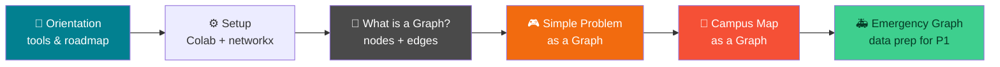
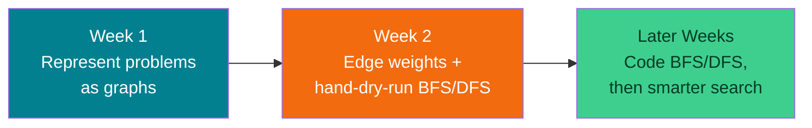
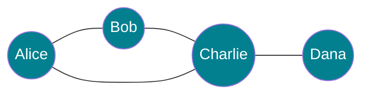
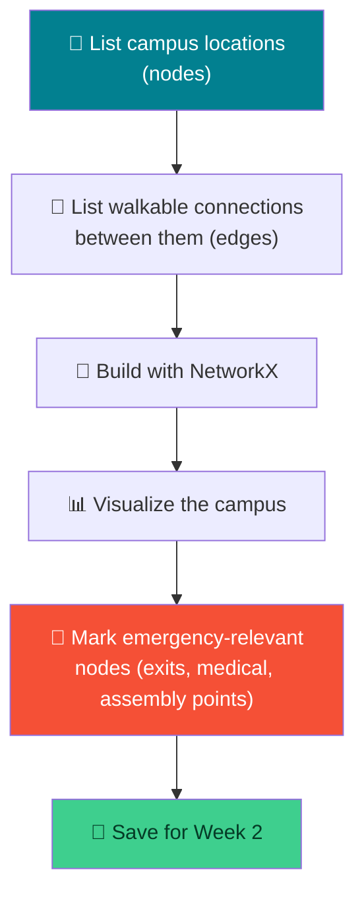

# 🕸️ Thinking in Graphs — Week 1 Practical (CSE 276)

### *Lab Orientation → What is a Graph? → Modeling a Campus/Emergency-Response Map, using Python + NetworkX + Matplotlib (all in Google Colab)*

> **What we're building today:** your very first mental model for "problem = graph." By the end of today you'll have (1) a working Python environment, (2) an intuitive feel for nodes/edges/degree/weighted vs. directed graphs, and (3) a real dataset — a small campus + emergency-response map — sitting in your notebook, ready to be searched with BFS/DFS in Week 2.

> 🧑‍🎓 **No prior AI/ML/DSA needed.** If the words "graph," "node," or "algorithm" sound scary — they won't by the end of this session. We start from zero.

> 💻 **Runtime:** Google Colab → `Runtime` → `Change runtime type` → **CPU** (the default). No GPU needed today — this is plain Python + a graph library.

**Session plan (2 hours, back-to-back — extra buffer material included so we never run dry):**

| Time | Block | Focus |
|------|-------|-------|
| 🕛 0:00 – 0:15 | **Orientation** | Course logistics, what "practical" sessions look like, roadmap for the semester |
| 🕧 0:15 – 0:35 | **Environment Setup** | Google Colab, Python check, installing/verifying `networkx` + `matplotlib` |
| 🕐 0:35 – 1:00 | **Practical 1** | What *is* a graph? Represent a simple, fun problem as a graph, by hand and in code |
| 🕜 1:00 – 1:50 | **Practical 2 (Buffer)** | Model a campus + emergency-response map as a graph — this becomes the dataset for Project 1 |
| 🕝 1:50 – 2:00 | **Wrap-up** | Recap, save your work, preview of Week 2 |
| ➕ Extra | **Extend It** | Optional deeper exercises if we move faster than expected |

---

## 🗺️ The Big Picture (Read This First)



**Why graphs, in an AI/CS course?** Almost every "smart" system — GPS navigation, social networks, recommendation engines, even chess-playing AI — is secretly just a graph with a search algorithm walking across it. Before we can write BFS or DFS (Week 2), we need to be fluent in the language graphs are written in: **nodes and edges.**

| Tool | Job | Analogy |
|------|-----|---------|
| 🐍 **Python** | The language we write everything in | The pen 🖊️ |
| 🕸️ **NetworkX** | Creates, stores, and manipulates graphs | The architect's blueprint tool 📐 |
| 📊 **Matplotlib** | Draws the graph so we can *see* it | The gallery wall 🖼️ |

---

## 📋 What You'll Need (all free)

1. A **Google account** (for Colab) → `https://colab.research.google.com`
2. That's it — `networkx` and `matplotlib` are either pre-installed on Colab or one `pip install` away (we'll check together).

---

# 🕛 ORIENTATION (0:00 – 0:15)

*(Talk-through block — light on typing, heavy on context-setting. Adjust pacing live.)*

### O.1 — Welcome & how this course runs

Quick verbal walkthrough (no need to write this down):

- **CSE 276** practicals happen every week, 2 hours, always hands-on — you will *build* something every single session, not just watch slides.
- Each week builds directly on the last. **Nothing is thrown away** — the campus map you build today is the exact same map you'll run search algorithms on in a few weeks.
- **No AI/ML background assumed.** If you've never coded in Python before, that's fine too — everything today is copy-run-tweak, not "write from scratch."

### O.2 — The roadmap (where today fits)



> 🎯 **Today's job is narrow on purpose:** get comfortable turning *any* problem into dots-and-lines, then build one real graph (a campus/emergency map) that we will keep reusing all semester.

### O.3 — Ground rules for practicals

- Bring a laptop, charged. Colab runs in the browser — nothing to install at home.
- Save your notebook to Google Drive as you go (`File → Save a copy in Drive`) — we will build on today's file next week.
- If you finish early, don't just sit — jump to the **🚀 Extend It** section near the end of this doc.

---

# 🕧 ENVIRONMENT SETUP (0:15 – 0:35)

### 1.1 — Open Google Colab

Go to `https://colab.research.google.com` → **New notebook**. Rename it `week1_cse276.ipynb` (click the title at the top-left).

### 1.2 — Confirm Python works at all

Type this in the first cell and run it (**Shift+Enter**):

```python
print("Hello, CSE 276! If you can see this, Python is working. ✅")
```

> 🧪 **What just happened?** Colab gave you a free virtual computer in the cloud, already running Python. `Shift+Enter` sends that cell's code to it and shows you the result. That's the entire workflow for the whole semester — write code in a cell, run it, read the output.

### 1.3 — Install/verify the graph libraries

```python
import sys
print("Python version:", sys.version)

# These usually come pre-installed on Colab — this cell just makes sure.
!pip install -q networkx matplotlib

import networkx as nx
import matplotlib.pyplot as plt

print("NetworkX version:", nx.__version__)
print("✅ Environment ready")
```

**Expected output (versions may differ slightly):**

```
Python version: 3.x.x ...
NetworkX version: 3.x
✅ Environment ready
```

### 1.4 — Your very first graph (sanity check, 3 lines)

```python
G = nx.Graph()
G.add_edge("A", "B")

nx.draw(G, with_labels=True, node_color="skyblue", node_size=1500, font_size=14)
plt.title("My first graph 🎉")
plt.show()
```

If you see two circles labeled **A** and **B** joined by a line — congratulations, you've drawn your first graph. Everything else today is this idea, scaled up.

---

## 🛠️ Troubleshooting — Setup

| Symptom | Likely cause | Fix |
|---------|-------------|-----|
| `ModuleNotFoundError: No module named 'networkx'` | Install cell didn't run, or ran in the wrong runtime | Re-run the `!pip install` cell; make sure you're connected (top-right should say "Connected") |
| Nothing shows up after `plt.show()` | Forgot to call `plt.show()`, or ran cells out of order | Always end a plotting cell with `plt.show()`; use `Runtime → Run all` if things feel out of sync |
| Graph looks like a jumbled mess of overlapping nodes | Normal for `nx.draw()` with default layout on bigger graphs | We'll fix this with a proper layout (`nx.spring_layout`) in Practical 1 |
| Colab says "Runtime disconnected" | Idle timeout | Just reconnect — nothing is lost if you saved to Drive |

---

# 🕐 PRACTICAL 1 (0:35 – 1:00): What *Is* a Graph?

## From real life → dots and lines → code

### 2.1 — The core idea, in plain English

A **graph** is just two things:

| Term | Plain-English meaning | Example |
|------|------------------------|---------|
| **Node** (or *vertex*) | A "thing" — anything you can point at | A person, a city, a webpage, a building |
| **Edge** | A connection *between* two nodes | "friends with," "road to," "link to" |

That's it. Everything else (weights, direction, algorithms) is extra detail layered on top of "dots and lines."



> 👆 That's a graph of 4 people and who's friends with whom. You already understood it instantly — that's the whole point of graphs: they match how humans naturally think about *connections*.

### 2.2 — Four flavors of graphs (know these words — you'll use them all semester)

| Flavor | Meaning | Real example |
|--------|---------|---------------|
| **Undirected** | Edges go both ways | "A is friends with B" (friendship is mutual) |
| **Directed** | Edges point one way only | "A follows B" on Instagram (not always mutual) |
| **Unweighted** | Every edge is "equally strong" | A friendship graph (you're just friends or not) |
| **Weighted** | Every edge has a number/cost attached | A road map (some roads are longer/slower than others) |

> 🔑 **Why this matters for later:** BFS (Week 2+) works great on unweighted graphs. Weighted graphs need smarter algorithms (coming later in the semester). Today we only need to *recognize* the difference — not solve anything with it yet.

### 2.3 — Let's build the friend graph in code

```python
friends = nx.Graph()   # undirected, unweighted, on purpose

# add_edge automatically creates the nodes too — no separate step needed
friends.add_edge("Alice", "Bob")
friends.add_edge("Bob", "Charlie")
friends.add_edge("Alice", "Charlie")
friends.add_edge("Charlie", "Dana")

print("Nodes:", list(friends.nodes()))
print("Edges:", list(friends.edges()))
print("Number of nodes:", friends.number_of_nodes())
print("Number of edges:", friends.number_of_edges())
```

### 2.4 — Draw it properly (with a layout, so it doesn't look messy)

```python
plt.figure(figsize=(6, 5))
pos = nx.spring_layout(friends, seed=42)   # seed = same layout every time you run it

nx.draw(
    friends, pos,
    with_labels=True,
    node_color="lightgreen",
    node_size=1800,
    font_size=12,
    font_weight="bold",
    edge_color="gray",
)
plt.title("Friend Graph")
plt.show()
```

> 🧠 **`spring_layout`?** NetworkX doesn't know where to *place* nodes on screen — `spring_layout` treats edges like springs pulling connected nodes together and unconnected nodes apart, so the picture untangles itself. You don't need to understand the physics, just know it's the "make it look nice" button.

### 2.5 — Ask simple questions of your graph (this *is* the point of building one)

```python
print("Is Alice friends with Dana directly?", friends.has_edge("Alice", "Dana"))
print("Who is Charlie friends with?", list(friends.neighbors("Charlie")))
print("How many friends does Charlie have? (degree):", friends.degree("Charlie"))
```

**Expected output:**

```
Is Alice friends with Dana directly? False
Who is Charlie friends with? ['Bob', 'Alice', 'Dana']
How many friends does Charlie have? (degree): 3
```

> 🎯 Notice: Alice and Dana **aren't** directly connected — but there's clearly a *path* between them (Alice → Charlie → Dana). Finding that path automatically is exactly what BFS/DFS will do for us in a couple of weeks. Today we're just building the map they'll walk on.

### 2.6 — Directed graphs: same idea, one-way edges

```python
follows = nx.DiGraph()   # Di = Directed

follows.add_edge("Alice", "Bob")      # Alice follows Bob
follows.add_edge("Bob", "Charlie")    # Bob follows Charlie
follows.add_edge("Charlie", "Alice")  # Charlie follows Alice
# Notice: nobody said Bob follows Alice back!

plt.figure(figsize=(5, 5))
pos = nx.spring_layout(follows, seed=1)
nx.draw(
    follows, pos,
    with_labels=True,
    node_color="lightsalmon",
    node_size=1800,
    font_size=12,
    arrows=True,           # <-- this is what makes it "directed" visually
    arrowsize=25,
)
plt.title("Follows Graph (Directed)")
plt.show()

print("Does Bob follow Alice?", follows.has_edge("Bob", "Alice"))
print("Does Alice follow Bob? ", follows.has_edge("Alice", "Bob"))
```

> 🔑 **The arrowheads are the whole difference.** Same `add_edge` syntax, but `nx.DiGraph()` instead of `nx.Graph()` makes NetworkX remember direction. This one-line swap is something you'll reuse constantly.

### 2.7 — 🎮 Your turn: pick *any* simple problem and graph it

In pairs or solo, pick **one** of these (or your own idea) and represent it with `nx.Graph()` or `nx.DiGraph()`, then draw it:

- 🎬 5 movies and which ones share an actor
- 🏸 Who beat whom in a badminton round-robin (hint: this is **directed**!)
- 🎮 Tic-tac-toe: the 9 board squares as nodes, "adjacent square" as edges
- 🍕 Your hostel/mess friend circle who shares food with whom

> 🧪 **5–8 minutes.** This is the moment the "graph = problem" idea clicks. Walk around and help pairs that get stuck — the usual snag is forgetting an edge is a *pair*, not a single item.

---

## 🧰 Quick Reference Card — Practical 1

```python
import networkx as nx
import matplotlib.pyplot as plt

G = nx.Graph()               # undirected graph
D = nx.DiGraph()              # directed graph

G.add_edge("X", "Y")          # adds nodes X, Y and the edge between them, if not already present
G.add_node("Z")               # adds an isolated node with no edges

list(G.nodes())                # all nodes
list(G.edges())                # all edges
G.has_edge("X", "Y")           # True/False
list(G.neighbors("X"))         # who X is connected to
G.degree("X")                  # how many edges touch X

pos = nx.spring_layout(G, seed=42)   # consistent, untangled layout
nx.draw(G, pos, with_labels=True, node_color="skyblue", node_size=1500, arrows=True)
plt.show()
```

| Concept | One-liner |
|---------|-----------|
| **Node** | A "thing" in your problem |
| **Edge** | A connection between two things |
| **Undirected (`nx.Graph`)** | Connections go both ways |
| **Directed (`nx.DiGraph`)** | Connections go one way only |
| **Degree** | How many edges touch a node |
| **Neighbor** | A node directly connected to another |
| **Path (not coded yet)** | A sequence of edges connecting two nodes that aren't directly linked |

---

# 🕜 PRACTICAL 2 — BUFFER (1:00 – 1:50): Modeling a Campus / Emergency-Response Map

## Goal: build the real dataset Project 1 will run on

This is the **most important block of today** — take your time here. Everything from here becomes the graph you keep reusing.



### 3.1 — Why a campus map, and why "emergency response"?

A campus is a perfect first real-world graph:

- **Nodes** = places (hostels, academic blocks, canteen, gate, medical room, ground)
- **Edges** = walkable paths between them
- It's something *you* actually navigate every day — you already have the map in your head, we're just writing it down formally.
- Framing it as **emergency response** (e.g., "fastest way from Hostel C to the Medical Room during a fire drill") gives our future BFS/DFS algorithms a real, meaningful job to do — instead of an abstract puzzle.

> 🧠 **Data prep for P1:** whatever graph you build in the next 40 minutes is *literally* the input file your Project 1 code will load and search over. Build it carefully — precision here saves debugging later.

### 3.2 — Step 1: List your campus locations (nodes)

Pick **8–12 real (or realistic) locations** on your own campus. Example set we'll use for the demo — **feel free to swap in your actual campus's names**:

```python
locations = [
    "Main Gate",
    "Admin Block",
    "Academic Block A",
    "Academic Block B",
    "Library",
    "Canteen",
    "Hostel A",
    "Hostel B",
    "Medical Room",
    "Sports Ground",
    "Auditorium",
    "Assembly Point",
]
print(f"Total locations: {len(locations)}")
```

> 💡 **Tip for your own campus:** walk through your daily route mentally — gate → academic blocks → hostel → canteen — and just list what you pass. That's your node list.

### 3.3 — Step 2: List the walkable connections (edges)

This is the part that needs care: an edge should only exist if you can **walk directly** between the two locations, without passing through a third location on our list.

```python
# Each tuple = a direct walkable path between two locations
paths = [
    ("Main Gate", "Admin Block"),
    ("Main Gate", "Sports Ground"),
    ("Admin Block", "Academic Block A"),
    ("Admin Block", "Library"),
    ("Academic Block A", "Academic Block B"),
    ("Academic Block A", "Canteen"),
    ("Academic Block B", "Library"),
    ("Library", "Canteen"),
    ("Canteen", "Hostel A"),
    ("Canteen", "Hostel B"),
    ("Hostel A", "Medical Room"),
    ("Hostel B", "Medical Room"),
    ("Medical Room", "Assembly Point"),
    ("Sports Ground", "Auditorium"),
    ("Auditorium", "Assembly Point"),
    ("Sports Ground", "Assembly Point"),
]
print(f"Total walkable connections: {len(paths)}")
```

> 🧪 **Class exercise:** before running the next cell, sketch this on paper as dots and lines by hand. Does your mental picture match what the code draws? This "predict, then verify" habit will make Week 2's hand-dry-run of BFS/DFS much easier.

### 3.4 — Step 3: Build the graph with NetworkX

```python
campus = nx.Graph()          # undirected: if you can walk A→B, you can walk B→A
campus.add_nodes_from(locations)
campus.add_edges_from(paths)

print("Nodes:", campus.number_of_nodes())
print("Edges:", campus.number_of_edges())
print("Is everything connected?", nx.is_connected(campus))
```

> 🔑 **`nx.is_connected()`** checks whether every location can be reached from every other location, via *some* path. If this prints `False`, you have an isolated location — a bug worth fixing now, because an unreachable building means your future emergency-response algorithm can never route anyone there.

### 3.5 — Step 4: Visualize the campus graph

```python
plt.figure(figsize=(10, 8))
pos = nx.spring_layout(campus, seed=7, k=0.8)   # k spreads nodes further apart

nx.draw(
    campus, pos,
    with_labels=True,
    node_color="lightblue",
    node_size=2200,
    font_size=9,
    font_weight="bold",
    edge_color="gray",
    width=2,
)
plt.title("Campus Walkability Graph", fontsize=14)
plt.show()
```

### 3.6 — Step 5: Mark the emergency-relevant nodes (this is what makes it an *emergency-response* map)

Not all nodes matter equally during an emergency. Let's tag the important ones with colors and sizes so the map communicates urgency visually — a small taste of how real emergency-mapping systems work.

```python
node_roles = {
    "Medical Room": "critical",
    "Assembly Point": "critical",
    "Main Gate": "exit",
    "Admin Block": "normal",
    "Academic Block A": "normal",
    "Academic Block B": "normal",
    "Library": "normal",
    "Canteen": "normal",
    "Hostel A": "normal",
    "Hostel B": "normal",
    "Sports Ground": "normal",
    "Auditorium": "normal",
}

color_map = {"critical": "red", "exit": "gold", "normal": "lightblue"}
size_map  = {"critical": 2800, "exit": 2600, "normal": 2000}

node_colors = [color_map[node_roles[n]] for n in campus.nodes()]
node_sizes  = [size_map[node_roles[n]] for n in campus.nodes()]

plt.figure(figsize=(10, 8))
pos = nx.spring_layout(campus, seed=7, k=0.8)

nx.draw(
    campus, pos,
    with_labels=True,
    node_color=node_colors,
    node_size=node_sizes,
    font_size=9,
    font_weight="bold",
    edge_color="gray",
    width=2,
)
plt.title("Campus Emergency-Response Map\n🔴 Critical  🟡 Exit  🔵 Normal", fontsize=13)
plt.show()
```

> 🎯 **Why this matters for Project 1:** in a real emergency-routing problem, the "goal node" is usually a critical location (Medical Room, Assembly Point) or an exit — the algorithm needs to know which nodes those are. Tagging them now means your Week-2-onward code doesn't have to guess.

### 3.7 — Step 6: Sanity-check the map like an algorithm would

Before we ever write BFS/DFS, let's manually ask the exact kind of question those algorithms will answer — just using NetworkX's built-in helpers, no algorithm-writing yet.

```python
# Is there ANY way to walk from Hostel A to the Assembly Point?
print("Path exists Hostel A -> Assembly Point?",
      nx.has_path(campus, "Hostel A", "Assembly Point"))

# What does the direct neighborhood of Medical Room look like?
print("Medical Room connects directly to:", list(campus.neighbors("Medical Room")))

# How "connected" is each location? (degree = how many paths lead to/from it)
for loc in campus.nodes():
    print(f"{loc:20s} degree = {campus.degree(loc)}")
```

> 🧠 This last loop is a preview of something important: locations with **low degree** (like a hostel with only one path out) are exactly the kind of bottleneck a real emergency plan needs to flag. File that thought away — it'll matter again later in the semester.

### 3.8 — Step 7: Save your graph so Week 2 can load it instantly

```python
nx.write_gml(campus, "campus_graph.gml")
print("✅ Saved as campus_graph.gml")

# Quick check: load it back and confirm it matches
reloaded = nx.read_gml("campus_graph.gml")
print("Reloaded nodes:", reloaded.number_of_nodes(), "| Reloaded edges:", reloaded.number_of_edges())
```

> 💾 **Don't skip this.** `.gml` is a plain-text graph format NetworkX can read and write natively. Next week's session (edge weights + hand-dry-run of BFS/DFS) picks up exactly where this file leaves off — no rebuilding from scratch. Also download this file to your own device (📁 sidebar → right-click `campus_graph.gml` → Download) as a backup.

### 3.9 — 🎮 Your turn: build YOUR actual campus (not the demo one)

Now repeat steps 3.2 – 3.8 using **your real campus** — actual hostel names, actual block names, actual walking routes you use every day. Aim for:

- ✅ At least 10 locations
- ✅ At least 12 walkable connections
- ✅ At least 1 "critical" node (medical/assembly) and 1 "exit" node
- ✅ `nx.is_connected()` prints `True`
- ✅ Saved as `my_campus_graph.gml`

> 🧪 **~20 minutes.** This is your actual Project 1 dataset. Walk around and check that everyone's graph is `connected` — a disconnected node is the single most common bug at this stage.

---

## 🛠️ Troubleshooting — Practical 2

| Symptom | Likely cause | Fix |
|---------|-------------|-----|
| `nx.is_connected()` returns `False` | Some location has no edge listed at all, or a typo in a name | Print `list(campus.nodes())` and `list(campus.edges())`, look for a name that appears in one but not the other |
| Graph looks like a tangled star, hard to read | Too few connections relative to nodes, or `spring_layout` needs tuning | Try `nx.spring_layout(campus, seed=7, k=1.2)` — bigger `k` spreads nodes apart |
| `KeyError` when building `node_colors` | A location in `locations` is missing from `node_roles` | Every node needs a role — add missing entries to `node_roles`, default unclear ones to `"normal"` |
| Two locations you *can* walk between aren't linked in code | Forgot to add that tuple to `paths` | Add `("LocationA", "LocationB")` to the `paths` list and re-run from 3.4 |
| `nx.write_gml` throws an error about node types | Node names contain unusual characters | Stick to plain text names (letters, numbers, spaces) — avoid slashes/quotes in location names |

---

## 🚀 Extend It (Buffer content — use if we're ahead of schedule)

If your section finishes core content early, work through any of these — they deepen intuition without touching Week 2's material yet:

1. **Weighted preview (no algorithms, just data):** add a rough walking-time-in-minutes to each edge using `campus.add_edge("Hostel A", "Medical Room", weight=3)`, then print `campus.edges(data=True)` to see weights attached. We'll *use* these properly next week.
2. **Compare directed vs. undirected on the same map:** what would it mean if "Main Gate → Admin Block" were one-way only (e.g., an entry-only gate)? Rebuild a small piece of your campus graph as a `DiGraph` to see the difference.
3. **Adjacency matrix view:** run `print(nx.to_numpy_array(campus))` and match the 1s and 0s back to the edges you listed — this is the "spreadsheet" way of storing the exact same graph.
4. **Degree histogram:** `import collections; collections.Counter(dict(campus.degree()).values())` — which locations are the busiest "hubs" of your campus?
5. **A second problem, for extra reps:** graph your class timetable — subjects as nodes, "taught back-to-back on the same day" as edges. Directed or undirected? Why?

---

# 🕝 WRAP-UP (1:50 – 2:00)

### ✅ What You Learned Today

- 🧭 Got oriented on how CSE 276 practicals run, and where today fits in the semester roadmap
- ⚙️ Set up Python + Colab + NetworkX + Matplotlib from scratch and verified it works
- 🔵 Learned the core vocabulary of graphs: **node, edge, directed vs. undirected, weighted vs. unweighted, degree, neighbor**
- 🎮 Represented a simple, fun problem (a friend network) as a graph — by hand and in code — both undirected and directed
- 🏫 Modeled a real campus as a graph, layer by layer: locations → walkable paths → visualization → emergency-relevant tags
- 🚨 Learned *why* this matters: this exact graph is the dataset your emergency-response search algorithm (coming soon) will run on
- 💾 Saved your work as a `.gml` file so next week starts instantly, with zero rebuilding

### 👀 Preview of Week 2

Next week we **stay in this same graph** and add two things:

1. **Edge weights/costs** — turning "connected or not" into "connected, and it takes *this* long/far"
2. **Hand-dry-run of BFS and DFS** — walking through the algorithms on paper, node by node, *before* writing a single line of search code

> Bring your saved `campus_graph.gml` (or `my_campus_graph.gml`) next week — we build directly on top of it.

---

## 🧰 Quick Reference Card — Full Session

```python
# ── SETUP ──
import networkx as nx
import matplotlib.pyplot as plt

# ── BUILD ──
G = nx.Graph()                      # undirected
D = nx.DiGraph()                    # directed
G.add_nodes_from(["A", "B", "C"])
G.add_edges_from([("A", "B"), ("B", "C")])

# ── INSPECT ──
list(G.nodes())                     # all nodes
list(G.edges())                     # all edges
G.has_edge("A", "B")                # True/False
list(G.neighbors("A"))              # direct connections
G.degree("A")                       # count of edges touching A
nx.is_connected(G)                  # is every node reachable from every other?
nx.has_path(G, "A", "C")            # does ANY path exist between two nodes?

# ── VISUALIZE ──
pos = nx.spring_layout(G, seed=42, k=0.8)
nx.draw(G, pos, with_labels=True, node_color="skyblue", node_size=1800, arrows=True)
plt.show()

# ── SAVE / LOAD ──
nx.write_gml(G, "my_graph.gml")
G_reloaded = nx.read_gml("my_graph.gml")
```

| Concept | One-liner |
|---------|-----------|
| **Node** | A "thing" in your problem |
| **Edge** | A connection between two things |
| **`nx.Graph()`** | Undirected — connections go both ways |
| **`nx.DiGraph()`** | Directed — connections go one way |
| **Degree** | Number of edges touching a node |
| **`nx.is_connected()`** | Sanity check: can every node reach every other node? |
| **`nx.has_path()`** | Does *any* route exist between two nodes? (the question BFS/DFS will answer *how*, next week) |
| **`.gml` file** | Plain-text way to save/load a graph between sessions |
| **Golden rule** | Any problem with "things" and "connections between things" can be a graph — campuses, friendships, timetables, all of it |
