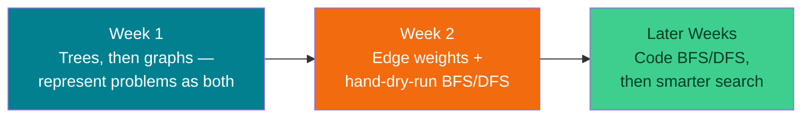
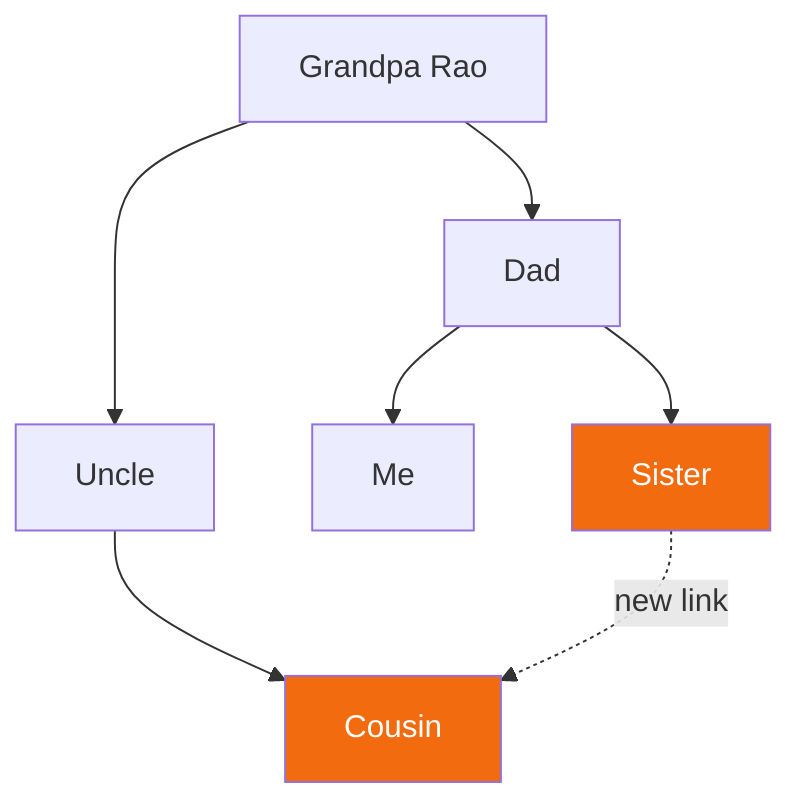
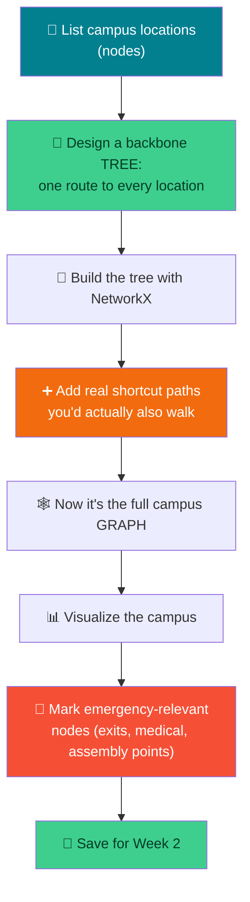

# 🕸️ Thinking in Graphs (Starting From Trees) — Week 1 Practical (CSE 276)

### *Lab Orientation → What is a Graph? (via the simplest graph there is: a Tree) → Modeling a Campus/Emergency-Response Map, using Python + NetworkX + Matplotlib (all in Google Colab)*

> **What we're building today:** your very first mental model for "problem = graph." We get there the easy way — starting with a **tree**, the simplest, most familiar kind of graph (you already think in trees every time you picture a family tree or a folder structure) — and then showing exactly what changes when a tree gets an extra connection and becomes a full **graph**. By the end of today you'll have (1) a working Python environment, (2) an intuitive feel for nodes/edges/degree/weighted vs. directed graphs, and (3) a real dataset — a small campus + emergency-response map, built the same tree-then-graph way — sitting in your notebook, ready to be searched with BFS/DFS in Week 2.

> 🧑‍🎓 **No prior AI/ML/DSA needed.** If the words "graph," "node," "tree," or "algorithm" sound scary — they won't by the end of this session. We start from zero.

> 💻 **Runtime:** Google Colab → `Runtime` → `Change runtime type` → **CPU** (the default). No GPU needed today — this is plain Python + a graph library.

**Session plan (2 hours, back-to-back — extra buffer material included so we never run dry):**

| Time | Block | Focus |
|------|-------|-------|
| 🕛 0:00 – 0:15 | **Orientation** | Course logistics, what "practical" sessions look like, roadmap for the semester |
| 🕧 0:15 – 0:35 | **Environment Setup** | Google Colab, Python check, installing/verifying `networkx` + `matplotlib` |
| 🕐 0:35 – 1:00 | **Practical 1a — Trees** | The simplest graph there is: a family tree, by hand and in code |
| 🕜 1:00 – 1:15 | **Practical 1b — Tree → Graph** | Add one real-world connection → it stops being a tree. What is a graph, generally? |
| 🕝 1:15 – 1:50 | **Practical 2 (Buffer)** | Model a campus as a **tree first**, then add real shortcut paths to make it the full emergency-response graph — this becomes the dataset for Project 1 |
| 🕞 1:50 – 2:00 | **Wrap-up** | Recap, save your work, preview of Week 2 |
| ➕ Extra | **Extend It** | Optional deeper exercises if we move faster than expected |

---

## 🗺️ The Big Picture (Read This First)


**Why graphs, in an AI/CS course?** Almost every "smart" system — GPS navigation, social networks, recommendation engines, even chess-playing AI — is secretly just a graph with a search algorithm walking across it. Before we can write BFS or DFS (Week 2), we need to be fluent in the language graphs are written in: **nodes and edges.** We'll start with the easiest possible version of that idea — a tree — because you've been reading trees your whole life without calling them that (family trees, org charts, folder structures) — and then generalize from there.

| Tool | Job | Analogy |
|------|-----|---------|
| 🐍 **Python** | The language we write everything in | The pen 🖊️ |
| 🕸️ **NetworkX** | Creates, stores, and manipulates graphs (and trees — a tree *is* a graph) | The architect's blueprint tool 📐 |
| 📊 **Matplotlib** | Draws the graph so we can *see* it | The gallery wall 🖼️ |

---

## 📋 What You'll Need (all free)

1. A **Google account** (for Colab) → `https://colab.research.google.com`
2. That's it — `networkx` and `matplotlib` are either pre-installed on Colab or one `pip install` away (we'll check together).

---

# 🕛 ORIENTATION (0:00 – 0:15)

*(Talk-through block — light on typing, heavy on context-setting. Adjust pacing live.)*

### O.1 — Welcome & how this course runs

Quick verbal walkthrough (no need to write this down):

- **CSE 276** practicals happen every week, 2 hours, always hands-on — you will *build* something every single session, not just watch slides.
- Each week builds directly on the last. **Nothing is thrown away** — the campus map you build today is the exact same map you'll run search algorithms on in a few weeks.
- **No AI/ML background assumed.** If you've never coded in Python before, that's fine too — everything today is copy-run-tweak, not "write from scratch."

### O.2 — The roadmap (where today fits)



> 🎯 **Today's job is narrow on purpose:** get comfortable turning *any* problem into dots-and-lines — first as the simplest case (a tree), then as the general case (a graph) — then build one real dataset (a campus/emergency map) the same way, which we'll keep reusing all semester.

### O.3 — Ground rules for practicals

- Bring a laptop, charged. Colab runs in the browser — nothing to install at home.
- Save your notebook to Google Drive as you go (`File → Save a copy in Drive`) — we will build on today's file next week.
- If you finish early, don't just sit — jump to the **🚀 Extend It** section near the end of this doc.

---

# 🕧 ENVIRONMENT SETUP (0:15 – 0:35)

### 1.1 — Open Google Colab

Go to `https://colab.research.google.com` → **New notebook**. Rename it `week1_cse276.ipynb` (click the title at the top-left).

### 1.2 — Confirm Python works at all

Type this in the first cell and run it (**Shift+Enter**):

```python
print("Hello, CSE 276! If you can see this, Python is working. ✅")
```

> 🧪 **What just happened?** Colab gave you a free virtual computer in the cloud, already running Python. `Shift+Enter` sends that cell's code to it and shows you the result. That's the entire workflow for the whole semester — write code in a cell, run it, read the output.

### 1.3 — Install/verify the graph libraries

```python
import sys
print("Python version:", sys.version)

# These usually come pre-installed on Colab — this cell just makes sure.
!pip install -q networkx matplotlib

import networkx as nx
import matplotlib.pyplot as plt

print("NetworkX version:", nx.__version__)
print("✅ Environment ready")
```

**Expected output (versions may differ slightly):**

```
Python version: 3.x.x ...
NetworkX version: 3.x
✅ Environment ready
```

### 1.4 — Your very first graph (sanity check, 3 lines)

```python
G = nx.Graph()
G.add_edge("A", "B")

nx.draw(G, with_labels=True, node_color="skyblue", node_size=1500, font_size=14)
plt.title("My first graph 🎉")
plt.show()
```

If you see two circles labeled **A** and **B** joined by a line — congratulations, you've drawn your first graph. Everything else today is this idea, scaled up.

---

## 🛠️ Troubleshooting — Setup

| Symptom | Likely cause | Fix |
|---------|-------------|-----|
| `ModuleNotFoundError: No module named 'networkx'` | Install cell didn't run, or ran in the wrong runtime | Re-run the `!pip install` cell; make sure you're connected (top-right should say "Connected") |
| Nothing shows up after `plt.show()` | Forgot to call `plt.show()`, or ran cells out of order | Always end a plotting cell with `plt.show()`; use `Runtime → Run all` if things feel out of sync |
| Graph looks like a jumbled mess of overlapping nodes | Normal for `nx.draw()` with default layout on bigger graphs | We'll fix this with a proper layout (`nx.spring_layout`) shortly |
| Colab says "Runtime disconnected" | Idle timeout | Just reconnect — nothing is lost if you saved to Drive |

---

# 🕐 PRACTICAL 1a (0:35 – 1:00): The Simplest Graph There Is — a Tree

## From real life → dots and lines → code

### 2.1 — The core idea, in plain English

A **graph** is just two things:

| Term | Plain-English meaning | Example |
|------|------------------------|---------|
| **Node** (or *vertex*) | A "thing" — anything you can point at | A person, a city, a webpage, a building |
| **Edge** | A connection *between* two nodes | "parent of," "friends with," "road to" |

That's it. Everything else (trees vs. general graphs, weights, direction, algorithms) is extra structure layered on top of "dots and lines." We're going to meet the *most structured, most restricted* version first — a **tree** — because it's the one you already understand intuitively.

### 2.2 — A tree you already know: the family tree

```
Grandpa Rao
├── Dad
│   ├── Me
│   └── Sister
└── Uncle
    └── Cousin
```

```python
family = nx.DiGraph()   # DiGraph because "parent of" only points one way
family.add_edges_from([
    ("Grandpa Rao", "Dad"),
    ("Grandpa Rao", "Uncle"),
    ("Dad", "Me"),
    ("Dad", "Sister"),
    ("Uncle", "Cousin"),
])

print("Nodes:", family.number_of_nodes())
print("Edges:", family.number_of_edges())
print("Is this a tree?", nx.is_tree(family))
```

```python
plt.figure(figsize=(7, 6))
pos = nx.spring_layout(family, seed=5)
nx.draw(
    family, pos,
    with_labels=True,
    node_color="lightgreen",
    node_size=2000,
    font_size=10,
    font_weight="bold",
    arrows=True,
    arrowsize=20,
)
plt.title("Family Tree")
plt.show()
```

### 2.3 — Tree vocabulary (you'll use these words all semester)

| Term | Meaning | In our family tree |
|------|---------|----------------------|
| **Root** | The node everything branches from | Grandpa Rao |
| **Parent / child** | A node directly above / below another | Dad is the parent of Me and Sister |
| **Leaf** | A node with no children | Me, Sister, Cousin |
| **Key tree fact** | Exactly `n − 1` edges for `n` nodes; no cycles; exactly one path between any two nodes | 6 nodes, 5 edges, `nx.is_tree()` → `True` |

> 🔑 **A tree is just a graph with one extra rule:** no shortcuts allowed. Every node has exactly one way to reach it from the root. That's *why* it's the simplest graph to reason about — there's never any ambiguity about "which path."

### 2.4 — 🎮 Hand exercise: build your own tiny tree

On paper, draw a 5-node tree of anything hierarchical — a folder structure, a tournament bracket, your own (simplified) family. Count the edges. Confirm it's `n − 1`. Then build it in code and check with `nx.is_tree()`.

---

## 🛠️ Troubleshooting — Practical 1a

| Symptom | Likely cause | Fix |
|---------|-------------|-----|
| `nx.is_tree()` returns `False` unexpectedly | An edge was added twice, or two nodes got connected through two different routes | Recount: for `n` nodes you need *exactly* `n − 1` edges, no more, no less |
| Arrows don't show on the drawing | Forgot `arrows=True` (or using `nx.Graph` instead of `nx.DiGraph`) | Both are needed for a visibly directed picture |

---

# 🕜 PRACTICAL 1b (1:00 – 1:15): Add One Link → Now It's a Graph

### 3.1 — Real life doesn't stay this tidy

Suppose Sister and Cousin are actually best friends and talk to each other directly all the time — that connection doesn't go through Dad, Grandpa, or Uncle at all. Let's add it:

```python
family.add_edge("Sister", "Cousin")
family.add_edge("Cousin", "Sister")   # mutual — add both directions

print("Edges now:", family.number_of_edges())
print("Is this still a tree?", nx.is_tree(family))
```

**One new edge, and `nx.is_tree()` flips to `False`.** That's it — that's the entire difference between a tree and a general graph.



### 3.2 — What changed, precisely

| | Tree | Graph |
|---|------|-------|
| **Edges** | Always `n − 1` | Can be anything ≥ `n − 1` |
| **Path between any two nodes** | Exactly one, guaranteed | Possibly more than one (e.g., Sister ↔ Cousin now has 2 routes: directly, or via Dad → Grandpa → Uncle) |
| **Cycles?** | Never | Possible (Sister → Cousin → Uncle → Grandpa → Dad → Sister) |
| **Root?** | Meaningful | Optional — a graph doesn't need a "top" |

> 🧠 **This is the one sentence to remember all semester:** *every tree is a graph, but not every graph is a tree — a graph becomes "not a tree" the moment there's more than one way to get somewhere.* Everything from here on (weighted, directed, campus maps, search algorithms) is about graphs in general; trees were just the cleanest possible starting example.

### 3.3 — Four flavors of graphs (know these words)

| Flavor | Meaning | Real example |
|--------|---------|---------------|
| **Undirected** | Edges go both ways | "A is friends with B" (mutual) |
| **Directed** | Edges point one way only | "A follows B" on Instagram; "parent of" in our family tree |
| **Unweighted** | Every edge is "equally strong" | A friendship graph (just friends or not) |
| **Weighted** | Every edge has a number/cost attached | A road map (some roads are longer/slower) |

> 🔑 **Why this matters for later:** BFS (Week 2+) works great on unweighted graphs. Weighted graphs need smarter algorithms (coming later). Today we only need to *recognize* the difference — not solve anything with it yet. Notice our family tree was naturally **directed** (descent only flows one way) — trees you meet in real life often are.

### 3.4 — Build a plain undirected graph: the friend graph

Not every graph starts life as a tree — most don't. Here's one built straight up as a graph, with a cycle from the very first edges:

```python
friends = nx.Graph()   # undirected, unweighted, on purpose

friends.add_edge("Alice", "Bob")
friends.add_edge("Bob", "Charlie")
friends.add_edge("Alice", "Charlie")   # <- this closes a triangle: a cycle, immediately
friends.add_edge("Charlie", "Dana")

print("Is this a tree?", nx.is_tree(friends))   # False — Alice/Bob/Charlie form a cycle
```

```python
plt.figure(figsize=(6, 5))
pos = nx.spring_layout(friends, seed=42)
nx.draw(
    friends, pos,
    with_labels=True,
    node_color="lightgreen",
    node_size=1800,
    font_size=12,
    font_weight="bold",
    edge_color="gray",
)
plt.title("Friend Graph")
plt.show()
```

### 3.5 — Ask simple questions of your graph (this *is* the point of building one)

```python
print("Is Alice friends with Dana directly?", friends.has_edge("Alice", "Dana"))
print("Who is Charlie friends with?", list(friends.neighbors("Charlie")))
print("How many friends does Charlie have? (degree):", friends.degree("Charlie"))
```

**Expected output:**

```
Is Alice friends with Dana directly? False
Who is Charlie friends with? ['Bob', 'Alice', 'Dana']
How many friends does Charlie have? (degree): 3
```

> 🎯 Notice: Alice and Dana **aren't** directly connected — but there's clearly a *path* between them (Alice → Charlie → Dana). Finding that path automatically is exactly what BFS/DFS will do for us in a couple of weeks. Today we're just building the map they'll walk on.

### 3.6 — Directed graphs: same idea, one-way edges (a non-tree example this time)

```python
follows = nx.DiGraph()

follows.add_edge("Alice", "Bob")      # Alice follows Bob
follows.add_edge("Bob", "Charlie")    # Bob follows Charlie
follows.add_edge("Charlie", "Alice")  # Charlie follows Alice
# Notice: nobody said Bob follows Alice back — and this loop (A->B->C->A) could never happen in a tree!

plt.figure(figsize=(5, 5))
pos = nx.spring_layout(follows, seed=1)
nx.draw(
    follows, pos,
    with_labels=True,
    node_color="lightsalmon",
    node_size=1800,
    font_size=12,
    arrows=True,
    arrowsize=25,
)
plt.title("Follows Graph (Directed)")
plt.show()

print("Does Bob follow Alice?", follows.has_edge("Bob", "Alice"))
print("Does Alice follow Bob? ", follows.has_edge("Alice", "Bob"))
print("Is this a tree?", nx.is_tree(follows))
```

> 🔑 That `A → B → C → A` loop is a cycle — the clearest possible proof this isn't a tree. Trees, by definition, can never loop back on themselves.

### 3.7 — 🎮 Your turn: pick a simple problem — is it naturally a tree, or a graph?

In pairs or solo, pick **one or two** of these, decide whether it's naturally a **tree** or a **graph** *before* you build it, then represent it with `nx.Graph()` or `nx.DiGraph()` and draw it:

| Idea | Tree or Graph? (guess first!) |
|------|-------------------------------|
| An organization's reporting structure (who reports to whom) | 🌳 Tree |
| Your own family tree | 🌳 Tree |
| 5 movies and which ones share an actor | 🕸️ Graph |
| Who beat whom in a badminton round-robin *(hint: directed!)* | 🕸️ Graph — can even have cycles (A beats B beats C beats A) |
| Tic-tac-toe: the 9 board squares as nodes, "adjacent square" as edges | 🕸️ Graph |
| Your hostel/mess friend circle | 🕸️ Graph |

> 🧪 **5–8 minutes.** This is the moment "graph = problem" clicks, and the tree-vs-graph guess is the moment "not every structure is that simple" clicks too. Walk around and help pairs that get stuck — the usual snag is forgetting an edge is a *pair*, not a single item.

---

## 🧰 Quick Reference Card — Practical 1

```python
import networkx as nx
import matplotlib.pyplot as plt

G = nx.Graph()               # undirected graph
D = nx.DiGraph()              # directed graph

G.add_edge("X", "Y")          # adds nodes X, Y and the edge between them, if not already present
G.add_node("Z")               # adds an isolated node with no edges

list(G.nodes())                # all nodes
list(G.edges())                # all edges
G.has_edge("X", "Y")           # True/False
list(G.neighbors("X"))         # who X is connected to
G.degree("X")                  # how many edges touch X
nx.is_tree(G)                  # True only if edges = n-1, no cycles, fully connected

pos = nx.spring_layout(G, seed=42)   # consistent, untangled layout
nx.draw(G, pos, with_labels=True, node_color="skyblue", node_size=1500, arrows=True)
plt.show()
```

| Concept | One-liner |
|---------|-----------|
| **Node** | A "thing" in your problem |
| **Edge** | A connection between two things |
| **Tree** | A graph with exactly `n-1` edges, no cycles, one unique path between any two nodes |
| **Graph** | The general case — any number of edges, cycles allowed |
| **Undirected (`nx.Graph`)** | Connections go both ways |
| **Directed (`nx.DiGraph`)** | Connections go one way only |
| **Degree** | How many edges touch a node |
| **Neighbor** | A node directly connected to another |
| **Path (not coded yet)** | A sequence of edges connecting two nodes that aren't directly linked |

---

# 🕝 PRACTICAL 2 — BUFFER (1:15 – 1:50): Modeling a Campus / Emergency-Response Map

## Goal: build the real dataset Project 1 will run on — the same tree-then-graph way

This is the **most important block of today** — take your time here. Everything from here becomes the graph you keep reusing.



### 4.1 — Why a campus map, and why tree-then-graph?

A campus is a perfect real-world graph — and it's also a perfect example of why real maps are *never* actually trees:

- **Nodes** = places (hostels, academic blocks, canteen, gate, medical room, ground)
- **Edges** = walkable paths between them
- If a campus really were a tree — exactly one route to every building — a single blocked path (construction, a locked gate) would cut off everything past it. **Real campuses have redundant paths on purpose**, precisely so there's always a backup route. That redundancy is *exactly* what turns a tree into a graph.

> 🧠 **Data prep for P1:** whatever graph you build in the next 35 minutes is *literally* the input file your Project 1 code will load and search over. Build it carefully — precision here saves debugging later.

### 4.2 — Step 1: List your campus locations (nodes)

Pick **10–12 real (or realistic) locations** on your own campus. Example set we'll use for the demo — **feel free to swap in your actual campus's names**:

```python
locations = [
    "Main Gate",
    "Admin Block",
    "Academic Block A",
    "Academic Block B",
    "Library",
    "Canteen",
    "Hostel A",
    "Hostel B",
    "Medical Room",
    "Sports Ground",
    "Auditorium",
    "Assembly Point",
]
print(f"Total locations: {len(locations)}")
```

> 💡 **Tip for your own campus:** walk through your daily route mentally — gate → academic blocks → hostel → canteen — and just list what you pass. That's your node list.

### 4.3 — Step 2: Design the backbone — a TREE first

Before adding every real path, first design the **minimum set of connections that reaches every location, with no redundancy at all** — exactly `n − 1` edges for `n` locations. Think of it as "if we could only build the cheapest possible set of walkways, what's the one route to each place?"

```python
# Backbone paths only — one prescribed route to every location. n=12 locations -> exactly 11 edges.
backbone_paths = [
    ("Main Gate", "Admin Block"),
    ("Main Gate", "Sports Ground"),
    ("Admin Block", "Academic Block A"),
    ("Admin Block", "Library"),
    ("Academic Block A", "Academic Block B"),
    ("Academic Block A", "Canteen"),
    ("Canteen", "Hostel A"),
    ("Canteen", "Hostel B"),
    ("Hostel A", "Medical Room"),
    ("Sports Ground", "Auditorium"),
    ("Sports Ground", "Assembly Point"),
]
print(f"Total backbone connections: {len(backbone_paths)}")   # should be len(locations) - 1
```

```python
campus_tree = nx.Graph()
campus_tree.add_nodes_from(locations)
campus_tree.add_edges_from(backbone_paths)

print("Nodes:", campus_tree.number_of_nodes())
print("Edges:", campus_tree.number_of_edges())
print("Is this a tree?", nx.is_tree(campus_tree))
```

```python
plt.figure(figsize=(10, 8))
pos_tree = nx.spring_layout(campus_tree, seed=7, k=0.8)
nx.draw(
    campus_tree, pos_tree,
    with_labels=True,
    node_color="lightgreen",
    node_size=2200,
    font_size=9,
    font_weight="bold",
    edge_color="gray",
    width=2,
)
plt.title("Campus Backbone (Tree) — one route to every location", fontsize=13)
plt.show()
```

> 🧪 **Class exercise:** before running the drawing cell, sketch `campus_tree` on paper as dots and lines by hand. Every location should be reachable, and there should be no way to draw a loop.

### 4.4 — Step 3: Add real shortcut paths → now it's a graph

In reality, your campus has *more* walkable connections than the bare minimum — that's what makes it convenient and safer. Let's add the real shortcuts that exist alongside the backbone:

```python
# Real, additional walkable connections — these overlap or shortcut the backbone above.
shortcut_paths = [
    ("Academic Block B", "Library"),
    ("Library", "Canteen"),
    ("Hostel B", "Medical Room"),
    ("Medical Room", "Assembly Point"),
    ("Auditorium", "Assembly Point"),
]

campus = campus_tree.copy()
campus.add_edges_from(shortcut_paths)

print("Nodes:", campus.number_of_nodes())
print("Edges:", campus.number_of_edges())          # 11 -> 16
print("Is it still a tree?", nx.is_tree(campus))    # False now
print("Is everything still connected?", nx.is_connected(campus))
```

> 🔑 **`nx.is_connected()`** checks whether every location can be reached from every other, via *some* path. It was already `True` for the tree (trees are always connected by definition) — what's new now is that some locations have **more than one way** to reach them.

| | Backbone (Tree) | Full Campus (Graph) |
|---|-------------------|--------------------------|
| **Edges** | 11 | 16 |
| **Route from Library to Canteen** | Only via Admin Block → Academic Block A (long way round) | Direct — the shortcut you just added |
| **What happens if one path is blocked (construction, locked gate)?** | Some locations could become totally unreachable | Usually there's still another way — this is *why* real campuses build extra paths |

> 🎯 **This is the real-world version of what you saw in the family tree.** One extra edge turned a rigid, single-route structure into a flexible one with backup options. For an *emergency-response* map specifically, that flexibility isn't a nice-to-have — it's the whole reason multiple paths matter.

### 4.5 — Step 4: Visualize the full campus graph

```python
plt.figure(figsize=(10, 8))
pos = nx.spring_layout(campus, seed=7, k=0.8)   # k spreads nodes further apart

nx.draw(
    campus, pos,
    with_labels=True,
    node_color="lightblue",
    node_size=2200,
    font_size=9,
    font_weight="bold",
    edge_color="gray",
    width=2,
)
plt.title("Campus Walkability Graph (backbone + shortcuts)", fontsize=14)
plt.show()
```

### 4.6 — Step 5: Mark the emergency-relevant nodes (this is what makes it an *emergency-response* map)

Not all nodes matter equally during an emergency. Let's tag the important ones with colors and sizes so the map communicates urgency visually — a small taste of how real emergency-mapping systems work.

```python
node_roles = {
    "Medical Room": "critical",
    "Assembly Point": "critical",
    "Main Gate": "exit",
    "Admin Block": "normal",
    "Academic Block A": "normal",
    "Academic Block B": "normal",
    "Library": "normal",
    "Canteen": "normal",
    "Hostel A": "normal",
    "Hostel B": "normal",
    "Sports Ground": "normal",
    "Auditorium": "normal",
}

color_map = {"critical": "red", "exit": "gold", "normal": "lightblue"}
size_map  = {"critical": 2800, "exit": 2600, "normal": 2000}

node_colors = [color_map[node_roles[n]] for n in campus.nodes()]
node_sizes  = [size_map[node_roles[n]] for n in campus.nodes()]

plt.figure(figsize=(10, 8))
pos = nx.spring_layout(campus, seed=7, k=0.8)

nx.draw(
    campus, pos,
    with_labels=True,
    node_color=node_colors,
    node_size=node_sizes,
    font_size=9,
    font_weight="bold",
    edge_color="gray",
    width=2,
)
plt.title("Campus Emergency-Response Map\n🔴 Critical  🟡 Exit  🔵 Normal", fontsize=13)
plt.show()
```

> 🎯 **Why this matters for Project 1:** in a real emergency-routing problem, the "goal node" is usually a critical location (Medical Room, Assembly Point) or an exit — the algorithm needs to know which nodes those are. Tagging them now means your Week-2-onward code doesn't have to guess.

### 4.7 — Step 6: Sanity-check the map like an algorithm would

Before we ever write BFS/DFS, let's manually ask the exact kind of question those algorithms will answer — just using NetworkX's built-in helpers, no algorithm-writing yet.

```python
# Is there ANY way to walk from Hostel A to the Assembly Point?
print("Path exists Hostel A -> Assembly Point?",
      nx.has_path(campus, "Hostel A", "Assembly Point"))

# What does the direct neighborhood of Medical Room look like? (bigger now than in the tree!)
print("Medical Room connects directly to (tree only):", list(campus_tree.neighbors("Medical Room")))
print("Medical Room connects directly to (full graph):", list(campus.neighbors("Medical Room")))

# How "connected" is each location? (degree = how many paths lead to/from it)
for loc in campus.nodes():
    print(f"{loc:20s} degree = {campus.degree(loc)}")
```

> 🧠 This last loop is a preview of something important: locations with **low degree** (like a hostel with only one path out) are exactly the kind of bottleneck a real emergency plan needs to flag — and are exactly the locations still most exposed if that one edge happens to be a backbone (tree) edge rather than a shortcut. File that thought away — it'll matter again later in the semester.

### 4.8 — Step 7: Save your graph so Week 2 can load it instantly

```python
nx.write_gml(campus, "campus_graph.gml")
print("✅ Saved as campus_graph.gml")

# Quick check: load it back and confirm it matches
reloaded = nx.read_gml("campus_graph.gml")
print("Reloaded nodes:", reloaded.number_of_nodes(), "| Reloaded edges:", reloaded.number_of_edges())
```

> 💾 **Don't skip this.** `.gml` is a plain-text graph format NetworkX can read and write natively. Next week's session (edge weights + hand-dry-run of BFS/DFS) picks up exactly where this file leaves off — no rebuilding from scratch. Also download this file to your own device (📁 sidebar → right-click `campus_graph.gml` → Download) as a backup.

### 4.9 — 🎮 Your turn: build YOUR actual campus (not the demo one)

Now repeat steps 4.2 – 4.8 using **your real campus** — actual hostel names, actual block names, actual walking routes you use every day. Aim for:

- ✅ At least 10 locations
- ✅ First design a backbone with exactly `n − 1` edges, and confirm `nx.is_tree()` is `True`
- ✅ Then add at least 3 real shortcut paths, and confirm `nx.is_tree()` flips to `False`
- ✅ At least 1 "critical" node (medical/assembly) and 1 "exit" node
- ✅ `nx.is_connected()` prints `True` at every stage
- ✅ Saved as `my_campus_graph.gml`

> 🧪 **~20 minutes.** This is your actual Project 1 dataset. Walk around and check that everyone's graph is `connected` — a disconnected node is the single most common bug at this stage.

---

## 🛠️ Troubleshooting — Practical 2

| Symptom | Likely cause | Fix |
|---------|-------------|-----|
| `nx.is_tree(campus_tree)` is `False`, but it should be a backbone | You accidentally listed more than `n − 1` edges, or duplicated one | Recount: for `n` locations, the backbone needs *exactly* `n − 1` edges |
| `nx.is_tree(campus)` is unexpectedly still `True` after adding shortcuts | The "shortcut" edges you added already existed in the backbone (duplicates do nothing) | Double-check `shortcut_paths` doesn't repeat any pair already in `backbone_paths` |
| `nx.is_connected()` returns `False` | Some location has no edge listed at all, or a typo in a name | Print `list(campus.nodes())` and `list(campus.edges())`, look for a name that appears in one but not the other |
| Graph looks like a tangled star, hard to read | Too few connections relative to nodes, or `spring_layout` needs tuning | Try `nx.spring_layout(campus, seed=7, k=1.2)` — bigger `k` spreads nodes apart |
| `KeyError` when building `node_colors` | A location in `locations` is missing from `node_roles` | Every node needs a role — add missing entries to `node_roles`, default unclear ones to `"normal"` |
| Two locations you *can* walk between aren't linked in code | Forgot to add that tuple to `backbone_paths` or `shortcut_paths` | Add the missing tuple to the right list and re-run from 4.3/4.4 |
| `nx.write_gml` throws an error about node types | Node names contain unusual characters | Stick to plain text names (letters, numbers, spaces) — avoid slashes/quotes in location names |

---

## 🚀 Extend It (Buffer content — use if we're ahead of schedule)

If your section finishes core content early, work through any of these — they deepen intuition without touching Week 2's material yet:

1. **Find the critical edges:** in `campus_tree`, remove any one edge and check `nx.is_connected()` — it should become `False` every single time (every backbone edge is load-bearing). Now try removing one of the `shortcut_paths` edges from the full `campus` graph instead — does it stay connected? This is the practical meaning of redundancy.
2. **Weighted preview (no algorithms, just data):** add a rough walking-time-in-minutes to each edge using `campus.add_edge("Hostel A", "Medical Room", weight=3)`, then print `campus.edges(data=True)` to see weights attached. We'll *use* these properly next week.
3. **Compare directed vs. undirected on the same map:** what would it mean if "Main Gate → Admin Block" were one-way only (e.g., an entry-only gate)? Rebuild a small piece of your campus graph as a `DiGraph` to see the difference.
4. **Adjacency matrix view:** run `print(nx.to_numpy_array(campus))` and match the 1s and 0s back to the edges you listed — this is the "spreadsheet" way of storing the exact same graph.
5. **Degree histogram:** `import collections; collections.Counter(dict(campus.degree()).values())` — which locations are the busiest "hubs" of your campus?
6. **A second tree-then-graph problem, for extra reps:** graph your class timetable as a tree first (e.g., Semester → Subjects), then add "taught back-to-back on the same day" edges directly between subjects — watch it stop being a tree the same way the campus map did.

---

# 🕞 WRAP-UP (1:50 – 2:00)

### ✅ What You Learned Today

- 🧭 Got oriented on how CSE 276 practicals run, and where today fits in the semester roadmap
- ⚙️ Set up Python + Colab + NetworkX + Matplotlib from scratch and verified it works
- 🌳 Learned the simplest possible graph — a **tree** — via a family tree: root, parent, child, leaf, exactly `n-1` edges, exactly one path between any two nodes
- ➕ Watched one new edge turn that tree into a **graph**, and named exactly what changed: cycles became possible, paths stopped being unique, `nx.is_tree()` flipped to `False`
- 🔵 Learned the core vocabulary of graphs in general: **node, edge, directed vs. undirected, weighted vs. unweighted, degree, neighbor**
- 🎮 Represented simple problems as graphs — a friend network and a "follows" network — and practiced guessing tree-vs-graph before building
- 🏫 Modeled a real campus **the same tree-then-graph way**: backbone paths first (the minimum to reach everywhere), then real shortcut paths added on top, then tagged with emergency-relevant roles
- 🚨 Learned *why* the extra paths matter: redundancy is what makes an emergency-response map actually useful, not just connected
- 💾 Saved your work as a `.gml` file so next week starts instantly, with zero rebuilding

### 👀 Preview of Week 2

Next week we **stay in this same graph** and add two things:

1. **Edge weights/costs** — turning "connected or not" into "connected, and it takes *this* long/far"
2. **Hand-dry-run of BFS and DFS** — walking through the algorithms on paper, node by node, on both the tree and the graph version, to see exactly how those extra shortcut edges change the answer — *before* writing a single line of search code

> Bring your saved `campus_graph.gml` (or `my_campus_graph.gml`) next week — we build directly on top of it.

---

## 🧰 Quick Reference Card — Full Session

```python
# ── SETUP ──
import networkx as nx
import matplotlib.pyplot as plt

# ── BUILD A TREE FIRST ──
T = nx.Graph()
T.add_nodes_from(["A", "B", "C", "D"])
T.add_edges_from([("A", "B"), ("B", "C"), ("B", "D")])   # n-1 edges
nx.is_tree(T)                        # True

# ── EXTEND INTO A GRAPH ──
G = T.copy()
G.add_edge("C", "D")                 # one shortcut -> no longer a tree
nx.is_tree(G)                        # False

# ── INSPECT ──
list(G.nodes())                     # all nodes
list(G.edges())                     # all edges
G.has_edge("A", "B")                # True/False
list(G.neighbors("A"))              # direct connections
G.degree("A")                       # count of edges touching A
nx.is_connected(G)                  # is every node reachable from every other?
nx.has_path(G, "A", "C")            # does ANY path exist between two nodes?

# ── VISUALIZE ──
pos = nx.spring_layout(G, seed=42, k=0.8)
nx.draw(G, pos, with_labels=True, node_color="skyblue", node_size=1800, arrows=True)
plt.show()

# ── SAVE / LOAD ──
nx.write_gml(G, "my_graph.gml")
G_reloaded = nx.read_gml("my_graph.gml")
```

| Concept | One-liner |
|---------|-----------|
| **Node** | A "thing" in your problem |
| **Edge** | A connection between two things |
| **Tree** | A graph with `n-1` edges, no cycles, exactly one path between any two nodes |
| **`nx.is_tree()`** | Checks whether a graph is currently a tree |
| **`nx.Graph()`** | Undirected — connections go both ways |
| **`nx.DiGraph()`** | Directed — connections go one way |
| **Degree** | Number of edges touching a node |
| **`nx.is_connected()`** | Sanity check: can every node reach every other node? |
| **`nx.has_path()`** | Does *any* route exist between two nodes? (the question BFS/DFS will answer *how*, next week) |
| **`.gml` file** | Plain-text way to save/load a graph between sessions |
| **Golden rule** | Every tree is a graph, but not every graph is a tree — real-world maps almost always have extra "shortcut" edges a tree wouldn't have, and that's exactly what makes traversal algorithms interesting |
