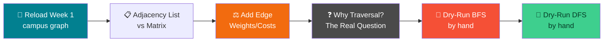
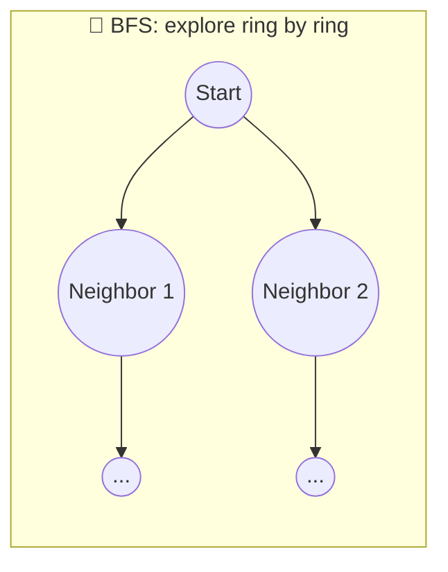
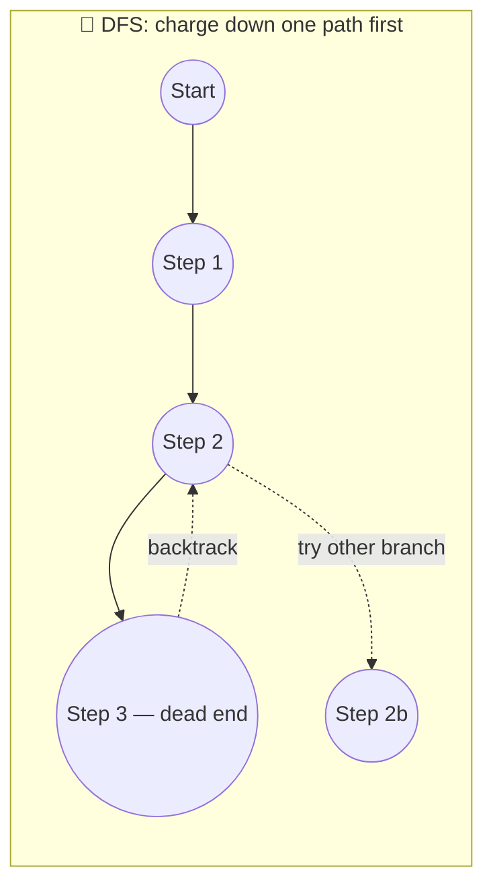

# 🧮 Weights, Costs, and Walking the Graph by Hand — Week 2 Practical (CSE 276)

### *Finish Graph Representation → Add Edge Weights/Costs → Dry-Run BFS & DFS by Hand (no code yet!), using Python + NetworkX + Matplotlib (all in Google Colab)*

> **What we're building today:** we pick up **exactly where Week 1 left off** — your saved campus/emergency-response graph. Today it gets two upgrades: (1) real walking-time/distance **weights** on every edge, and (2) you personally become the algorithm — tracing **BFS and DFS by hand**, node by node, on paper and on the board, *before* a single line of search code gets written. Code comes next week; today is about building the mental model so the code (when it arrives) feels obvious instead of magic.

> 🧑‍🎓 **Builds directly on Week 1.** You'll need your saved `campus_graph.gml` (or `my_campus_graph.gml`). If you missed Week 1 or lost the file, a backup demo graph is provided below — you won't be stuck.

> 💻 **Runtime:** Google Colab → CPU (default). Still no GPU needed — today is even lighter on code than last week, and heavier on paper/whiteboard work.

**Session plan (2 hours, back-to-back — extra buffer material included so we never run dry):**

| Time | Block | Focus |
|------|-------|-------|
| 🕛 0:00 – 0:10 | **Recap** | Reload last week's campus graph, refresh vocabulary |
| 🕧 0:10 – 0:45 | **Practical 1 — Finish Graph Representation** | Adjacency list vs. adjacency matrix, both by hand and in code |
| 🕐 0:45 – 1:05 | **Practical 1 (Buffer)** | Add edge weights/costs to the campus graph — walking time, distance |
| 🕜 1:05 – 1:15 | **Bridge** | Why traversal? What BFS/DFS are *for*, in one real question |
| 🕝 1:15 – 1:50 | **Practical 2 — Dry-Run BFS & DFS by Hand** | Trace both algorithms step-by-step on paper, using queue/stack worksheets |
| 🕞 1:50 – 2:00 | **Wrap-up** | Recap, save your worksheets, preview of Week 3 (actually coding it) |
| ➕ Extra | **Extend It** | Optional deeper exercises if we move faster than expected |

---

## 🗺️ The Big Picture (Read This First)



**The one idea to hold onto all session:** a graph on its own is just a static map. **Traversal algorithms (BFS, DFS) are what make it *do* something** — they're the difference between "here's a map" and "here's the fastest way out during a fire drill." Today we get the map fully ready (weights) and learn to walk it by hand, so next week's code just formalizes what your own hand and brain already did.

---

## 📋 What You'll Need

1. Your Google account + last week's Colab notebook (or a fresh one — we'll reload the saved graph either way)
2. Your **`campus_graph.gml`** file from Week 1, uploaded to this week's Colab session (📁 sidebar → upload icon)
3. 🖊️ **Paper or a notebook** — today's second half is deliberately hands-on-paper before it's hands-on-keyboard
4. If you don't have last week's file: no problem, a backup demo graph is provided in section 1.1

---

# 🕛 RECAP (0:00 – 0:10)

### 0.1 — Reload your Week 1 graph

```python
import networkx as nx
import matplotlib.pyplot as plt

# Upload campus_graph.gml via the 📁 sidebar first, then run:
campus = nx.read_gml("campus_graph.gml")

print("Nodes:", campus.number_of_nodes())
print("Edges:", campus.number_of_edges())
print("Connected?", nx.is_connected(campus))
```

> 🆘 **Don't have the file?** Run this instead to recreate last week's demo campus graph and keep going — nobody gets stuck:
> ```python
> locations = ["Main Gate","Admin Block","Academic Block A","Academic Block B",
>              "Library","Canteen","Hostel A","Hostel B","Medical Room",
>              "Sports Ground","Auditorium","Assembly Point"]
> paths = [("Main Gate","Admin Block"),("Main Gate","Sports Ground"),
>          ("Admin Block","Academic Block A"),("Admin Block","Library"),
>          ("Academic Block A","Academic Block B"),("Academic Block A","Canteen"),
>          ("Academic Block B","Library"),("Library","Canteen"),
>          ("Canteen","Hostel A"),("Canteen","Hostel B"),
>          ("Hostel A","Medical Room"),("Hostel B","Medical Room"),
>          ("Medical Room","Assembly Point"),("Sports Ground","Auditorium"),
>          ("Auditorium","Assembly Point"),("Sports Ground","Assembly Point")]
> campus = nx.Graph()
> campus.add_nodes_from(locations)
> campus.add_edges_from(paths)
> ```

### 0.2 — 60-second vocabulary refresh

| Term | Quick reminder |
|------|-----------------|
| **Node / vertex** | A "thing" (a location, in our campus graph) |
| **Edge** | A connection between two nodes |
| **Undirected graph** | Edges work both ways (`nx.Graph`) |
| **Degree** | How many edges touch a node |
| `nx.has_path(G, a, b)` | Does *any* route exist between `a` and `b`? |

> 🎯 Today's question builds directly on that last one: `has_path()` only tells you **yes/no**. By the end of today, *you* — by hand — will be able to say **which** path, and how algorithms find it.

---

# 🕧 PRACTICAL 1 (0:10 – 0:45): Finish Graph Representation

## Two ways to *store* the exact same graph

Last week we built graphs visually and with `add_edge()`. But underneath, a computer has to store a graph as actual data — numbers and lists. There are two standard ways, and you need to be fluent in both.

### 1.1 — Adjacency List: "for each node, who are its neighbors?"

This is the most natural, and the one you already used without naming it — `list(campus.neighbors("..."))` from last week *is* an adjacency list lookup.

```python
adjacency_list = {node: list(campus.neighbors(node)) for node in campus.nodes()}

for node, neighbors in adjacency_list.items():
    print(f"{node:20s} -> {neighbors}")
```

**Expected output (shape, exact order may vary):**

```
Main Gate            -> ['Admin Block', 'Sports Ground']
Admin Block          -> ['Main Gate', 'Academic Block A', 'Library']
...
```

> 🔑 **Mental model:** an adjacency list is like a phonebook — look up a node's name, get back the list of everyone it's directly connected to. Compact, and fast to answer "who is X connected to?"

### 1.2 — Adjacency Matrix: "a big table of 0s and 1s"

```python
import numpy as np

nodes_ordered = list(campus.nodes())
matrix = nx.to_numpy_array(campus, nodelist=nodes_ordered, dtype=int)

print("Node order:", nodes_ordered)
print(matrix)
```

**How to read it:** row `i`, column `j` is `1` if there's an edge between `nodes_ordered[i]` and `nodes_ordered[j]`, else `0`. The matrix is always **symmetric** for an undirected graph (row `i` col `j` always equals row `j` col `i`).

### 1.3 — Side-by-side comparison table

| | Adjacency List | Adjacency Matrix |
|---|-----------------|-------------------|
| **Looks like** | `{node: [neighbors]}` | A grid of 0s and 1s, size N×N |
| **Best for** | "Who is X connected to?" (fast) | "Are X and Y directly connected?" (instant lookup) |
| **Space used** | Small for sparse graphs (few edges) | Always N×N, even if the graph is mostly empty |
| **Our campus graph** | 12 short lists | A 12×12 grid, mostly zeros |

> 🧠 **Why "sparse" matters here:** our campus has 12 locations but only 16 walkable paths — out of a possible 66 pairs. Most of that matrix is 0. This is exactly why real-world maps (and most real graphs — social networks, road networks) are stored as adjacency **lists**, not matrices — the matrix wastes enormous space on graphs like this.

### 1.4 — 🎮 Hand exercise: convert on paper

On paper, take this tiny 4-node graph and write out **both** representations yourself, then check with code:

```
Nodes: P, Q, R, S
Edges: P-Q, Q-R, R-S, P-S
```

```python
mini = nx.Graph()
mini.add_edges_from([("P","Q"), ("Q","R"), ("R","S"), ("P","S")])

print("Your adjacency list attempt — compare to:")
print({n: list(mini.neighbors(n)) for n in mini.nodes()})

print("\nYour adjacency matrix attempt — compare to:")
print(nx.to_numpy_array(mini, nodelist=list(mini.nodes()), dtype=int))
```

---

## 🛠️ Troubleshooting — Practical 1

| Symptom | Likely cause | Fix |
|---------|-------------|-----|
| `FileNotFoundError` reading `campus_graph.gml` | File wasn't uploaded to *this* session | Re-upload via 📁 sidebar, or use the backup demo graph in section 0.1 |
| Adjacency matrix has more rows/columns than expected | `nodelist` wasn't passed, so order isn't guaranteed to match what you expect | Always pass `nodelist=list(G.nodes())` explicitly to `to_numpy_array` |
| Matrix isn't symmetric | You accidentally built the graph as a `DiGraph` | Undirected campus graphs should always give a symmetric matrix — check `type(campus)` |
| Adjacency list shows neighbors in a different order than you expected | Neighbor order isn't guaranteed/meaningful for an undirected graph | This is fine — order doesn't matter for now, only *which* nodes appear |

---

# 🕐 PRACTICAL 1, BUFFER (0:45 – 1:05): Edge Weights / Costs

## From "connected or not" to "connected, and here's the cost"

### 2.1 — Why weights matter (one motivating question)

> *"What's the walkable distance from Main Gate to the Medical Room?"*

Right now, `nx.has_path()` can only tell you **yes**, a route exists. It has no idea if that route is 50 meters or 2 kilometers. **Weights fix that** — every edge gets a number attached representing cost (distance, time, difficulty, whatever fits the problem).


### 2.2 — Add weights to your campus graph

Weights can be anything numeric — here we use **walking time in minutes**, since that's the most natural fit for an emergency-response map.

```python
# Approximate walking times, in minutes, for the demo campus.
# 👉 Replace these with real (or realistic estimated) values for YOUR campus graph.
edge_weights = {
    ("Main Gate", "Admin Block"): 2,
    ("Main Gate", "Sports Ground"): 4,
    ("Admin Block", "Academic Block A"): 3,
    ("Admin Block", "Library"): 5,
    ("Academic Block A", "Academic Block B"): 2,
    ("Academic Block A", "Canteen"): 3,
    ("Academic Block B", "Library"): 2,
    ("Library", "Canteen"): 4,
    ("Canteen", "Hostel A"): 5,
    ("Canteen", "Hostel B"): 6,
    ("Hostel A", "Medical Room"): 3,
    ("Hostel B", "Medical Room"): 2,
    ("Medical Room", "Assembly Point"): 1,
    ("Sports Ground", "Auditorium"): 3,
    ("Auditorium", "Assembly Point"): 2,
    ("Sports Ground", "Assembly Point"): 5,
}

for (u, v), w in edge_weights.items():
    campus[u][v]["weight"] = w

# Confirm it worked
print(list(campus.edges(data=True))[:3])
```

### 2.3 — Visualize the graph with weights labeled

```python
plt.figure(figsize=(11, 9))
pos = nx.spring_layout(campus, seed=7, k=0.8)

nx.draw(
    campus, pos,
    with_labels=True,
    node_color="lightblue",
    node_size=2200,
    font_size=9,
    font_weight="bold",
    edge_color="gray",
    width=2,
)

edge_labels = nx.get_edge_attributes(campus, "weight")
nx.draw_networkx_edge_labels(campus, pos, edge_labels=edge_labels, font_size=9, font_color="darkred")

plt.title("Campus Graph with Walking-Time Weights (minutes)", fontsize=13)
plt.show()
```

### 2.4 — Query costs, not just connections

```python
# Direct cost between two connected locations
print("Hostel A -> Medical Room direct cost:", campus["Hostel A"]["Medical Room"]["weight"], "min")

# Total weight of ALL edges touching a node (not the same as degree!)
total = sum(w["weight"] for _, _, w in campus.edges("Canteen", data=True))
print("Sum of edge weights touching Canteen:", total, "min")
```

> 🔑 **Degree vs. weighted degree:** `campus.degree("Canteen")` counts *how many* paths touch Canteen. The sum above adds up *how costly* those paths are combined. Two very different questions — both useful, for different reasons.

### 2.5 — Save the weighted version

```python
nx.write_gml(campus, "campus_graph_weighted.gml")
print("✅ Saved weighted graph as campus_graph_weighted.gml")
```

### 2.6 — 🎮 Your turn: weight YOUR campus graph

Load `my_campus_graph.gml` from last week, estimate a realistic walking time (in minutes) for each of your edges, and repeat 2.2 – 2.5. Rough estimates are fine — precision isn't the point, having *a* number on every edge is.

> 🧪 **~10 minutes.** Walk around checking that every edge got a weight — a missing weight will cause an error next week when we compute shortest paths.

---

## 🛠️ Troubleshooting — Weights

| Symptom | Likely cause | Fix |
|---------|-------------|-----|
| `KeyError` when setting `campus[u][v]["weight"]` | That edge doesn't actually exist in the graph (typo in name, or wrong pair) | Check `campus.has_edge(u, v)` first; fix the location name spelling |
| Edge labels overlap and are unreadable | Too many edges in a small figure | Increase `figsize`, or only label a subset of edges for the demo |
| `sum(...)` for weighted degree throws an error | Some edges are missing the `"weight"` attribute | Loop through `campus.edges(data=True)` and check every edge has a `weight` key |
| Weights look wrong after reloading from `.gml` | `.gml` sometimes stores numbers as strings | Cast explicitly: `int(campus[u][v]["weight"])` when reading back |

---

# 🕜 BRIDGE (1:05 – 1:15): Why Traversal? What Are BFS/DFS *For*?

*(Discussion block — no code, sets up the hand-dry-run.)*

### 3.1 — The real question we still can't answer

We now have a full campus graph with costs. But try asking NetworkX this:

```python
print(nx.has_path(campus, "Main Gate", "Medical Room"))   # only tells us yes/no
```

`has_path()` says **yes** — but during an actual emergency, "yes, a route exists" isn't good enough. We need:

- **Which** locations to pass through, in order
- Ideally, **the shortest/fastest** such route

**That is exactly the job of a traversal algorithm.** BFS and DFS are two different strategies for systematically exploring a graph, node by node, until they find what they're looking for.

### 3.2 — BFS vs. DFS, in one sentence each

| Algorithm | Strategy, in plain English | Real-life analogy |
|-----------|------------------------------|---------------------|
| **BFS** (Breadth-First Search) | Explore *all* immediate neighbors first, then their neighbors, ring by ring | Ripples spreading outward from a stone dropped in water 🌊 |
| **DFS** (Depth-First Search) | Charge down *one* path as far as possible, only backtrack when stuck | Exploring a maze by always taking the next unexplored turn, backing up only at dead ends 🌲 |





> 🧠 **Neither is "better" universally.** BFS is guaranteed to find the *shortest* route (in terms of number of hops) first. DFS uses less memory and is great for questions like "does *any* path exist at all" or "explore everything reachable." You'll feel this difference firsthand in the next block.

### 3.3 — The data structure each one secretly relies on

This is the detail that makes BFS and DFS behave so differently, and it's the whole reason today's hand-dry-run matters:

| Algorithm | Uses a... | Which means... |
|-----------|-----------|------------------|
| **BFS** | **Queue** (FIFO — First In, First Out) | The node you discovered *earliest* gets explored next |
| **DFS** | **Stack** (LIFO — Last In, First Out) | The node you discovered *most recently* gets explored next |

> 🎯 **Today, you *are* the queue/stack.** No code yet — grab a pen. We're about to trace both algorithms by hand on the campus graph, and you'll maintain the queue/stack yourself, on paper, so that next week's code is just "teach the computer to do what I just did."

---

# 🕝 PRACTICAL 2 (1:15 – 1:50): Dry-Run BFS & DFS by Hand

## No code in this block. Pen, paper, and the campus graph only.

### 4.1 — Setup: draw a clean, unweighted copy of a small graph

For hand-tracing, weights just add clutter — we'll drop them for this exercise and use a trimmed 8-node slice of the campus so it fits comfortably on paper:

```
Main Gate — Admin Block
Main Gate — Sports Ground
Admin Block — Academic Block A
Admin Block — Library
Academic Block A — Canteen
Library — Canteen
Canteen — Hostel A
Hostel A — Medical Room
Sports Ground — Assembly Point
Medical Room — Assembly Point
```

**Draw this on paper now** (dots and lines, exactly like Week 1) before continuing — you'll trace directly on top of your own drawing.

**Our question for both traversals:** *starting from **Main Gate**, find a path to **Medical Room**.*

### 4.2 — BFS by hand: the Queue Worksheet

**Rule:** Maintain a **Queue** (write it as a left-to-right list; add to the right, remove from the left) and a **Visited** set. At each step: remove the front of the queue, mark it visited, then add *all* of its unvisited neighbors to the *back* of the queue, in the order you list them.

Fill this table as a class, one row at a time, on the board:

| Step | Remove from front of Queue | Mark Visited | Neighbors found → added to back of Queue | Queue after this step |
|------|------------------------------|----------------|----------------------------------------------|--------------------------|
| 1 | — (start) | Main Gate | Admin Block, Sports Ground | `[Admin Block, Sports Ground]` |
| 2 | Admin Block | Admin Block | Academic Block A, Library *(Main Gate already visited — skip)* | `[Sports Ground, Academic Block A, Library]` |
| 3 | Sports Ground | Sports Ground | Assembly Point | `[Academic Block A, Library, Assembly Point]` |
| 4 | Academic Block A | Academic Block A | Canteen | `[Library, Assembly Point, Canteen]` |
| 5 | Library | Library | Canteen already in queue — skip | `[Assembly Point, Canteen]` |
| 6 | Assembly Point | Assembly Point | Medical Room | `[Canteen, Medical Room]` |
| 7 | Canteen | Canteen | Hostel A | `[Medical Room, Hostel A]` |
| 8 | Medical Room | Medical Room | 🎯 **Found it!** | — |

> ✅ **BFS found Medical Room in 8 steps**, and — because BFS always explores ring-by-ring — the path it found (`Main Gate → Sports Ground → Assembly Point → Medical Room`) is guaranteed to be the **shortest possible in number of hops**.

**Now you try:** re-run this exact worksheet, but starting from **Canteen**, targeting **Sports Ground**. Fill in your own table on paper.

### 4.3 — DFS by hand: the Stack Worksheet

**Rule:** Maintain a **Stack** (write it top-to-bottom or left-to-right; always add and remove from the *same* end — the "top"). At each step: remove the top of the stack, mark it visited (if not already), then push *all* of its unvisited neighbors onto the top.

Same graph, same start/target — trace it as a class:

| Step | Remove from top of Stack | Mark Visited | Neighbors found → pushed to top of Stack | Stack after this step |
|------|-----------------------------|----------------|-----------------------------------------------|---------------------------|
| 1 | — (start) | Main Gate | Admin Block, Sports Ground | `[Admin Block, Sports Ground]` (top = Sports Ground) |
| 2 | Sports Ground | Sports Ground | Assembly Point | `[Admin Block, Assembly Point]` (top = Assembly Point) |
| 3 | Assembly Point | Assembly Point | Medical Room *(Sports Ground already visited — skip)* | `[Admin Block, Medical Room]` (top = Medical Room) |
| 4 | Medical Room | Medical Room | 🎯 **Found it!** | — |

> ⚡ **DFS found it in only 4 steps this time** — but that's a bit of luck from which neighbor order we pushed. Change the order neighbors are pushed (e.g., push `Sports Ground` before `Admin Block`) and re-trace — you'll get a *completely different* route. **This unpredictability is a defining trait of DFS** — it has no built-in preference for "shortest," only "keep going deeper until stuck."

**Now you try:** re-run this worksheet from **Canteen** to **Sports Ground** (same as your BFS practice above) using a Stack instead of a Queue. Compare: did BFS and DFS find the *same* route? Which was shorter?

### 4.4 — The side-by-side comparison that makes it click

| | BFS trace | DFS trace |
|---|-----------|-----------|
| **Data structure** | Queue (FIFO) | Stack (LIFO) |
| **Steps to reach Medical Room** | 8 | 4 (order-dependent!) |
| **Path found** | `Main Gate → Sports Ground → Assembly Point → Medical Room` | `Main Gate → Sports Ground → Assembly Point → Medical Room` (in this run — could differ) |
| **Guaranteed shortest (fewest hops)?** | ✅ Always | ❌ Not guaranteed |
| **Explores like...** | Spreading outward evenly | Committing to one direction |

> 🧠 **Why this matters for emergency response:** if the goal is *fastest evacuation route*, BFS's guarantee matters a lot. If the goal is just *"can we get everyone out at all, by any route, using minimal memory to track it"*, DFS's simplicity can win. Neither is "the correct algorithm" in general — the problem decides.

### 4.5 — Verify your hand-trace against NetworkX (peek, don't code yet)

Purely to **check your paper work** — not yet writing the algorithm ourselves (that's next week):

```python
import networkx as nx

mini = nx.Graph()
mini.add_edges_from([
    ("Main Gate", "Admin Block"), ("Main Gate", "Sports Ground"),
    ("Admin Block", "Academic Block A"), ("Admin Block", "Library"),
    ("Academic Block A", "Canteen"), ("Library", "Canteen"),
    ("Canteen", "Hostel A"), ("Hostel A", "Medical Room"),
    ("Sports Ground", "Assembly Point"), ("Medical Room", "Assembly Point"),
])

# NetworkX's built-in BFS/DFS edge order — compare to your hand-trace
print("BFS order from Main Gate:", list(nx.bfs_tree(mini, "Main Gate")))
print("DFS order from Main Gate:", list(nx.dfs_tree(mini, "Main Gate")))
```

> 🎯 **This is not cheating — it's checking your work.** If your hand-traced visited-order roughly matches this output, you've correctly internalized the algorithm. Small order differences are expected (they depend on neighbor listing order) — the *shape* of the traversal is what matters.

---

## 🛠️ Troubleshooting — Dry-Run Block

| Symptom | Likely cause | Fix |
|---------|-------------|-----|
| Students keep re-adding an already-visited node to the queue/stack | Forgot to check "already visited" before adding neighbors | Emphasize: **check Visited before adding to Queue/Stack**, every single time, no exceptions |
| BFS and DFS worksheets give the exact same path every time | Graph section is too simple / linear (no real branching) | Use a node with 3+ neighbors as the start to see the algorithms diverge more clearly |
| Confusion about "front" vs "top" | Queue and Stack use different ends by definition | Physically act it out: queue = line at a canteen (join back, served from front); stack = stack of plates (add/remove only from top) |
| `nx.bfs_tree` output order doesn't match the hand-trace exactly | NetworkX's internal neighbor ordering may differ from the order you wrote neighbors on paper | This is expected and fine — same algorithm, different (valid) neighbor ordering. What must match is that BFS visits closer nodes before farther ones |

---

## 🚀 Extend It (Buffer content — use if we're ahead of schedule)

If your section finishes core content early, work through any of these — deepens intuition, still no full algorithm-writing yet (that's Week 3):

1. **Trace BFS/DFS on the FULL campus graph** (all 12 locations, not the trimmed 8-node slice) from Main Gate to Assembly Point — does the extra complexity change which algorithm "feels" faster to trace by hand?
2. **Weighted trap:** trace BFS from Main Gate to Medical Room again, but this time also add up the edge *weights* (minutes) along the path BFS found. Compare to the weight-total of the DFS path. Which route is actually *faster in real minutes* — is it always the BFS one? (Spoiler: not necessarily — this is a preview of why "shortest by hops" ≠ "shortest by cost," a distinction later algorithms in the course will handle properly.)
3. **Disconnected node test:** temporarily delete one edge from your paper graph so a node becomes unreachable from Main Gate. Hand-trace BFS — what happens to the queue when it empties out without reaching the target?
4. **Multiple starting points:** trace BFS starting from **Assembly Point** instead of Main Gate — since the graph is undirected, does it reach every node eventually? What's different about the *order*?
5. **Adjacency-list-only trace:** redo one hand-trace using *only* the adjacency list from Practical 1 (no drawing) — can you trace BFS/DFS purely from the `{node: [neighbors]}` table, without a picture? (This is literally what the code will do next week.)

---

# 🕞 WRAP-UP (1:50 – 2:00)

### ✅ What You Learned Today

- 📋 Finished graph representation: fluently converting between **adjacency list** and **adjacency matrix**, and knowing when each is the practical choice
- ⚖️ Added real **edge weights/costs** (walking time) to the campus graph, and learned the difference between *degree* and *weighted degree*
- ❓ Understood **why** traversal algorithms exist — `has_path()` says yes/no, BFS/DFS say *which way and how*
- 🌊 Hand-traced **BFS** using a Queue worksheet — ring-by-ring exploration, shortest-hop-guaranteed
- 🌲 Hand-traced **DFS** using a Stack worksheet — commit-and-backtrack exploration, no shortest-path guarantee
- 🔍 Compared both traces side-by-side on the *same* graph and start/target, and saw firsthand why the two algorithms can return different routes
- ✅ Verified your hand-work against NetworkX's built-in `bfs_tree`/`dfs_tree` — without writing the algorithm yourself yet

### 👀 Preview of Week 3

Next week, everything you did *by hand* today — maintaining a Queue, maintaining a Stack, checking Visited, following neighbors — gets turned into actual Python code, from scratch. Because you've already done it on paper, the code will mostly be "how do I say what I already know how to do, in Python."

> Bring your BFS/DFS worksheets from today, plus your saved `campus_graph_weighted.gml` — Week 3 builds directly on both.

---

## 🧰 Quick Reference Card — Full Session

```python
# ── RELOAD ──
campus = nx.read_gml("campus_graph.gml")

# ── ADJACENCY LIST ──
adjacency_list = {n: list(campus.neighbors(n)) for n in campus.nodes()}

# ── ADJACENCY MATRIX ──
nodes_ordered = list(campus.nodes())
matrix = nx.to_numpy_array(campus, nodelist=nodes_ordered, dtype=int)

# ── ADD WEIGHTS ──
campus[u][v]["weight"] = 5                       # set a weight on one edge
nx.get_edge_attributes(campus, "weight")         # read all weights back
sum(w["weight"] for _,_,w in campus.edges("X", data=True))  # weighted degree

# ── DRAW WITH WEIGHTS ──
edge_labels = nx.get_edge_attributes(campus, "weight")
nx.draw_networkx_edge_labels(campus, pos, edge_labels=edge_labels)

# ── SAVE ──
nx.write_gml(campus, "campus_graph_weighted.gml")

# ── PEEK AT TRAVERSAL ORDER (checking hand-work only) ──
list(nx.bfs_tree(campus, "Main Gate"))
list(nx.dfs_tree(campus, "Main Gate"))
```

| Concept | One-liner |
|---------|-----------|
| **Adjacency list** | `{node: [neighbors]}` — compact, best for "who's connected to X?" |
| **Adjacency matrix** | N×N grid of 0/1 — best for instant "are X,Y directly connected?" lookups |
| **Weight/cost** | A number attached to an edge — distance, time, difficulty |
| **Weighted degree** | Sum of weights on all edges touching a node (≠ plain degree!) |
| **BFS** | Queue-based; explores ring-by-ring; guarantees shortest path by hop count |
| **DFS** | Stack-based; commits to one path, backtracks on dead ends; no shortest-path guarantee |
| **Queue (FIFO)** | Add to the back, remove from the front — "join the line" |
| **Stack (LIFO)** | Add and remove from the same end (the top) — "stack of plates" |
| **Golden rule of today** | Before you trust any code to traverse a graph, be able to trace it correctly by hand first |
