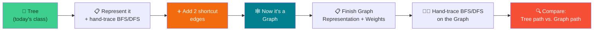
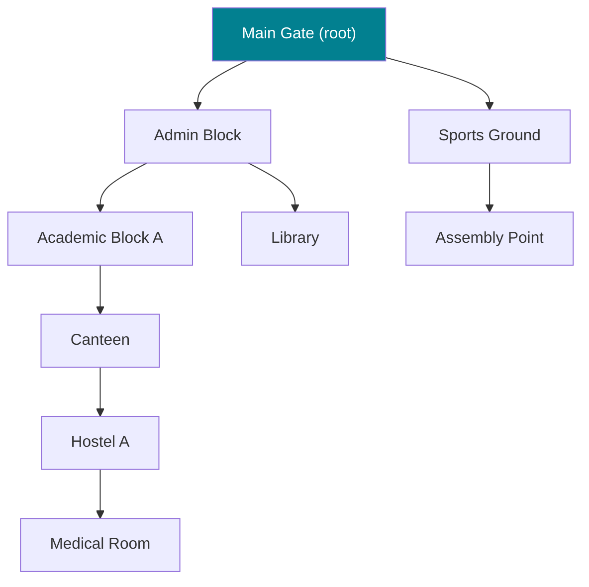
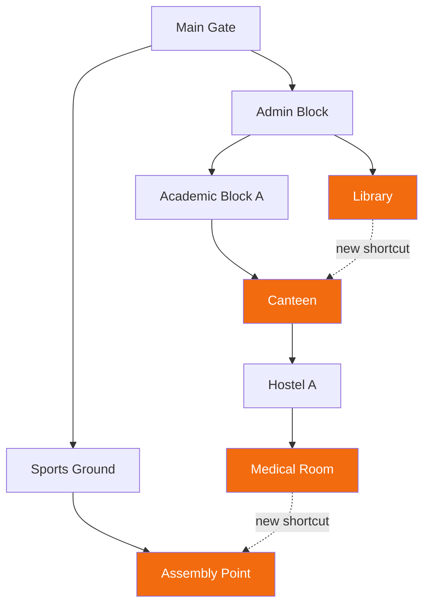

# 🌳➡️🕸️ From Trees to Graphs — Week 2 Practical (CSE 276)

### *You already traced BFS/DFS on trees in class today. Now: same algorithms, one small twist — Python + NetworkX + Matplotlib (all in Google Colab)*

> **What we're building today:** we start from the **exact same idea you used in class today** — a tree, root at the top, one path down to every node — but drawn as our campus emergency-evacuation plan. Then we do something sneaky: we add **two extra "shortcut" paths** that actually exist on campus but aren't part of the official tree plan. That one small change turns your tree into a **graph** — and suddenly BFS and DFS have *choices* to make that they never had before. That's the whole lesson today, in one sentence: **a graph is a tree that got some shortcuts, and shortcuts are exactly what make traversal interesting.**

> 🧑‍🎓 **Builds directly on today's class.** You already know how to hand-trace BFS (queue) and DFS (stack) on a tree — we reuse that skill immediately, no re-teaching from scratch.

> 💻 **Runtime:** Google Colab → CPU (default). No GPU needed.

**Session plan (2 hours, back-to-back):**

| Time | Block | Focus |
|------|-------|-------|
| 🕛 0:00 – 0:10 | **Recap** | What you already know from today's tree lesson |
| 🕧 0:10 – 0:45 | **Practical 1 — Trees** | Represent a tree, hand-dry-run BFS & DFS (fast — you've done this) |
| 🕜 0:45 – 0:55 | **Bridge** | Add two shortcut edges → your tree becomes a graph. What changes? |
| 🕝 0:55 – 1:20 | **Practical 2 — Finish Graph Representation** | Adjacency list vs. matrix, add edge weights/costs |
| 🕞 1:20 – 1:45 | **Practical 2 (cont.) — Dry-Run BFS & DFS on the Graph** | Same start, same target as Practical 1 — compare the paths |
| 🕠 1:45 – 2:00 | **Wrap-up** | Tree vs. graph, side by side; preview of Week 3 (actually coding it) |
| ➕ Extra | **Extend It** | Optional deeper exercises if we move faster than expected |

---

## 🗺️ The Big Picture (Read This First)



**The one idea to hold onto all session:** in a **tree**, there is only ever **one possible path** between any two nodes — so BFS and DFS have no real choice to make; they just discover it in a different order. In a **graph**, once you add even one extra edge that isn't part of the tree, **multiple paths become possible** — and *now* the difference between BFS and DFS actually matters, because they can find *different* routes, of *different* lengths. Today you'll watch that happen on the same graph, with your own hands.

---

# 🕛 RECAP (0:00 – 0:10)

### 0.1 — What you already know (from today's class)

| Term | Quick reminder |
|------|-----------------|
| **Root** | The top node of a tree — where traversal usually starts |
| **Parent / child** | A node directly above / below another |
| **Leaf** | A node with no children |
| **BFS (tree)** | Queue-based; visits level by level, root → children → grandchildren |
| **DFS (tree)** | Stack-based; charges down one branch fully before backtracking |
| **Key tree fact** | There is **exactly one path** between the root and any other node — no cycles, no alternate routes |

> 🎯 Today's twist: what happens the moment that "exactly one path" stops being true?

---

# 🕧 PRACTICAL 1 (0:10 – 0:45): Trees — Represent It, Then Trace It

## 1.1 — Our tree for today: the official evacuation plan

This is a small rooted tree — think of it as the "official" evacuation plan a campus safety notice would print: one prescribed route down from the main entrance to every location, no alternates listed.

```
Main Gate
├── Admin Block
│   ├── Academic Block A
│   │   └── Canteen
│   │       └── Hostel A
│   │           └── Medical Room
│   └── Library
└── Sports Ground
    └── Assembly Point
```



**9 nodes, 8 edges** — notice that's always `n − 1` edges for a tree with `n` nodes. One less edge and it'd be disconnected; one more edge and (as you're about to see) it stops being a tree at all.

### 1.2 — Build it and represent it

```python
import networkx as nx
import matplotlib.pyplot as plt

evac_tree = nx.Graph()
evac_tree.add_edges_from([
    ("Main Gate", "Admin Block"),
    ("Main Gate", "Sports Ground"),
    ("Admin Block", "Academic Block A"),
    ("Admin Block", "Library"),
    ("Academic Block A", "Canteen"),
    ("Canteen", "Hostel A"),
    ("Hostel A", "Medical Room"),
    ("Sports Ground", "Assembly Point"),
])

print("Nodes:", evac_tree.number_of_nodes())
print("Edges:", evac_tree.number_of_edges())
print("Is this actually a tree?", nx.is_tree(evac_tree))
```

```python
adjacency_list = {n: list(evac_tree.neighbors(n)) for n in evac_tree.nodes()}
for node, neighbors in adjacency_list.items():
    print(f"{node:20s} -> {neighbors}")
```

> 🔑 **Same adjacency-list idea as a tree's "children" — just without a fixed direction.** Once you store it this way, "root," "parent," and "child" are just labels *you* apply on top; the underlying data doesn't care which end is "up."

### 1.3 — Draw it in Colab

```python
plt.figure(figsize=(9, 7))
pos = nx.spring_layout(evac_tree, seed=3)
nx.draw(evac_tree, pos, with_labels=True, node_color="lightgreen",
        node_size=2200, font_size=9, font_weight="bold", edge_color="gray", width=2)
plt.title("Evacuation Tree — one prescribed route to every location", fontsize=12)
plt.show()
```

### 1.4 — BFS by hand: the Queue Worksheet

**Question:** starting from **Main Gate**, find a path to **Medical Room**.

Same rule as today's class: remove from the **front** of the Queue, mark visited, add unvisited neighbors to the **back**.

| Step | Remove from front | Mark Visited | Neighbors found → added to back | Queue after this step |
|------|--------------------|----------------|-------------------------------------|---------------------------|
| 1 | — (start) | Main Gate | Admin Block, Sports Ground | `[Admin Block, Sports Ground]` |
| 2 | Admin Block | Admin Block | Academic Block A, Library *(Main Gate already visited)* | `[Sports Ground, Academic Block A, Library]` |
| 3 | Sports Ground | Sports Ground | Assembly Point | `[Academic Block A, Library, Assembly Point]` |
| 4 | Academic Block A | Academic Block A | Canteen | `[Library, Assembly Point, Canteen]` |
| 5 | Library | Library | *(none new)* | `[Assembly Point, Canteen]` |
| 6 | Assembly Point | Assembly Point | *(none new)* | `[Canteen]` |
| 7 | Canteen | Canteen | Hostel A | `[Hostel A]` |
| 8 | Hostel A | Hostel A | Medical Room | `[Medical Room]` |
| 9 | Medical Room | Medical Room | 🎯 **Found it!** | — |

**Path found:** `Main Gate → Admin Block → Academic Block A → Canteen → Hostel A → Medical Room` — **5 hops.**

> 🧠 Notice this took **9 steps to reach a node only 5 hops away** — BFS had to fully clear every closer node first (that's the "ring by ring" price it pays for its shortest-path guarantee).

### 1.5 — DFS by hand: the Stack Worksheet

Same rule as today's class: remove from the **top** of the Stack, mark visited, push unvisited neighbors onto the **top**.

| Step | Remove from top | Mark Visited | Neighbors found → pushed to top | Stack after this step |
|------|--------------------|----------------|-------------------------------------|---------------------------|
| 1 | — (start) | Main Gate | Admin Block, Sports Ground | `[Admin Block, Sports Ground]` (top = Sports Ground) |
| 2 | Sports Ground | Sports Ground | Assembly Point | `[Admin Block, Assembly Point]` (top = Assembly Point) |
| 3 | Assembly Point | Assembly Point | *(none new)* | `[Admin Block]` |
| 4 | Admin Block | Admin Block | Academic Block A, Library | `[Academic Block A, Library]` (top = Library) |
| 5 | Library | Library | *(none new)* | `[Academic Block A]` |
| 6 | Academic Block A | Academic Block A | Canteen | `[Canteen]` |
| 7 | Canteen | Canteen | Hostel A | `[Hostel A]` |
| 8 | Hostel A | Hostel A | Medical Room | `[Medical Room]` |
| 9 | Medical Room | Medical Room | 🎯 **Found it!** | — |

**Path found:** `Main Gate → Admin Block → Academic Block A → Canteen → Hostel A → Medical Room` — **same 5-hop path as BFS.**

> ⚡ **This is the key tree fact in action:** BFS wandered into the Sports Ground branch first, DFS did too — but because a tree has only **one possible route** to Medical Room, both algorithms are eventually forced onto that same single path. They explored the *rest of the tree* in a different order, but the *answer* couldn't differ. **Hold that thought — it's about to stop being true.**

### 1.6 — 🎮 Your turn

Re-run both worksheets, starting from **Library**, targeting **Assembly Point**. Confirm: is there still only one possible path?

### 1.7 — Verify against NetworkX (peek, don't code the algorithm yet)

```python
print("BFS order from Main Gate:", list(nx.bfs_tree(evac_tree, "Main Gate")))
print("DFS order from Main Gate:", list(nx.dfs_tree(evac_tree, "Main Gate")))
```

---

## 🛠️ Troubleshooting — Practical 1

| Symptom | Likely cause | Fix |
|---------|-------------|-----|
| `nx.is_tree()` returns `False` | An edge was duplicated, or a node got connected to two different parts, forming a cycle | Recheck the edge list against section 1.1 exactly |
| BFS and DFS gave *different* paths | A bug in the trace, not the tree — a real tree can't allow two different paths between the same two nodes | Re-check each row: did you add a neighbor that was actually already visited? |
| Confused about "front" vs "top" | Queue and Stack use different ends by definition | Queue = line at a canteen (join back, served from front); Stack = stack of plates (add/remove only from top) |

---

# 🕜 BRIDGE (0:45 – 0:55): Add Two Shortcuts → Now It's a Graph

### 2.1 — The real campus has shortcuts your tree plan doesn't show

The official plan (your tree) doesn't mention that, in real life, **the Library actually opens directly onto the Canteen**, and **the Medical Room has a side door straight onto the Assembly Point**. Both are real, walkable connections — they just weren't part of the "one official route per location" plan.

```python
campus = evac_tree.copy()
campus.add_edge("Library", "Canteen")
campus.add_edge("Medical Room", "Assembly Point")

print("Nodes:", campus.number_of_nodes())
print("Edges:", campus.number_of_edges())          # 8 -> 10
print("Is it still a tree?", nx.is_tree(campus))    # False now
```



### 2.2 — What actually changed, precisely

| | Tree (Practical 1) | Graph (now) |
|---|---------------------|----------------|
| **Edges** | 8 (always `n − 1`) | 10 |
| **Path between any two nodes** | Exactly one, guaranteed | Possibly more than one |
| **Cycles?** | Never | Yes — e.g. Admin Block → Academic Block A → Canteen → Library → Admin Block |
| **Does "visited" matter?** | Barely — a node can basically only be discovered once | **Critically** — without it, an algorithm could loop forever around a cycle |
| **Root?** | Meaningful (the plan starts there) | Optional — a graph doesn't need a "top" |
| **Does BFS/DFS answer stay the same regardless of algorithm?** | Yes (only one path exists) | **No — this is the whole point of today's second half** |

> 🎯 **The question we're about to answer by hand:** Main Gate → Medical Room took **5 hops** in the tree. Now that a shortcut exists between Medical Room and Assembly Point, does that answer change?

---

# 🕝 PRACTICAL 2 (0:55 – 1:45): Finish Graph Representation, Then Re-Trace

## 2.3 — Adjacency List vs. Adjacency Matrix

You already built an adjacency list for the tree in 1.2 — the process for a graph is identical, just with (possibly) more neighbors per node now.

```python
adjacency_list = {node: list(campus.neighbors(node)) for node in campus.nodes()}
for node, neighbors in adjacency_list.items():
    print(f"{node:20s} -> {neighbors}")
```

Notice `Canteen` and `Medical Room` etc. now show **more neighbors** than they did as tree nodes — that's the shortcut edges showing up.

**Adjacency Matrix — the other standard way to store a graph:**

```python
import numpy as np

nodes_ordered = list(campus.nodes())
matrix = nx.to_numpy_array(campus, nodelist=nodes_ordered, dtype=int)

print("Node order:", nodes_ordered)
print(matrix)
```

**How to read it:** row `i`, column `j` is `1` if there's an edge between `nodes_ordered[i]` and `nodes_ordered[j]`, else `0`. Always symmetric for an undirected graph.

| | Adjacency List | Adjacency Matrix |
|---|-----------------|-------------------|
| **Looks like** | `{node: [neighbors]}` | A grid of 0s and 1s, size N×N |
| **Best for** | "Who is X connected to?" (fast) | "Are X and Y directly connected?" (instant lookup) |
| **Our 9-node graph** | 9 short lists | A 9×9 grid, mostly zeros |

> 🧠 **Why "sparse" matters:** 9 locations, only 10 walkable paths, out of a possible 36 pairs. Most of the matrix is 0 — this is exactly why real-world maps (and most real graphs) are stored as adjacency **lists**, not matrices.

### 🎮 Hand exercise

On paper, take this tiny 4-node graph and write out both representations, then check with code:

```
Nodes: P, Q, R, S
Edges: P-Q, Q-R, R-S, P-S
```

```python
mini = nx.Graph()
mini.add_edges_from([("P","Q"), ("Q","R"), ("R","S"), ("P","S")])
print({n: list(mini.neighbors(n)) for n in mini.nodes()})
print(nx.to_numpy_array(mini, nodelist=list(mini.nodes()), dtype=int))
```

## 2.4 — Add edge weights/costs

Right now `nx.has_path()` only tells you **yes/no** a route exists. **Weights fix that** — every edge gets a number representing real cost (here, walking time in minutes).

```python
edge_weights = {
    ("Main Gate", "Admin Block"): 2,
    ("Main Gate", "Sports Ground"): 4,
    ("Admin Block", "Academic Block A"): 3,
    ("Admin Block", "Library"): 5,
    ("Academic Block A", "Canteen"): 3,
    ("Library", "Canteen"): 4,          # the shortcut
    ("Canteen", "Hostel A"): 5,
    ("Hostel A", "Medical Room"): 3,
    ("Sports Ground", "Assembly Point"): 5,
    ("Medical Room", "Assembly Point"): 1,   # the shortcut
}

for (u, v), w in edge_weights.items():
    campus[u][v]["weight"] = w

print(list(campus.edges(data=True))[:3])
```

**Visualize with weights labeled:**

```python
plt.figure(figsize=(10, 8))
pos = nx.spring_layout(campus, seed=7, k=0.8)
nx.draw(campus, pos, with_labels=True, node_color="lightblue", node_size=2200,
        font_size=9, font_weight="bold", edge_color="gray", width=2)
edge_labels = nx.get_edge_attributes(campus, "weight")
nx.draw_networkx_edge_labels(campus, pos, edge_labels=edge_labels, font_size=9, font_color="darkred")
plt.title("Campus Graph with Walking-Time Weights (minutes)", fontsize=13)
plt.show()
```

**Query costs, not just connections:**

```python
print("Hostel A -> Medical Room direct cost:", campus["Hostel A"]["Medical Room"]["weight"], "min")

total = sum(w["weight"] for _, _, w in campus.edges("Canteen", data=True))
print("Sum of edge weights touching Canteen:", total, "min")
```

> 🔑 **Weighted degree ≠ degree.** `campus.degree("Canteen")` counts *how many* paths touch Canteen; the sum above adds up *how costly* those paths are combined.

**Save it:**

```python
nx.write_gml(campus, "campus_graph_weighted.gml")
```

### 🎮 Your turn: weight YOUR own graph

If you have last week's saved graph (`my_campus_graph.gml`), load it and add a realistic walking-time estimate to every edge, the same way. Rough numbers are fine — the point is that *every* edge has one, so shortest-path calculations don't break next week.

---

## 🛠️ Troubleshooting — Practical 2 (Representation & Weights)

| Symptom | Likely cause | Fix |
|---------|-------------|-----|
| Adjacency matrix has unexpected row/column order | `nodelist` wasn't passed explicitly | Always pass `nodelist=list(G.nodes())` to `to_numpy_array` |
| Matrix isn't symmetric | Graph was accidentally built as a `DiGraph` | Undirected campus graphs should give a symmetric matrix — check `type(campus)` |
| `KeyError` setting a weight | That edge doesn't actually exist (typo, or wrong pair) | Check `campus.has_edge(u, v)` first |
| Weighted-degree sum throws an error | Some edge is missing the `"weight"` attribute | Loop through `campus.edges(data=True)` and confirm every edge has `weight` |

---

## 2.5 — Dry-Run BFS & DFS on the Graph — Same Question as Practical 1

**Same question as before:** starting from **Main Gate**, find a path to **Medical Room**. Only difference: two shortcut edges now exist. **Drop the weights for this trace** — pure hop-counting, just like Practical 1, so the comparison is fair.

### BFS — the Queue Worksheet

| Step | Remove from front | Mark Visited | Neighbors found → added to back | Queue after this step |
|------|--------------------|----------------|-------------------------------------|---------------------------|
| 1 | — (start) | Main Gate | Admin Block, Sports Ground | `[Admin Block, Sports Ground]` |
| 2 | Admin Block | Admin Block | Academic Block A, Library | `[Sports Ground, Academic Block A, Library]` |
| 3 | Sports Ground | Sports Ground | Assembly Point | `[Academic Block A, Library, Assembly Point]` |
| 4 | Academic Block A | Academic Block A | Canteen | `[Library, Assembly Point, Canteen]` |
| 5 | Library | Library | Canteen *already in queue — skip* | `[Assembly Point, Canteen]` |
| 6 | Assembly Point | Assembly Point | **Medical Room** *(via the new shortcut!)* | `[Canteen, Medical Room]` |
| 7 | Canteen | Canteen | Hostel A *(Library already visited)* | `[Medical Room, Hostel A]` |
| 8 | Medical Room | Medical Room | 🎯 **Found it!** | — |

**Path found:** `Main Gate → Sports Ground → Assembly Point → Medical Room` — **only 3 hops.**

> ✅ **The shortcut changed the answer.** BFS is guaranteed to find the shortest hop-count path — and now that a shortcut exists, "shortest" is a completely different, much shorter route than the one your tree plan showed.

### DFS — the Stack Worksheet

| Step | Remove from top | Mark Visited | Neighbors found → pushed to top | Stack after this step |
|------|--------------------|----------------|-------------------------------------|---------------------------|
| 1 | — (start) | Main Gate | Admin Block, Sports Ground | `[Admin Block, Sports Ground]` (top = Sports Ground) |
| 2 | Sports Ground | Sports Ground | Assembly Point | `[Admin Block, Assembly Point]` (top = Assembly Point) |
| 3 | Assembly Point | Assembly Point | **Medical Room** *(via shortcut)* | `[Admin Block, Medical Room]` (top = Medical Room) |
| 4 | Medical Room | Medical Room | 🎯 **Found it!** | — |

**Path found:** `Main Gate → Sports Ground → Assembly Point → Medical Room` — **4 steps, same 3-hop path.**

> ⚡ **This run, BFS and DFS agree.** But unlike the tree, that's now a coincidence of neighbor ordering, not a guarantee. **Try it:** re-trace DFS but push `Sports Ground` before `Admin Block` at Step 1 instead — you'll very likely get a *different* route this time. That never could have happened in Practical 1.

### 2.6 — Side-by-side: Tree vs. Graph, same start, same target

| | Tree (Practical 1) | Graph (Practical 2) |
|---|---------------------|-------------------------|
| **BFS path found** | Main Gate → Admin Block → Academic Block A → Canteen → Hostel A → Medical Room | Main Gate → Sports Ground → Assembly Point → Medical Room |
| **Hops** | 5 | 3 |
| **BFS steps taken** | 9 | 8 |
| **DFS path found** | *Identical to BFS path* | *Matched BFS this run — but not guaranteed* |
| **Could DFS ever find a different route than BFS?** | No — only one path exists | **Yes** — and often does |

> 🧠 **The one-sentence takeaway for today:** trees give traversal algorithms no choices, so BFS and DFS can't disagree. Graphs — because of cycles and multiple paths — give them real choices, and that's exactly where the *difference* between "explore breadth-first" and "explore depth-first" starts to matter for the answer you get, not just the order you explore in.

### 2.7 — 🎮 Your turn

Re-run both worksheets from **Canteen** to **Sports Ground**. Compare: does the shortcut edge change *this* route too, or only some routes?

### 2.8 — Verify against NetworkX

```python
print("BFS order from Main Gate:", list(nx.bfs_tree(campus, "Main Gate")))
print("DFS order from Main Gate:", list(nx.dfs_tree(campus, "Main Gate")))
```

> 🎯 Small order differences from your hand-trace are expected and fine — what must match is *which* nodes come before *which* others.

---

## 🛠️ Troubleshooting — Dry-Run Block

| Symptom | Likely cause | Fix |
|---------|-------------|-----|
| Students keep re-adding an already-visited node | Forgot to check "already visited" before adding | Emphasize: check Visited before adding to Queue/Stack, every time, no exceptions — this check barely mattered in the tree but is essential now |
| BFS and DFS give the exact same path every single time, no matter the order tried | Not actually testing a different push order | Deliberately reverse the neighbor push order at the very first step and re-trace |
| `nx.bfs_tree`/`dfs_tree` output doesn't match the hand-trace exactly | NetworkX's internal neighbor ordering may differ from paper order | Expected — same algorithm, different valid ordering |

---

## 🚀 Extend It (Buffer content — use if we're ahead of schedule)

1. **Add a weighted trap:** add up the edge *weights* (minutes) along the BFS graph-path (3 hops) versus the tree path (5 hops). Which is faster in real minutes? Is fewer hops always fewer minutes? (Spoiler: not necessarily — a preview of why "shortest by hops" ≠ "shortest by cost.")
2. **A third shortcut:** add one more edge of your choice to `campus` and re-trace BFS from Main Gate to Medical Room. Did the path change again, or did it already find the best possible route?
3. **Disconnected node test:** temporarily remove an edge so a node becomes unreachable. Hand-trace BFS — what happens when the queue empties without reaching the target?
4. **Full campus:** if you have your saved Week 1 graph with all 12 locations, trace BFS/DFS on it from Main Gate to Assembly Point and see how much longer the worksheets get.
5. **Adjacency-list-only trace:** redo one hand-trace using *only* the adjacency list table (no picture) — this is literally what next week's code will do.

---

# 🕠 WRAP-UP (1:45 – 2:00)

### ✅ What You Learned Today

- 🌳 Represented a **tree** and re-used your queue/stack hand-tracing skill from class — and saw that BFS and DFS are *forced* to agree, because a tree offers only one path between any two nodes
- ➕ Turned that tree into a **graph** by adding two real shortcut edges, and named exactly what changed: cycles, multiple paths, and the sudden real importance of tracking "visited"
- 📋 Finished graph representation: fluent conversion between **adjacency list** and **adjacency matrix**
- ⚖️ Added real **edge weights/costs**, and the difference between *degree* and *weighted degree*
- 🌊🌲 Hand-traced **BFS and DFS on the graph**, on the *same* start/target as the tree version, and watched the shortcut edges cut the shortest route from 5 hops down to 3
- 🔍 Directly compared tree-traversal vs. graph-traversal side by side — the single clearest way to see why graphs need real algorithms, not just "the one obvious path"

### 👀 Preview of Week 3

Next week, everything you did *by hand* today — maintaining a Queue, maintaining a Stack, checking Visited, following neighbors — becomes actual Python code, for both the tree and the graph case. Because you've already done both versions on paper, the code will mostly be "how do I say what I already know how to do, in Python."

> Bring your BFS/DFS worksheets from today (both the tree and graph versions), plus your saved `campus_graph_weighted.gml` — Week 3 builds directly on all of it.

---

## 🧰 Quick Reference Card — Full Session

```python
# ── TREE ──
evac_tree = nx.Graph()
evac_tree.add_edges_from([...])          # n-1 edges, no cycles
nx.is_tree(evac_tree)                     # True

# ── TREE -> GRAPH: add shortcuts ──
campus = evac_tree.copy()
campus.add_edge("Library", "Canteen")
campus.add_edge("Medical Room", "Assembly Point")
nx.is_tree(campus)                        # False

# ── ADJACENCY LIST ──
adjacency_list = {n: list(campus.neighbors(n)) for n in campus.nodes()}

# ── ADJACENCY MATRIX ──
nodes_ordered = list(campus.nodes())
matrix = nx.to_numpy_array(campus, nodelist=nodes_ordered, dtype=int)

# ── ADD WEIGHTS ──
campus[u][v]["weight"] = 5
nx.get_edge_attributes(campus, "weight")
sum(w["weight"] for _,_,w in campus.edges("X", data=True))   # weighted degree

# ── SAVE ──
nx.write_gml(campus, "campus_graph_weighted.gml")

# ── PEEK AT TRAVERSAL ORDER (checking hand-work only) ──
list(nx.bfs_tree(campus, "Main Gate"))
list(nx.dfs_tree(campus, "Main Gate"))
```

| Concept | One-liner |
|---------|-----------|
| **Tree** | `n − 1` edges, no cycles, exactly one path between any two nodes |
| **Graph** | Any number of edges, cycles allowed, possibly many paths between two nodes |
| **Adjacency list** | `{node: [neighbors]}` — compact, best for "who's connected to X?" |
| **Adjacency matrix** | N×N grid of 0/1 — best for instant "are X,Y directly connected?" lookups |
| **Weight/cost** | A number attached to an edge — distance, time, difficulty |
| **BFS** | Queue-based; ring-by-ring; guarantees shortest path by hop count |
| **DFS** | Stack-based; commits to one path, backtracks on dead ends; no shortest-path guarantee |
| **Golden rule of today** | On a tree, BFS and DFS can't disagree — there's only one path. On a graph, they can, because shortcuts create choices. |
