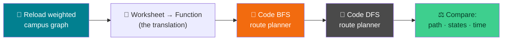

# 🚑 Building the Route Planner — Week 3 Practical (CSE 276)

### *Practical 1a: Implement BFS → Practical 1b: Implement DFS → Compare Path Quality, States Explored, and Execution Time, using Python + NetworkX + Matplotlib (all in Google Colab)*

> **What we're building today:** this is the week your hand-dry-run worksheets become real, running code. You will write **BFS and DFS from scratch** (no `nx.bfs_tree` shortcuts) as two competing engines inside one **Campus Route Planner** — the same emergency-response tool this whole course thread has been building toward. By 2:00 you'll have a working planner, a side-by-side comparison of both algorithms, and hard numbers on which one is "better," and in what sense.

> 🧑‍🎓 **This is Project 1.** Everything from Weeks 1–2 — your campus graph, its edge weights, your BFS/DFS worksheets — was data prep for exactly this session. If you're missing any of that, backups are provided below so nobody is stuck.

> 💻 **Runtime:** Google Colab → CPU (default). Still no GPU needed.

**Session plan (2 hours, back-to-back — extra buffer material included so we never run dry):**

| Time | Block | Focus |
|------|-------|-------|
| 🕛 0:00 – 0:10 | **Recap** | Reload the weighted campus graph, rebuild the adjacency dict in code |
| 🕧 0:10 – 0:20 | **Bridge** | From paper worksheet to Python function — what changes, what doesn't |
| 🕐 0:20 – 1:00 | **Practical 1a** | Implement BFS as a route-planning function; test, visualize, instrument |
| 🕜 1:00 – 1:40 | **Practical 1b** | Implement DFS as a route-planning function; compare against BFS |
| 🕝 1:40 – 1:50 | **Benchmark Harness** | Run both across multiple start/target pairs — states explored, cost, execution time |
| 🕞 1:50 – 2:00 | **Wrap-up** | Recap, save your planner, preview of what's next |
| ➕ Extra | **Extend It** | Optional deeper exercises if we move faster than expected |

---

## 🗺️ The Big Picture (Read This First)



**The one idea to hold onto all session:** a hand-traced worksheet and a working function do **the exact same thing** — maintain a frontier (queue or stack), maintain a visited set, and record who discovered whom. Today we're not learning a new algorithm; we're learning to say the algorithm you already know **in Python**.

---

## 📋 What You'll Need

1. Your Google account + last week's Colab notebook (or fresh — we reload the saved graph either way)
2. Your **`campus_graph_weighted.gml`** file from Week 2, uploaded to this week's session (📁 sidebar → upload icon)
3. Your Week 2 BFS/DFS hand-dry-run worksheets — keep them next to your keyboard, we'll check code output against them line by line
4. No file from Week 2? A backup weighted demo graph is provided in section 0.1

---

# 🕛 RECAP (0:00 – 0:10)

### 0.1 — Reload your Week 2 weighted graph

```python
import networkx as nx
import matplotlib.pyplot as plt
from collections import deque
import time

# Upload campus_graph_weighted.gml via the 📁 sidebar first, then run:
campus = nx.read_gml("campus_graph_weighted.gml")

print("Nodes:", campus.number_of_nodes())
print("Edges:", campus.number_of_edges())
print("Connected?", nx.is_connected(campus))
```

> 🆘 **Don't have the file?** Run this to recreate a weighted demo campus and keep going:
> ```python
> locations = ["Main Gate","Admin Block","Academic Block A","Academic Block B","Library",
>              "Canteen","Hostel A","Hostel B","Medical Room","Sports Ground","Auditorium","Assembly Point"]
> edges_with_weights = [
>     ("Main Gate","Admin Block",2), ("Main Gate","Sports Ground",4),
>     ("Admin Block","Academic Block A",3), ("Admin Block","Library",5),
>     ("Academic Block A","Academic Block B",2), ("Academic Block A","Canteen",3),
>     ("Academic Block B","Library",2), ("Library","Canteen",4),
>     ("Canteen","Hostel A",5), ("Canteen","Hostel B",6),
>     ("Hostel A","Medical Room",3), ("Hostel B","Medical Room",2),
>     ("Medical Room","Assembly Point",1), ("Sports Ground","Auditorium",3),
>     ("Auditorium","Assembly Point",2), ("Sports Ground","Assembly Point",5),
> ]
> campus = nx.Graph()
> campus.add_nodes_from(locations)
> for a, b, w in edges_with_weights:
>     campus.add_edge(a, b, weight=w)
> ```

### 0.2 — Rebuild the adjacency dict — in code, for real this time

Last week you sketched adjacency lists by hand. Today's functions will run directly on a Python dict shaped exactly like that worksheet column:

```python
def build_adjacency(graph):
    """node -> sorted list of (neighbor, weight) tuples."""
    adj = {}
    for node in graph.nodes():
        neighbors = [(nbr, graph[node][nbr]["weight"]) for nbr in graph.neighbors(node)]
        neighbors.sort(key=lambda pair: pair[0])   # alphabetical, same as your worksheet
        adj[node] = neighbors
    return adj

adj = build_adjacency(campus)

for node, neighbors in list(adj.items())[:3]:
    print(f"{node:20s} -> {neighbors}")
```

> 🔑 Notice `adj` is *exactly* the adjacency list from Week 2 — just now every neighbor carries its weight along with it, and it's sorted so your code's traversal order will match a hand-trace done in the same neighbor order.

---

# 🕧 BRIDGE (0:10 – 0:20): From Worksheet to Function

*(Discussion + light typing — sets up both practicals.)*

### 1.1 — Line up your BFS worksheet against the code you're about to write

| Worksheet column | Python equivalent |
|---|---|
| "Queue after this step" | a `collections.deque()` — a list-like structure with fast add/remove from both ends |
| "Mark Visited" | a `set()` called `visited` |
| "Remove from front of Queue" | `queue.popleft()` |
| "Neighbors found → added to back of Queue" | `queue.append(neighbor)` |
| Table row itself | one loop iteration |

> 🧠 **The whole leap from paper to code is this:** every row of your worksheet table is one pass through a `while` loop. Nothing conceptually new happens today — we're just teaching the computer to fill in the table for us, at a speed no human worksheet could match.

### 1.2 — The one new thing: reconstructing the *path*, not just the *visit order*

Your worksheets tracked **who got visited, in what order** — that told you *whether* a target was reachable. To actually output a **route** ("go through X, then Y, then Z"), code needs one more piece of bookkeeping your hand-trace didn't need to write down explicitly: a **parent pointer** for every node — *who discovered me?*


Once every node remembers its parent, reconstructing the path is just: **start at the target, keep asking "who's your parent?", walk backward until you hit the start, then reverse the list.**

> 🎯 This `parent` dictionary is the single most important piece of new code today — both BFS and DFS below use exactly this trick.

---

# 🕐 PRACTICAL 1a (0:20 – 1:00): Implement BFS as a Route Planner

## Goal: a function that takes (graph, start, target) and returns the route

### 2.1 — Write `bfs_route()`, matching your worksheet rule for rule

```python
def bfs_route(adj, start, target):
    """
    Returns: (path, visit_order, states_explored)
    path = list of nodes from start to target (or None if unreachable)
    visit_order = the order nodes were DEQUEUED (processed) — for instrumentation
    states_explored = how many nodes were actually processed
    """
    visited = {start}
    parent = {start: None}
    queue = deque([start])
    visit_order = []
    states_explored = 0

    while queue:
        current = queue.popleft()          # front of queue
        visit_order.append(current)
        states_explored += 1

        if current == target:
            break

        for neighbor, weight in adj[current]:
            if neighbor not in visited:
                visited.add(neighbor)
                parent[neighbor] = current
                queue.append(neighbor)      # back of queue

    if target not in parent:
        return None, visit_order, states_explored

    # walk backward from target to start using parent pointers
    path = []
    node = target
    while node is not None:
        path.append(node)
        node = parent[node]
    path.reverse()

    return path, visit_order, states_explored
```

> 🔍 **Read this against your Week 2 BFS worksheet, line by line, before running it.** `queue.popleft()` is your "remove from front." The `for neighbor, weight in adj[current]` loop is your "neighbors found" column. This *is* your worksheet — just faster.

### 2.2 — Run it on the campus graph

```python
start_node = "Main Gate"
target_node = "Medical Room"

path, visit_order, states = bfs_route(adj, start_node, target_node)

print("BFS path:      ", " → ".join(path) if path else "UNREACHABLE")
print("BFS visit order:", visit_order)
print("BFS states explored:", states)
```

> 🧪 **Before running:** predict the output using your Week 2 hand-trace of this exact start/target pair. Run it. Do they match? If not, that's a great debugging exercise — walk through the mismatch together as a class.

### 2.3 — Compute the path's real-world cost

BFS guarantees fewest **hops** — let's see what that route actually costs in minutes:

```python
def path_cost(adj, path):
    """Sum the edge weights along a path."""
    total = 0
    for a, b in zip(path, path[1:]):
        for neighbor, weight in adj[a]:
            if neighbor == b:
                total += weight
                break
    return total

if path:
    print(f"BFS path hops: {len(path)-1}")
    print(f"BFS path cost: {path_cost(adj, path)} min")
```

### 2.4 — Visualize the route on the campus map

```python
def draw_route(graph, path, title, color="orange"):
    plt.figure(figsize=(10, 8))
    pos = nx.spring_layout(graph, seed=7, k=0.8)

    nx.draw(
        graph, pos, with_labels=True,
        node_color="lightblue", node_size=2000, font_size=9,
        edge_color="lightgray", width=1.5,
    )

    if path:
        path_edges = list(zip(path, path[1:]))
        nx.draw_networkx_nodes(graph, pos, nodelist=path, node_color=color, node_size=2200)
        nx.draw_networkx_edges(graph, pos, edgelist=path_edges, edge_color=color, width=4)

    edge_labels = nx.get_edge_attributes(graph, "weight")
    nx.draw_networkx_edge_labels(graph, pos, edge_labels=edge_labels, font_size=8, font_color="gray")

    plt.title(title, fontsize=13)
    plt.show()

draw_route(campus, path, f"BFS Route: {start_node} → {target_node}", color="orange")
```

### 2.5 — Instrument it: how many states did BFS actually touch?

"States explored" is our first taste of measuring an algorithm's **efficiency** — not just "did it work," but "how much work did it do?"

```python
print(f"Total locations on campus: {campus.number_of_nodes()}")
print(f"BFS states explored to find target: {states}")
print(f"BFS explored {states}/{campus.number_of_nodes()} = {states/campus.number_of_nodes()*100:.0f}% of the campus")
```

> 🧠 **Why this matters:** on a huge map (think: an entire city's road network), you do *not* want an algorithm that explores every single location before finding a nearby target. "States explored" is a simple, honest proxy for how much work an algorithm did — we'll use it again in a few minutes to compare against DFS.

### 2.6 — 🎮 Your turn: run BFS on 2 more start/target pairs

Pick two more pairs (e.g., `"Hostel B"` → `"Auditorium"`, or two locations from **your own** campus graph if you built one in Week 1–2). For each, record: path found, hops, cost, states explored. Compare to what you'd have gotten by hand.

> 🧪 **~10 minutes.** Try one pair where start and target are close together, and one where they're far apart — notice how states-explored scales with distance.

---

## 🛠️ Troubleshooting — Practical 1a

| Symptom | Likely cause | Fix |
|---------|-------------|-----|
| `KeyError` inside the `for neighbor, weight in adj[current]` loop | `adj` was built before weights were added, or node name typo | Rebuild `adj` with `build_adjacency(campus)` *after* confirming `campus` has weights (section 0.2) |
| `bfs_route` returns `(None, [...], n)` unexpectedly | Target isn't reachable, or target name has a typo/extra space | Print `list(campus.nodes())` and compare spelling exactly, including capitalization |
| Path looks right but in **reverse** | Forgot `path.reverse()` at the end | Add it back — we build the path target→start, then flip it |
| `visit_order` doesn't match your Week 2 worksheet | Neighbor order in `adj` differs from what you wrote on paper | This is expected if your paper trace used a different neighbor order — the *shape* of the traversal should still match |
| `draw_route` throws a `KeyError` on edge_labels | Graph doesn't actually have `weight` attributes | Re-check section 0.1 — make sure you loaded/built the *weighted* graph, not last week's plain one |

---

# 🕜 PRACTICAL 1b (1:00 – 1:40): Implement DFS as a Route Planner

## Same job, opposite data structure — let's see what changes

### 3.1 — Write `dfs_route()`, matching your Stack worksheet

```python
def dfs_route(adj, start, target):
    """
    Returns: (path, visit_order, states_explored)
    Mirrors your Week 2 DFS worksheet: mark visited when POPPED, not when pushed.
    """
    visited = set()
    parent = {start: None}
    stack = [start]
    visit_order = []
    states_explored = 0

    while stack:
        current = stack.pop()              # top of stack

        if current in visited:
            continue                       # duplicate entry — already handled, skip

        visited.add(current)
        visit_order.append(current)
        states_explored += 1

        if current == target:
            break

        for neighbor, weight in reversed(adj[current]):
            if neighbor not in visited:
                parent[neighbor] = current
                stack.append(neighbor)     # push onto top

    if target not in parent:
        return None, visit_order, states_explored

    path = []
    node = target
    while node is not None:
        path.append(node)
        node = parent[node]
    path.reverse()

    return path, visit_order, states_explored
```

> 🔑 **Two deliberate differences from `bfs_route`, both straight from your worksheet:**
> 1. `stack.pop()` removes from the **end** of the list (top of stack) instead of the front — that one-line swap (`popleft()` → `pop()`, plus `queue`→`stack`) is the *entire* structural difference between BFS and DFS.
> 2. We mark `visited` when **popped**, not when pushed — which means we need the `if current in visited: continue` guard for duplicate stack entries, exactly like the "already visited → skip (duplicate)" row in your Week 2 worksheet.
> 3. `reversed(adj[current])` — pushing neighbors in reverse order means the *first-listed* neighbor ends up on top and gets explored first, matching the natural reading order of your adjacency list.

### 3.2 — Run it on the same start/target as BFS

```python
dfs_path, dfs_visit_order, dfs_states = dfs_route(adj, start_node, target_node)

print("DFS path:      ", " → ".join(dfs_path) if dfs_path else "UNREACHABLE")
print("DFS visit order:", dfs_visit_order)
print("DFS states explored:", dfs_states)

if dfs_path:
    print(f"DFS path hops: {len(dfs_path)-1}")
    print(f"DFS path cost: {path_cost(adj, dfs_path)} min")
```

### 3.3 — Side-by-side visualization

```python
fig_path_bfs, fig_path_dfs = path, dfs_path

def draw_two_routes(graph, path_a, label_a, color_a, path_b, label_b, color_b):
    fig, axes = plt.subplots(1, 2, figsize=(18, 8))
    pos = nx.spring_layout(graph, seed=7, k=0.8)

    for ax, p, lbl, col in [(axes[0], path_a, label_a, color_a), (axes[1], path_b, label_b, color_b)]:
        nx.draw(graph, pos, ax=ax, with_labels=True, node_color="lightblue",
                node_size=1800, font_size=8, edge_color="lightgray", width=1.5)
        if p:
            edges = list(zip(p, p[1:]))
            nx.draw_networkx_nodes(graph, pos, nodelist=p, node_color=col, node_size=2000, ax=ax)
            nx.draw_networkx_edges(graph, pos, edgelist=edges, edge_color=col, width=4, ax=ax)
        ax.set_title(lbl, fontsize=12)

    plt.tight_layout()
    plt.show()

draw_two_routes(
    campus,
    fig_path_bfs, f"BFS: {start_node} → {target_node}\nhops={len(fig_path_bfs)-1}, cost={path_cost(adj, fig_path_bfs)}", "orange",
    fig_path_dfs, f"DFS: {start_node} → {target_node}\nhops={len(fig_path_dfs)-1}, cost={path_cost(adj, fig_path_dfs)}", "mediumpurple",
)
```

### 3.4 — Compare path quality directly

```python
print(f"{'Metric':<20}{'BFS':<15}{'DFS':<15}")
print("-"*50)
print(f"{'Hops':<20}{len(path)-1:<15}{len(dfs_path)-1:<15}")
print(f"{'Cost (min)':<20}{path_cost(adj, path):<15}{path_cost(adj, dfs_path):<15}")
print(f"{'States explored':<20}{states:<15}{dfs_states:<15}")
print(f"{'Same route?':<20}{'Yes' if path == dfs_path else 'No':<30}")
```

> 🧠 **What to expect, and why:** BFS's hop count will always be ≤ DFS's hop count for the *same* start/target — that's the guarantee from Week 2. DFS's *cost* can come out higher, lower, or equal — there's no guarantee either way, because DFS was never optimizing for cost or hops, only "keep going until stuck." That surprise is the whole point of today's comparison.

---

## 🛠️ Troubleshooting — Practical 1b

| Symptom | Likely cause | Fix |
|---------|-------------|-----|
| DFS runs forever / notebook hangs | Missing the `if current in visited: continue` guard, causing infinite reprocessing | Re-check section 3.1 — that guard is not optional for this implementation style |
| DFS and BFS always return the identical path | Graph section being tested is a simple chain with no branching | Try a start/target pair that has to pass through a node with 3+ neighbors |
| `dfs_path` reconstruction looks broken/looped | `parent[neighbor]` got overwritten after the neighbor was already visited | This shouldn't happen with the guard in 3.1 — if it does, check you didn't accidentally set `parent[neighbor]` outside the `if neighbor not in visited` check |
| Reversed neighbor order doesn't change anything | Node's neighbors happen to be visited in the same order either way | Try it on a node with more neighbors — the effect is more visible with higher branching |

---

# 🕝 BENCHMARK HARNESS (1:40 – 1:50): Timing Both Algorithms

## Adding execution time to the comparison

### 4.1 — Why timing on a 12-node graph is tricky (and how to do it honestly)

A campus graph this small runs in **microseconds** — far too fast to time reliably with a single run (system noise dominates). The fix: run each function **many times** and look at the average.

```python
def time_it(func, adj, start, target, repeats=2000):
    t0 = time.perf_counter()
    for _ in range(repeats):
        func(adj, start, target)
    t1 = time.perf_counter()
    avg_ms = ((t1 - t0) / repeats) * 1000
    return avg_ms

bfs_avg_ms = time_it(bfs_route, adj, start_node, target_node)
dfs_avg_ms = time_it(dfs_route, adj, start_node, target_node)

print(f"BFS average time: {bfs_avg_ms:.5f} ms")
print(f"DFS average time: {dfs_avg_ms:.5f} ms")
```

> ⚠️ **Don't over-interpret this number.** On a graph this small, BFS vs. DFS timing differences mostly reflect Python overhead and system noise, *not* a fundamental speed advantage of one algorithm. Both are technically **O(V + E)** — the same growth rate. The lesson today is the *method* of measuring fairly (many repeats, average), which matters far more once you're benchmarking on graphs with thousands of nodes later in the course.

### 4.2 — Full comparison table across multiple start/target pairs

```python
test_pairs = [
    ("Main Gate", "Medical Room"),
    ("Hostel B", "Auditorium"),
    ("Library", "Assembly Point"),
    ("Sports Ground", "Hostel A"),
]

print(f"{'Start':<16}{'Target':<16}{'BFS hops':<10}{'DFS hops':<10}{'BFS cost':<10}{'DFS cost':<10}{'BFS states':<12}{'DFS states':<12}")
print("-"*100)
for s, t in test_pairs:
    bp, _, bs = bfs_route(adj, s, t)
    dp, _, ds = dfs_route(adj, s, t)
    bh = len(bp)-1 if bp else "—"
    dh = len(dp)-1 if dp else "—"
    bc = path_cost(adj, bp) if bp else "—"
    dc = path_cost(adj, dp) if dp else "—"
    print(f"{s:<16}{t:<16}{str(bh):<10}{str(dh):<10}{str(bc):<10}{str(dc):<10}{bs:<12}{ds:<12}")
```

> 🎯 **This table is your Project 1 deliverable in miniature.** Screenshot or save this output — it's direct evidence comparing both algorithms on real routes, exactly the kind of result a project report would ask for.

---

## 🚀 Extend It (Buffer content — use if we're ahead of schedule)

If your section finishes core content early, work through any of these:

1. **Benchmark every pair at once:** loop over *all* `(start, target)` combinations using `itertools.permutations(campus.nodes(), 2)` and compute the *average* states-explored and cost gap between BFS and DFS across the entire campus, not just 4 hand-picked pairs.
2. **Recursive DFS:** rewrite `dfs_route` using recursion instead of an explicit stack (`def dfs_recursive(adj, current, target, visited, parent): ...`). Compare its behavior to the iterative version — do they visit nodes in the same order?
3. **"Explore everything" mode:** remove the `if current == target: break` line and let both algorithms run to completion. Compare `states_explored` now — this is what BFS/DFS look like when used for full-map exploration (e.g., "which locations are reachable at all") instead of point-to-point routing.
4. **Cost-blind BFS demo:** deliberately construct (or find within your own campus graph) a start/target pair where the DFS path is *cheaper* than the BFS path despite having more hops. Explain in one sentence why BFS didn't find it — this is the seed idea for smarter, cost-aware search coming later in the course.
5. **Stress test:** use `generateGraph`-style logic (or just `nx.gnm_random_graph(200, 400)`) to build a 200-node random graph, rebuild `adj` for it, and re-run the timing harness with `repeats=50`. Now does a timing gap between BFS and DFS start to show up? Why might it, even though both are O(V+E)?

---

# 🕞 WRAP-UP (1:50 – 2:00)

### ✅ What You Learned Today

- 🧠 Translated your Week 2 **hand-dry-run worksheets directly into working Python** — Queue → `deque`, Stack → `list.pop()`, Visited → `set()`, "who found me" → `parent` dict
- 🌊 Implemented **`bfs_route()`** from scratch: full path reconstruction, not just reachability
- 🌲 Implemented **`dfs_route()`** from scratch, including the visited-on-pop / duplicate-skip behavior your worksheet predicted
- 📏 Learned to measure **path quality** two ways: hop count and real-world weighted cost — and saw firsthand that they don't always agree
- 🔢 Instrumented **states explored** as an honest, simple efficiency metric
- ⏱️ Learned to **time code fairly** on tiny inputs (many repeats + average), and why raw millisecond numbers on a 12-node graph can be misleading
- 📊 Built a **benchmark harness** comparing BFS vs. DFS across multiple routes at once — your first real algorithm comparison table

### 👀 Preview of What's Next

You now have two working, instrumented search algorithms and a way to score them. The natural next question the course will build toward: **what if you want the algorithm to actively prefer low-cost routes, instead of just measuring cost after the fact?** That's the doorway to smarter, cost-aware search — keep `path_cost()` and your benchmark harness handy, they'll get reused.

> Save your notebook (`File → Save a copy in Drive`) with both functions intact — `bfs_route`, `dfs_route`, `path_cost`, and `build_adjacency` are your toolkit from here on.

---

## 🧰 Quick Reference Card — Full Session

```python
# ── ADJACENCY ──
def build_adjacency(graph):
    adj = {}
    for node in graph.nodes():
        neighbors = [(nbr, graph[node][nbr]["weight"]) for nbr in graph.neighbors(node)]
        neighbors.sort(key=lambda pair: pair[0])
        adj[node] = neighbors
    return adj

# ── BFS ──
from collections import deque
def bfs_route(adj, start, target):
    visited = {start}; parent = {start: None}
    queue = deque([start]); visit_order = []; states = 0
    while queue:
        current = queue.popleft()
        visit_order.append(current); states += 1
        if current == target: break
        for nb, w in adj[current]:
            if nb not in visited:
                visited.add(nb); parent[nb] = current; queue.append(nb)
    if target not in parent: return None, visit_order, states
    path = []; node = target
    while node is not None: path.append(node); node = parent[node]
    path.reverse()
    return path, visit_order, states

# ── DFS ──
def dfs_route(adj, start, target):
    visited = set(); parent = {start: None}
    stack = [start]; visit_order = []; states = 0
    while stack:
        current = stack.pop()
        if current in visited: continue
        visited.add(current); visit_order.append(current); states += 1
        if current == target: break
        for nb, w in reversed(adj[current]):
            if nb not in visited:
                parent[nb] = current; stack.append(nb)
    if target not in parent: return None, visit_order, states
    path = []; node = target
    while node is not None: path.append(node); node = parent[node]
    path.reverse()
    return path, visit_order, states

# ── COST + TIMING ──
def path_cost(adj, path):
    total = 0
    for a, b in zip(path, path[1:]):
        for nb, w in adj[a]:
            if nb == b: total += w; break
    return total

import time
def time_it(func, adj, start, target, repeats=2000):
    t0 = time.perf_counter()
    for _ in range(repeats): func(adj, start, target)
    return ((time.perf_counter()-t0)/repeats) * 1000   # ms
```

| Concept | One-liner |
|---------|-----------|
| **Parent dict** | Records "who discovered me" — lets you reconstruct a full path, not just reachability |
| **`states_explored`** | How many nodes were actually processed — a simple efficiency proxy |
| **Path hops** | `len(path) - 1` — BFS guarantees this is minimal |
| **Path cost** | Sum of edge weights along the path — not guaranteed minimal by either BFS or DFS |
| **Fair timing** | Run many repeats, take the average — single-run timings on tiny inputs are noise |
| **BFS vs DFS, structurally** | One line differs: `queue.popleft()` vs. `stack.pop()` — everything else follows from that |
| **Golden rule of today** | If your code's output doesn't match your Week 2 worksheet, the worksheet is your debugger — walk the mismatch row by row |
