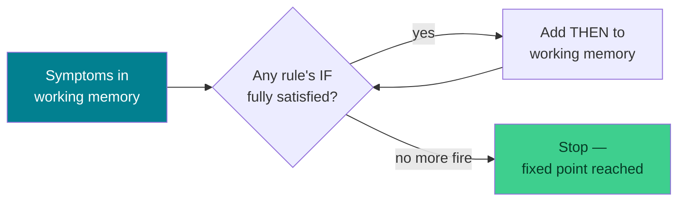

# 🧠 Expert Systems & Knowledge Representation — Week 5 Practical (CSE 276)

### *Practical 3: Build a Rule-Based Expert System (Forward Chaining) → Practical 4: Represent Knowledge Three Ways — Semantic Nets, Frames, and Logic, using Python + NetworkX + Matplotlib (all in Google Colab)*

> **What we're building today:** everything through Week 4 was *search* — moving through a space of states looking for a goal. Today there's no goal to search for. Instead, a program **reasons from what it knows**. In Practical 3 you'll build a tiny rule-based expert system that mimics classic systems like MYCIN — feed it symptoms, watch it chain simple IF-THEN rules together into a conclusion. In Practical 4 you'll take a single, small chunk of real-world knowledge (an animal taxonomy) and represent it **three different ways** — as a semantic net, as frames with inheritance, and as logic — and prove all three give the same answers.

> ⚕️ **A note before we start:** the medical expert system today is a **teaching toy**, deliberately modeled on the historical design of systems like MYCIN. It is not medically accurate, not validated, and not meant for real diagnosis. Treat every "diagnosis" it produces as a demonstration of *how rule-chaining works*, nothing more.

> 🧑‍🎓 **This is Project 3.** It's a different kind of project from Weeks 3–4: instead of one continuous build, today is two shorter, self-contained pieces that both answer the same underlying question — "how do we get a program to reason about something, instead of just search through it?"

> 💻 **Runtime:** Google Colab → CPU (default). No files to upload — all knowledge (rules, frames, facts) is written directly in code.

**Session plan (≈120 minutes, back-to-back):**

| Time | Block | Focus |
|------|-------|-------|
| 🕛 0:00 – 0:10 | **Recap** | From search to knowledge — why "find a path" isn't the right frame for every problem |
| 🕧 0:10 – 0:20 | **Bridge A** | Meet production rules, working memory, and forward chaining |
| 🕐 0:20 – 0:55 | **Practical 3** | Build a rule-based expert system; test, trace, visualize |
| 🕜 0:55 – 1:05 | **Bridge B** | Meet semantic nets, frames, inheritance, and exceptions |
| 🕝 1:05 – 1:40 | **Practical 4** | Represent one knowledge domain as a semantic net, a frame system, and logic |
| 🕞 1:40 – 1:55 | **Verification Harness** | Test the expert system across many patients; cross-check all three KR methods agree |
| 🕟 1:55 – 2:00 | **Wrap-up** | Recap, save your work, preview of what's next |
| ➕ Extra | **Extend It** | Optional deeper exercises if we move faster than expected |

---

## 🗺️ The Big Picture (Read This First)


**The one idea to hold onto all session:** knowledge and reasoning are separable. A **rule** ("IF fever and cough THEN suspect flu") is knowledge about *how to conclude things*. A **frame** ("a Penguin is a Bird, but unlike most birds, it cannot fly") is knowledge about *what things are and how they relate*. Today you'll write both kinds, and see that the "reasoning" part — chaining facts together, walking up an inheritance hierarchy — is often just a small, mechanical loop sitting on top of the knowledge, not something mysterious.

---

## 📋 What You'll Need

1. Your Google account + a fresh (or continued) Colab notebook
2. Nothing to upload — every rule, fact, and frame is written directly in code today
3. Comfort with Python dictionaries and sets — today's "data structure of the week" is the `set` (for matching rule conditions) and the `dict` (for frames)

---

# 🕛 RECAP (0:00 – 0:10)

### 0.1 — Why search isn't the right hammer for every nail

Weeks 3 and 4 were all versions of the same question: "starting here, how do I reach there?" That framing works great for routes and puzzles, where a *state* is a clear, fixed thing (a location, a tile arrangement) and a *move* is a clear, fixed action.

Plenty of real reasoning doesn't look like that at all. A doctor doesn't "search" through possible diagnoses one state-transition at a time — they hold a set of facts (symptoms) and apply *knowledge* ("these symptoms together usually mean this") to reach conclusions. That's **rule-based reasoning**, and it's today's first topic.

Separately, a program often needs to just *know things* — "a Penguin is a bird," "birds usually fly," "penguins are the exception" — without any searching or rule-firing at all. That's **knowledge representation**, today's second topic.

### 0.2 — Setup

```python
import networkx as nx
import matplotlib.pyplot as plt

print("Ready. No files needed today — everything is defined in code.")
```

---

# 🕧 BRIDGE A (0:10 – 0:20): Production Rules & Forward Chaining

*(Discussion + light typing — sets up Practical 3.)*

### 1.1 — What a production rule is

A **production rule** is just an IF-THEN statement over a set of known facts:

```
IF fever AND cough AND body_ache AND fatigue THEN flu_like_illness
```

A whole expert system is usually nothing more than: a bag of these rules, a **working memory** of facts currently known to be true, and a loop that keeps checking "does any rule's IF-part match what's in working memory right now?"

### 1.2 — Forward chaining: run the rules until nothing new happens

**Forward chaining** means starting from known facts (symptoms) and repeatedly firing any rule whose conditions are satisfied, adding its conclusion to working memory — and then checking again, because that new fact might satisfy *another* rule's conditions. You stop when a full pass over every rule produces nothing new. This is called reaching a **fixed point**.



> 🔑 Notice this is structurally the *same shape* as Week 3's BFS "keep processing the queue until it's empty" and Week 4's "keep improving until nothing improves" — a loop that runs until no more progress can be made. Different domain, same skeleton.

---

# 🕐 PRACTICAL 3 (0:20 – 0:55): Build a Rule-Based Expert System

## Goal: a function that takes (rules, symptoms) and returns everything that can be concluded

### 2.1 — Write the rule base

```python
# Each rule: a set of facts that must ALL be present ("if"), and one fact it adds ("then").
# Rules 1-5 go from raw symptoms to a diagnosis.
# Rules 6-9 go from a diagnosis to a recommendation — a second "layer" of reasoning
# that can only fire AFTER a diagnosis rule has already fired. That's what makes
# this genuinely "chained" reasoning, not just a single lookup table.

rules = [
    {"name": "R1_flu",             "if": {"fever", "cough", "body_ache", "fatigue"},        "then": "flu_like_illness"},
    {"name": "R2_cold",            "if": {"sneezing", "runny_nose", "sore_throat", "congestion"}, "then": "common_cold"},
    {"name": "R3_migraine",        "if": {"headache", "sensitivity_to_light", "nausea"},     "then": "migraine"},
    {"name": "R4_dehydration",     "if": {"excessive_thirst", "dizziness", "dry_mouth"},     "then": "dehydration"},
    {"name": "R5_allergies",       "if": {"sneezing", "itchy_eyes", "runny_nose"},           "then": "seasonal_allergies"},
    {"name": "R6_flu_advice",      "if": {"flu_like_illness", "fatigue", "chills"},          "then": "advise_rest_and_fluids"},
    {"name": "R7_cold_advice",     "if": {"common_cold"},                                    "then": "advise_rest_and_fluids"},
    {"name": "R8_migraine_advice", "if": {"migraine"},                                       "then": "advise_dark_quiet_room"},
    {"name": "R9_dehydration_advice", "if": {"dehydration"},                                 "then": "advise_fluids_urgently"},
]

print(f"Loaded {len(rules)} production rules.")
```

### 2.2 — Write `forward_chain()`

```python
def forward_chain(rules, initial_facts):
    """
    Repeatedly fires any rule whose IF-conditions are a subset of working memory,
    until a full pass fires nothing new (a fixed point).

    Returns: (working_memory, trace)
    working_memory = every fact known to be true, initial + derived
    trace = rule names, in the order they fired (our "states explored" for today)
    """
    working_memory = set(initial_facts)
    trace = []
    fired_something = True

    while fired_something:
        fired_something = False
        for rule in rules:
            already_known = rule["then"] in working_memory
            conditions_met = rule["if"].issubset(working_memory)
            if conditions_met and not already_known:
                working_memory.add(rule["then"])
                trace.append(rule["name"])
                fired_something = True   # something changed — worth one more full pass

    return working_memory, trace
```

> 🔍 **Why we loop over ALL the rules every pass, instead of stopping at the first match:** a rule that fires late in one pass (like `R7_cold_advice`, which needs `common_cold` to already be true) might unlock a rule *earlier* in the list on the next pass. Scanning every rule, every pass, until nothing changes, is what guarantees we don't miss a valid chain of reasoning just because of rule order. This full-rescan approach is simple but not the fastest possible design — production AI systems use smarter indexing (like the RETE algorithm) to avoid rechecking rules that couldn't possibly have changed; we're keeping it simple today so the logic stays visible.

### 2.3 — Run it on a test patient

```python
patient_1 = {"fever", "cough", "body_ache", "fatigue", "chills"}

memory, trace = forward_chain(rules, patient_1)
derived = memory - patient_1

print("Initial symptoms:", sorted(patient_1))
print("Rules fired, in order:", trace)
print("Everything derived:", sorted(derived))
```

> 🧪 **Before running:** look at `patient_1`'s symptoms against the rule base in 2.1. Which rule fires first? Does its conclusion unlock any other rule? Trace it by hand, then run the code and check.

### 2.4 — Visualize the inference chain

```python
def draw_inference_trace(rules, initial_facts, trace, title=""):
    fired_rules = {r["name"]: r for r in rules if r["name"] in trace}
    G = nx.DiGraph()

    for fact in initial_facts:
        G.add_node(fact, kind="fact")

    for rule_name in trace:
        rule = fired_rules[rule_name]
        G.add_node(rule_name, kind="rule")
        for condition in rule["if"]:
            G.add_edge(condition, rule_name)
        G.add_node(rule["then"], kind="fact")
        G.add_edge(rule_name, rule["then"])

    pos = nx.spring_layout(G, seed=3, k=1.0)
    fact_nodes = [n for n, d in G.nodes(data=True) if d["kind"] == "fact"]
    rule_nodes = [n for n, d in G.nodes(data=True) if d["kind"] == "rule"]

    plt.figure(figsize=(11, 7))
    nx.draw_networkx_nodes(G, pos, nodelist=fact_nodes, node_color="lightblue", node_size=1900)
    nx.draw_networkx_nodes(G, pos, nodelist=rule_nodes, node_color="orange", node_shape="s", node_size=1600)
    nx.draw_networkx_edges(G, pos, arrows=True, arrowsize=15, edge_color="gray")
    nx.draw_networkx_labels(G, pos, font_size=8)
    plt.title(title, fontsize=13)
    plt.axis("off")
    plt.show()

draw_inference_trace(rules, patient_1, trace, title="Patient 1 — inference trace")
```

> 🔑 Blue circles are facts (symptoms and conclusions); orange squares are the rules that fired. Follow the arrows and you're reading the exact same chain the loop in 2.2 discovered — symptoms feed a rule, a rule produces a fact, that fact feeds the *next* rule.

### 2.5 — Instrument it: how much reasoning did it take?

```python
print(f"Symptoms provided: {len(patient_1)}")
print(f"Rules fired: {len(trace)}")
print(f"New facts derived: {len(derived)}")
```

> 🧠 **Why this matters:** "rules fired" is today's version of Week 3–4's "states explored" — a simple, honest measure of how much reasoning work the system did to reach its conclusions. A system that needs to fire 20 rules to reach a simple conclusion may be missing a more direct rule; a system that needs zero is suspicious too.

### 2.6 — 🎮 Your turn: run 2 more cases, including one with no clear diagnosis

```python
patient_2 = {"sneezing", "itchy_eyes", "runny_nose"}
patient_3 = {"cough"}   # deliberately too little evidence

for label, patient in [("patient_2", patient_2), ("patient_3", patient_3)]:
    memory, trace = forward_chain(rules, patient)
    derived = memory - patient
    print(f"{label}: symptoms={sorted(patient)}")
    print(f"  rules fired={trace}")
    print(f"  derived={sorted(derived) if derived else 'NOTHING — insufficient evidence'}")
    print()
```

> 🧪 **~10 minutes.** `patient_3` should derive nothing — exactly like Hill Climbing getting stuck last week, an expert system with insufficient matching evidence simply has nothing to conclude. That's not a bug; it's the system correctly recognizing the limits of what it knows. Try writing a `patient_4` of your own and predict the output before running it.

---

## 🛠️ Troubleshooting — Practical 3

| Symptom | Likely cause | Fix |
|---------|-------------|-----|
| `forward_chain` returns the initial facts with nothing derived, even though it "should" fire | A symptom name has a typo (e.g. `"bodyache"` vs `"body_ache"`) — sets match on exact string equality only | Print `patient_1` and the relevant rule's `"if"` set side by side and compare spelling exactly |
| The loop seems to run forever / notebook hangs | A rule's `"then"` accidentally equals one of its own `"if"` conditions, so it can "re-fire" logic incorrectly | This shouldn't happen with the `already_known` guard in 2.2 — double check that guard wasn't removed |
| `draw_inference_trace` throws a `KeyError` | `trace` contains a rule name not present in `rules` (usually from editing the rule base without updating both) | Confirm every rule's `"name"` is unique and matches exactly what's referenced elsewhere |
| Two patients with different symptoms get the exact same diagnosis | Expected if their symptom sets both fully satisfy the same rule — try printing which specific rule fired for each to confirm it's not a bug | Not a bug — multiple different symptom sets can legitimately satisfy the same rule |

---

# 🕜 BRIDGE B (0:55 – 1:05): Semantic Nets, Frames, and Logic

*(Discussion + light typing — sets up Practical 4.)*

### 3.1 — Three ways to say the same thing

Rules are great for "if this, then that" reasoning. But a lot of knowledge isn't a rule at all — it's just **facts about what things are and how they relate**. "A penguin is a bird." "Birds usually fly." "Penguins are an exception." AI has three classic ways to write this down:

| Representation | What it looks like | Best at |
|---|---|---|
| **Semantic net** | A graph — concepts as nodes, relationships (`is-a`, `has-part`, `can`) as labeled edges | Showing structure visually; easy to eyeball at a glance |
| **Frame** | A dictionary of "slots" per concept, with inheritance from a parent frame | Bundling many properties per concept; overriding defaults with exceptions |
| **Logic** | Facts and rules as formal statements (`isa(Penguin, Bird)`, `can_fly(Bird)`) | Precise, checkable reasoning; the foundation the other two are often translated into |

> 🧠 **Today's twist:** we're going to encode the *exact same* animal knowledge all three ways, and confirm they agree. That agreement isn't a coincidence — all three are just different notations for the same underlying facts.

### 3.2 — Inheritance and the exception problem

Most birds fly. So it's tempting to say "Bird → can_fly = True" once, and let every kind of bird inherit it. But a penguin is a bird that *can't* fly. Good knowledge representation needs to let a specific concept **override** an inherited default — without breaking the general rule for every other bird. Watch for exactly this in Practical 4.

---

# 🕝 PRACTICAL 4 (1:05 – 1:40): One Domain, Three Representations

## Goal: represent a small animal taxonomy as a semantic net, a frame system, and logic — and get matching answers from all three

### 4.1 — Representation 1: Semantic net (a graph)

```python
def build_semantic_net():
    G = nx.DiGraph()

    is_a_edges = [
        ("Bird", "Animal"), ("Fish", "Animal"), ("Mammal", "Animal"),
        ("Penguin", "Bird"), ("Sparrow", "Bird"),
        ("Salmon", "Fish"),
        ("Dog", "Mammal"), ("Bat", "Mammal"),
    ]
    for child, parent in is_a_edges:
        G.add_edge(child, parent, relation="is-a")

    # Property edges — general defaults attach to the category, exceptions attach to the specific animal
    property_edges = [
        ("Bird", "can_fly", "yes"),
        ("Penguin", "can_fly", "no"),      # exception, overrides the Bird default
        ("Bat", "can_fly", "yes"),          # true even though most mammals can't
        ("Fish", "lives_in_water", "yes"),
        ("Mammal", "has_fur", "yes"),
    ]
    for concept, prop, value in property_edges:
        label = f"{prop}={value}"
        G.add_edge(concept, label, relation="property")

    return G

net = build_semantic_net()

def draw_semantic_net(G):
    pos = nx.spring_layout(G, seed=5, k=1.1)
    is_a_edges = [(u, v) for u, v, d in G.edges(data=True) if d["relation"] == "is-a"]
    prop_edges = [(u, v) for u, v, d in G.edges(data=True) if d["relation"] == "property"]

    plt.figure(figsize=(11, 8))
    nx.draw_networkx_nodes(G, pos, node_color="lightblue", node_size=1800)
    nx.draw_networkx_edges(G, pos, edgelist=is_a_edges, edge_color="steelblue", width=2, arrows=True)
    nx.draw_networkx_edges(G, pos, edgelist=prop_edges, edge_color="orange", style="dashed", arrows=True)
    nx.draw_networkx_labels(G, pos, font_size=8)
    plt.title("Semantic net: solid blue = is-a, dashed orange = property", fontsize=11)
    plt.axis("off")
    plt.show()

draw_semantic_net(net)
```

> 🔑 A semantic net is easy to *read* — you can trace `Penguin → is-a → Bird → is-a → Animal` with your eyes. What it can't do on its own is tell you which property wins when two edges disagree (`Bird → can_fly=yes` vs `Penguin → can_fly=no`). That's where frames come in.

### 4.2 — Representation 2: Frames (with inheritance and overrides)

```python
frames = {
    "Animal":  {"is_a": None,     "slots": {"can_move": True, "needs_food": True}},
    "Bird":    {"is_a": "Animal", "slots": {"has_wings": True, "can_fly": True, "lays_eggs": True}},
    "Fish":    {"is_a": "Animal", "slots": {"has_gills": True, "lives_in_water": True}},
    "Mammal":  {"is_a": "Animal", "slots": {"has_fur": True, "gives_birth": True, "can_fly": False}},
    "Penguin": {"is_a": "Bird",   "slots": {"can_fly": False, "can_swim": True}},   # overrides Bird's default
    "Sparrow": {"is_a": "Bird",   "slots": {}},
    "Salmon":  {"is_a": "Fish",   "slots": {}},
    "Dog":     {"is_a": "Mammal", "slots": {"is_pet": True}},
    "Bat":     {"is_a": "Mammal", "slots": {"can_fly": True}},                      # overrides Mammal's default
}

def get_slot(frames, concept, slot, visited=None):
    """
    Walk up the is-a chain looking for `slot`. A slot defined LOCALLY on a
    concept always wins over one inherited from a parent — this is exactly
    how Penguin's own can_fly=False overrides the inherited Bird default.
    """
    if visited is None:
        visited = set()
    if concept in visited or concept not in frames:
        return None
    visited.add(concept)

    frame = frames[concept]
    if slot in frame["slots"]:
        return frame["slots"][slot]

    parent = frame["is_a"]
    if parent is None:
        return None
    return get_slot(frames, parent, slot, visited)

for animal in ["Sparrow", "Penguin", "Bat", "Dog"]:
    print(f"{animal:10s} can_fly = {get_slot(frames, animal, 'can_fly')}")
```

> 🧪 **Predict before running:** `Sparrow` has no local `can_fly` slot, so it inherits from `Bird` → should print `True`. `Penguin` has its own `can_fly` slot → should print `False`, overriding what `Bird` says. `Bat` has no local slot on `Mammal`'s side except its own override → should print `True`, overriding `Mammal`'s default `False`. Run it and check.

### 4.3 — Representation 3: Logic (facts + rules as tuples)

```python
isa_facts = [
    ("Bird", "Animal"), ("Fish", "Animal"), ("Mammal", "Animal"),
    ("Penguin", "Bird"), ("Sparrow", "Bird"),
    ("Salmon", "Fish"),
    ("Dog", "Mammal"), ("Bat", "Mammal"),
]

property_facts = [
    ("Bird", "can_fly", True),
    ("Penguin", "can_fly", False),
    ("Mammal", "can_fly", False),
    ("Bat", "can_fly", True),
    ("Fish", "lives_in_water", True),
    ("Mammal", "has_fur", True),
]

def isa_chain(isa_facts, concept):
    """All ancestors of `concept`, most specific first — the logic-world version of walking up frames."""
    chain = [concept]
    changed = True
    while changed:
        changed = False
        for child, parent in isa_facts:
            if child == chain[-1] and parent not in chain:
                chain.append(parent)
                changed = True
    return chain

def query_property(property_facts, chain, prop):
    """First match, walking from most specific to most general, wins — same override rule as frames."""
    for concept in chain:
        for c, p, v in property_facts:
            if c == concept and p == prop:
                return v, concept   # value, and WHICH concept in the chain provided it
    return None, None

for animal in ["Sparrow", "Penguin", "Bat", "Dog"]:
    chain = isa_chain(isa_facts, animal)
    value, source = query_property(property_facts, chain, "can_fly")
    print(f"{animal:10s} can_fly = {value}  (from fact attached to: {source})")
```

> 🔑 Notice `query_property` and `get_slot` are doing **the same override logic**, just on different data shapes — a list of tuples versus nested dictionaries. That's the point: the *representation* changed, the *reasoning* didn't.

### 4.4 — 🎮 Your turn: add a new animal to all three representations

Pick an animal with an interesting exception (e.g. `"Ostrich"` — a bird that can't fly; or `"Platypus"` — a mammal that lays eggs). Add it to `build_semantic_net()`, `frames`, and `isa_facts`/`property_facts`, then confirm `get_slot()` and `query_property()` agree on its overridden property.

> 🧪 **~10 minutes.** If the two disagree, that's a genuine bug to hunt down — a great debugging exercise, since it means the "same knowledge" isn't actually the same across your three representations yet.

---

## 🛠️ Troubleshooting — Practical 4

| Symptom | Likely cause | Fix |
|---------|-------------|-----|
| `get_slot` returns `None` for a property that should be inherited | The chain hit a frame with `"is_a": None` (reached `Animal`) without ever finding the slot — meaning it's genuinely not defined anywhere in the hierarchy | Check whether the slot should exist at all on `Animal` or a closer ancestor |
| `get_slot` and `query_property` disagree for the same animal+property | The frame and the logic facts were edited separately and now hold different information | Re-check section 4.4 — every fact added to `frames` needs a matching entry in `isa_facts`/`property_facts`, and vice versa |
| Semantic net drawing looks cluttered/unreadable | Too many nodes for `spring_layout` at the default figure size | Increase `figsize`, or draw a subset of the graph (e.g. only the `Bird` branch) using `G.subgraph([...])` |
| `isa_chain` returns just `[concept]` with no ancestors | `isa_facts` list wasn't updated for a newly added animal, or a typo in the parent name | Print `isa_facts` and confirm an exact `(YourAnimal, Parent)` tuple exists |

---

# 🕞 VERIFICATION HARNESS (1:40 – 1:55): Testing Both Systems at Scale

## Same idea as Week 3–4's benchmark table — run many cases, tabulate honestly

### 5.1 — Run the expert system across several patients at once

```python
test_patients = {
    "patient_flu":        {"fever", "cough", "body_ache", "fatigue", "chills"},
    "patient_cold":       {"sneezing", "runny_nose", "sore_throat", "congestion"},
    "patient_migraine":   {"headache", "sensitivity_to_light", "nausea"},
    "patient_dehydrated": {"excessive_thirst", "dizziness", "dry_mouth"},
    "patient_allergies":  {"sneezing", "itchy_eyes", "runny_nose"},
    "patient_unclear":    {"cough"},
}

print(f"{'Patient':<20}{'Rules fired':<14}{'Conclusions':<40}")
print("-" * 74)
for label, symptoms in test_patients.items():
    memory, trace = forward_chain(rules, symptoms)
    derived = sorted(memory - symptoms)
    conclusions = ", ".join(derived) if derived else "— none —"
    print(f"{label:<20}{len(trace):<14}{conclusions:<40}")
```

> 🎯 **This table is your Project 3 deliverable in miniature.** It shows every test case, how much reasoning each one took, and what it concluded — direct evidence of the expert system working correctly across varied inputs, including honestly reporting "nothing" when evidence is insufficient.

### 5.2 — Cross-check all three knowledge representations agree

```python
animals_to_check = ["Sparrow", "Penguin", "Bat", "Dog", "Salmon"]
properties_to_check = ["can_fly", "has_fur", "lives_in_water"]

print(f"{'Animal':<10}{'Property':<18}{'Frame says':<14}{'Logic says':<14}{'Match?':<8}")
print("-" * 64)
for animal in animals_to_check:
    for prop in properties_to_check:
        frame_answer = get_slot(frames, animal, prop)
        chain = isa_chain(isa_facts, animal)
        logic_answer, _ = query_property(property_facts, chain, prop)
        match = "✅" if frame_answer == logic_answer else "❌"
        print(f"{animal:<10}{prop:<18}{str(frame_answer):<14}{str(logic_answer):<14}{match:<8}")
```

> 🧠 **Why this matters:** in a real system, you'd rarely maintain the same knowledge three separate times like we did today for learning purposes — you'd pick one representation and stick to it. But being able to prove two independent implementations agree is exactly how you'd catch a bug in either one before it caused a wrong conclusion downstream.

---

## 🚀 Extend It (Buffer content — use if we're ahead of schedule)

1. **Conflict resolution:** modify `forward_chain` so that when multiple rules could fire in the same pass, it picks the rule with the *most* conditions satisfied first (a simple form of "specificity" conflict resolution used in real production systems). Does the trace order change for `patient_1`?
2. **Certainty factors:** give each rule a `"confidence"` value between 0 and 1 (loosely inspired by MYCIN's actual design). When multiple rules support the same conclusion, combine their confidences (e.g. `1 - (1-a)*(1-b)`) instead of just adding a plain fact. Print the final confidence alongside each conclusion in section 5.1.
3. **Backward chaining:** instead of starting from symptoms and deriving conclusions, start from a target conclusion (e.g. `"migraine"`) and write a function that checks *which* symptoms would need to be true to prove it — working backward through the rules. Compare its logic to `forward_chain`.
4. **Bigger taxonomy:** add 5+ more animals (including at least 2 more exceptions like Penguin/Bat) to all three representations, and rerun the verification harness in 5.2 across all of them.
5. **Multiple inheritance:** research what happens when a frame needs *two* parents (e.g. a "Flying Fish" that's-a Fish but also has some Bird-like properties) — sketch how `get_slot` would need to change, even if you don't fully implement it.

---

# 🕟 WRAP-UP (1:55 – 2:00)

### ✅ What You Learned Today

- 🩺 Implemented a **rule-based expert system** using **forward chaining** — repeatedly firing IF-THEN production rules until nothing new can be concluded
- 🔗 Saw multi-step reasoning in action: symptom facts triggered diagnosis rules, and those diagnoses triggered *further* recommendation rules — true chaining, not a single lookup
- 🧭 Learned **working memory**, the fact-store every rule reads from and writes to, and why scanning all rules every pass guarantees nothing gets missed
- 🕸️ Built a **semantic net** — concepts as nodes, `is-a` and property relationships as labeled edges
- 🗂️ Built a **frame system** with **inheritance** — properties flow down from general concepts to specific ones by default
- ⚠️ Implemented **exception handling via override** — a specific frame's own slot always wins over an inherited default (Penguin can't fly, Bat can, despite their categories' defaults)
- 🔢 Represented the same knowledge as **logic facts and rules**, and used it to independently verify the frame system's answers
- 📊 Built two verification tables — one testing the expert system across 6 patients, one cross-checking two knowledge representations agree — your first evidence-based proof of correctness for *reasoning* systems, not just search algorithms

### 👀 Preview of What's Next

Weeks 3–5 gave you two big toolkits: search (finding paths and solutions) and knowledge representation (encoding and reasoning over facts). Week 6 is a buffer week to consolidate both — bring your open questions on rules, inheritance, or anything else so far. Then Week 7 turns to **agents**: programs that don't just answer one question, but perceive an environment and act in it over time, including multiple agents that have to cooperate or compete.

> Save your notebook (`File → Save a copy in Drive`) with `forward_chain`, `get_slot`, and `query_property` intact — the override-on-inheritance pattern from today reappears constantly in KR.

---

## 🧰 Quick Reference Card — Full Session

```python
# ── PRODUCTION RULES + FORWARD CHAINING ──
def forward_chain(rules, initial_facts):
    working_memory = set(initial_facts)
    trace = []
    fired_something = True
    while fired_something:
        fired_something = False
        for rule in rules:
            if rule["if"].issubset(working_memory) and rule["then"] not in working_memory:
                working_memory.add(rule["then"])
                trace.append(rule["name"])
                fired_something = True
    return working_memory, trace

# ── FRAMES WITH INHERITANCE + OVERRIDE ──
def get_slot(frames, concept, slot, visited=None):
    if visited is None: visited = set()
    if concept in visited or concept not in frames: return None
    visited.add(concept)
    frame = frames[concept]
    if slot in frame["slots"]: return frame["slots"][slot]
    parent = frame["is_a"]
    if parent is None: return None
    return get_slot(frames, parent, slot, visited)

# ── LOGIC: FACTS + CHAIN QUERY ──
def isa_chain(isa_facts, concept):
    chain = [concept]; changed = True
    while changed:
        changed = False
        for child, parent in isa_facts:
            if child == chain[-1] and parent not in chain:
                chain.append(parent); changed = True
    return chain

def query_property(property_facts, chain, prop):
    for concept in chain:
        for c, p, v in property_facts:
            if c == concept and p == prop:
                return v, concept
    return None, None
```

| Concept | One-liner |
|---------|-----------|
| **Production rule** | An IF-THEN statement: if a set of facts all hold, conclude one more fact |
| **Working memory** | The current set of known facts — grows as rules fire |
| **Forward chaining** | Start from facts, fire any satisfied rule, repeat until a full pass changes nothing (a fixed point) |
| **Semantic net** | Concepts as graph nodes, relationships (`is-a`, properties) as labeled edges |
| **Frame** | A concept's properties bundled as named "slots," with inheritance from a parent frame |
| **Default + exception** | A general property inherited from a parent, unless the specific concept defines its own override |
| **Logic representation** | Facts and relationships as formal tuples/statements — often what the other two are translated into under the hood |
| **Golden rule of today** | Representation is a choice of notation; the reasoning underneath (chaining, inheritance-with-override) is the same idea wearing different clothes |
