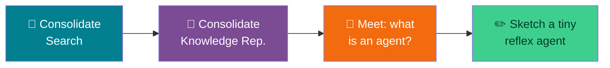

# 🧘 Consolidation & Agent Warm-Up — Week 6 Buffer (CSE 276)

### *Doubt-Clearing on Search & Knowledge Representation → A Light Primer on Agents, Before Project 4 Builds One*

> **What today is (and isn't):** this is a buffer week — no new build, no benchmark harness, no troubleshooting marathon. Half the session is yours: bring whatever from Weeks 3–5 (BFS/DFS, Hill Climbing/A\*, expert systems, KR) is still fuzzy, and we'll work through it together using the checklists below as a starting point. The second half is a short, code-light primer on **agents** — just enough vocabulary and one tiny example so Week 7's full build doesn't start from zero.

> 💻 **Runtime:** Google Colab → CPU (default). Today's one code cell is a handful of lines; nothing to upload.

**Session plan (≈90 minutes, lighter than a full practical):**

| Time | Block | Focus |
|------|-------|-------|
| 🕛 0:00 – 0:20 | **Consolidate** | Search — BFS, DFS, Hill Climbing, A\* |
| 🕧 0:20 – 0:40 | **Consolidate** | Knowledge Representation — rules, frames, logic |
| 🕐 0:40 – 0:55 | **Primer** | What is an agent? PEAS, agent types, environment properties |
| 🕜 0:55 – 1:15 | **Warm-up** | Sketch a tiny reflex agent — no environment build yet, just the decision logic |
| 🕝 1:15 – 1:30 | **Open Q&A** | Whatever's still unclear, from any week so far |

---

## 🗺️ The Big Picture (Read This First)



---

# 🕛 CONSOLIDATE: SEARCH (0:00 – 0:20)

Work through these as a group. If any answer isn't immediately obvious, that's exactly what this block is for — pull up your Week 3/4 notebook and check.

**Self-check questions:**
- What's the *one-line* structural difference between the BFS and DFS code from Week 3? *(Hint: `queue.popleft()` vs. `stack.pop()`.)*
- Why does BFS guarantee the fewest **hops**, but not the lowest **cost**?
- In Hill Climbing (Week 4), what exactly causes it to stop at a local optimum — and why can't it recover on its own?
- What does it mean for a heuristic to be **admissible**, and what does that property buy A\* that Hill Climbing doesn't get?
- Both BFS and A\* use a frontier structure that holds every undiscovered option. Hill Climbing and DFS don't (DFS discards the "visited" ones, HC discards *everything but the current state*). Why does that difference matter for whether an algorithm can backtrack?

**Most common sticking points from Weeks 3–4:**

| Symptom | Usual cause |
|---------|-------------|
| Traversal order doesn't match a hand-trace | Neighbor order in the adjacency structure differs from the order used on paper |
| An algorithm "succeeds" suspiciously fast | The start state already equals the goal — always print/inspect your start before debugging further |
| A* or BFS never terminates | A missing/broken guard against re-adding already-finalized states to the frontier |
| Hill Climbing "fails" on an easy-looking case | Working as intended — a local optimum can happen on any puzzle, easy or hard; that unpredictability is the whole lesson |

---

# 🕧 CONSOLIDATE: KNOWLEDGE REPRESENTATION (0:20 – 0:40)

**Self-check questions:**
- Forward chaining (Week 5) relies on one loop, repeated until something stops changing. What's the loop doing each pass, and what condition ends it?
- In a frame system, how does a *specific* concept's own slot "win" over a slot it would otherwise inherit from a parent? Walk through the Penguin/Bird example from memory.
- Give one more example (not from the Week 5 notebook) of a "default + exception" pair — a general rule and a specific thing that breaks it.
- Semantic nets, frames, and logic all encoded the *same* animal knowledge in Week 5. What was actually different between them — the facts, or just the notation?

**Most common sticking points from Week 5:**

| Symptom | Usual cause |
|---------|-------------|
| A rule that "should" fire doesn't | A fact name typo — set membership is exact-string-match only, no fuzzy matching |
| `get_slot()` returns `None` unexpectedly | The property genuinely isn't defined anywhere up the `is_a` chain — check whether it should be |
| Frame answer and logic-fact answer disagree for the same concept | The two were edited separately and now hold different information — they need to be kept in sync by hand |

**If you have time:** pick one rule from your Week 5 rule base and one frame from the animal KB, and trace both by hand on the whiteboard/paper — no code needed, just to confirm the mental model is solid before it gets reused (with much more moving parts) starting next week.

---

# 🕐 PRIMER: WHAT IS AN AGENT? (0:40 – 0:55)

*(Lecture-style — this is new material, but light. Week 7 is where it becomes code.)*

### An agent, in one sentence

An **agent** is anything that perceives its environment through **sensors** and acts on that environment through **actuators**. That's it — a thermostat, a chess program, and a self-driving car are all agents by this definition, just wildly different in sophistication.

### PEAS: how to describe *any* agent task precisely

| Element | Meaning | Example — a robot vacuum |
|---|---|---|
| **P**erformance measure | How do we score success? | Amount of dirt cleaned per unit of time/energy used |
| **E**nvironment | What world does it operate in? | A room (or grid of rooms) with dirt and obstacles |
| **A**ctuators | What can it *do*? | Move, turn, suck |
| **S**ensors | What can it *perceive*? | Dirt detector, bump sensor, location |

### Four classic agent types

| Type | How it decides | Limitation |
|---|---|---|
| **Simple reflex** | Acts purely on the *current* percept — no memory at all | Can't handle situations where the right action depends on history |
| **Model-based reflex** | Keeps an internal model/state (e.g. "what have I already seen?") and uses it alongside the current percept | Model only tracks what it's explicitly designed to track |
| **Goal-based** | Chooses actions that lead toward an explicit goal — this is where Weeks 3–4's search comes back | Needs a way to search/plan, which can be expensive |
| **Utility-based** | Like goal-based, but ranks *multiple* ways of reaching the goal by how "good" each one is, not just whether it works | Needs a well-designed utility function, which is often the hard part |

### Environment properties — the vocabulary for describing *where* an agent operates

| Property | Meaning |
|---|---|
| **Fully vs. partially observable** | Can the agent see the entire relevant state at once, or only part of it? |
| **Deterministic vs. stochastic** | Does the same action always produce the same result? |
| **Episodic vs. sequential** | Are decisions independent of each other, or does the current one affect future ones? |
| **Static vs. dynamic** | Can the environment change while the agent is deciding what to do? |
| **Discrete vs. continuous** | Is there a finite, countable set of states/actions, or an infinite continuum? |
| **Single-agent vs. multi-agent** | Is this agent alone, or sharing the environment with others (Week 7's second half)? |

---

# 🕜 WARM-UP (0:55 – 1:15): Sketch a Tiny Reflex Agent

## Goal: the decision logic only — no environment simulation loop yet, that's next week

### Classic example: the two-room vacuum world

```python
def reflex_vacuum_agent(location, status):
    """
    A SIMPLE REFLEX agent: the action depends ONLY on what it perceives
    right now (location + dirt status) — nothing about the past matters.
    """
    if status == "Dirty":
        return "Suck"
    return "Right" if location == "A" else "Left"

def simulate(steps=6):
    world = {"A": "Dirty", "B": "Dirty"}
    location = "A"
    for t in range(steps):
        status = world[location]
        action = reflex_vacuum_agent(location, status)
        print(f"t={t}: at {location}, perceives '{status}' -> action: {action}")
        if action == "Suck":
            world[location] = "Clean"
        elif action == "Right":
            location = "B"
        elif action == "Left":
            location = "A"

simulate()
```

> 🧠 **Notice what's missing on purpose:** this agent has no memory of anywhere it's been. It works fine in a world with exactly 2 rooms, but drop it into Week 7's larger grid and it has no way to guarantee full coverage — it would just react forever with no sense of progress. Next week's agent adds exactly one thing to fix that: an internal model of the grid it's exploring. That single addition is what turns this into a **model-based reflex agent**.

---

# 🕝 OPEN Q&A (1:15 – 1:30)

Bring anything from Weeks 3–5 that's still unclear. If the room runs out of questions early, use the extra time to actually build and run the `simulate()` cell above with a modified `world` (try 3 rooms instead of 2 — notice the simple reflex agent's logic doesn't even generalize to that without being rewritten, which is itself worth discussing).

---

### 👀 Preview of What's Next

Week 7 turns the warm-up above into a real build: **Practical 5** puts a model-based agent into a simulated grid environment it has to fully explore, and **Practical 6** puts *multiple* agents into that same grid — first with no coordination (watch it go badly, the same way Hill Climbing did in Week 4), then with a simple coordination strategy that fixes it.
