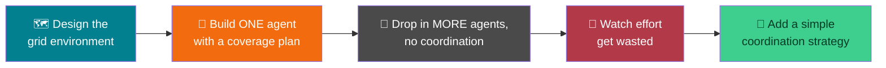

# 🤖 Agents in a Simulated World — Week 7 Practical (CSE 276)

### *Practical 5: Build an Autonomous Agent in a Simulated Environment → Practical 6: Multi-Agent Simulation — Cooperation and Coordination, using Python + Matplotlib (all in Google Colab)*

> **What we're building today:** Week 6 gave you the vocabulary — PEAS, agent types, environment properties — and one tiny reflex agent with no memory. Today that agent gets a body: a **grid world** it has to explore and clean, and an internal model that guarantees full coverage. Then, in Practical 6, you'll drop *multiple* copies of that agent into the same grid and watch what happens with no coordination — before fixing it with a simple strategy that actually cooperates.

> 🧑‍🎓 **This is Project 4.** It reuses Week 6's PEAS framing directly: today's grid world is a fully specified environment (Performance, Environment, Actuators, Sensors), and today's agent is explicitly a **model-based reflex agent** — reflex because it still just reacts to its current cell, model-based because it also consults an internal plan built from knowing the grid's shape.

> 💻 **Runtime:** Google Colab → CPU (default). No files to upload — the grid world is generated in code.

**Session plan (≈120 minutes, back-to-back):**

| Time | Block | Focus |
|------|-------|-------|
| 🕛 0:00 – 0:10 | **Recap** | Week 6's PEAS framework and agent types, applied to today's task |
| 🕧 0:10 – 0:25 | **Bridge** | Designing a simulated environment; why pure reflex isn't enough for full coverage |
| 🕐 0:25 – 1:00 | **Practical 5** | Build a single model-based agent that fully explores and cleans a grid |
| 🕜 1:00 – 1:40 | **Practical 6** | Multi-agent: naive (uncoordinated) vs. coordinated cleaning |
| 🕝 1:40 – 1:55 | **Benchmark Harness** | Compare across grid sizes and agent counts — steps, makespan, waste |
| 🕞 1:55 – 2:00 | **Wrap-up** | Recap, save your simulation, preview of what's next |
| ➕ Extra | **Extend It** | Optional deeper exercises if we move faster than expected |

---

## 🗺️ The Big Picture (Read This First)



**The one idea to hold onto all session:** more agents is not automatically better. Without a way to know what the *other* agents have already done, extra agents can do nothing but repeat each other's work — exactly like Hill Climbing repeating a mistake it has no memory of. Coordination isn't an optional nicety; it's the difference between "more agents" and "more waste."

---

## 📋 What You'll Need

1. Your Google account + a fresh (or continued) Colab notebook
2. Nothing to upload — the grid environment is generated in code
3. Your Week 6 warm-up code (`reflex_vacuum_agent`) — not required today, but a useful comparison point

---

# 🕛 RECAP (0:00 – 0:10)

### 0.1 — PEAS for today's task

| Element | Today's grid-cleaning task |
|---|---|
| **P**erformance measure | Dirt cleaned, relative to steps taken (efficiency) — and, for multiple agents, **makespan** (time until the *last* agent finishes) |
| **E**nvironment | A grid of cells, each either dirty or clean |
| **A**ctuators | Move to the next planned cell, suck if dirty |
| **S**ensors | Perceive whether the *current* cell is dirty; the agent also **knows the grid's dimensions** in advance — that's its "model" |

### 0.2 — Setup

```python
import random
import math
import matplotlib.pyplot as plt

def make_grid(rows, cols, dirty_fraction=0.4, seed=None):
    """Each cell is independently dirty with probability `dirty_fraction`."""
    rng = random.Random(seed)
    return [[rng.random() < dirty_fraction for _ in range(cols)] for _ in range(rows)]

def draw_grid(grid, title=""):
    rows, cols = len(grid), len(grid[0])
    fig, ax = plt.subplots(figsize=(max(cols, 3), max(rows, 3)))
    for r in range(rows):
        for c in range(cols):
            color = "saddlebrown" if grid[r][c] else "white"
            ax.add_patch(plt.Rectangle((c, rows - 1 - r), 1, 1, facecolor=color, edgecolor="gray"))
    ax.set_xlim(0, cols); ax.set_ylim(0, rows)
    ax.set_xticks([]); ax.set_yticks([]); ax.set_aspect("equal")
    ax.set_title(title, fontsize=11)
    plt.show()

demo_grid = make_grid(5, 5, dirty_fraction=0.4, seed=1)
draw_grid(demo_grid, title="Starting grid (brown = dirty)")
```

---

# 🕧 BRIDGE (0:10 – 0:25): Designing the Environment

*(Discussion + light typing — sets up both practicals.)*

### 1.1 — Why a pure reflex agent isn't enough here

Week 6's `reflex_vacuum_agent` decided its next move from *only* its current room and status. That worked in a 2-room world with hardcoded left/right logic — but it has no way to generalize to an arbitrary grid, and worse, nothing stops it from revisiting the same clean cells forever with no sense of progress. To *guarantee* full coverage, the agent needs an internal model: a plan, built once from knowing the grid's dimensions, that it then follows step by step. That one addition — a stored plan — is what makes it a **model-based reflex agent** instead of a simple one.

### 1.2 — The plan: a boustrophedon ("ox-turning") sweep

The simplest guaranteed-full-coverage plan is the same pattern a lawnmower or an actual robot vacuum often uses: sweep each row fully in one direction, then the next row in the opposite direction — like an ox plowing a field.


```python
def boustrophedon_path(rows, cols):
    """A snake-shaped path that visits every cell in the grid exactly once."""
    path = []
    for r in range(rows):
        col_order = range(cols) if r % 2 == 0 else range(cols - 1, -1, -1)
        for c in col_order:
            path.append((r, c))
    return path

path_preview = boustrophedon_path(3, 4)
print(path_preview)
```

> 🔑 Reversing direction every other row means the agent never has to "teleport" back to the start of a row — every step in the plan is a legal one-cell move, exactly like `get_neighbors()` from Week 4's puzzle world.

### 1.3 — Environment properties, applied

Using Week 6's vocabulary: this grid world is **discrete** (a finite grid of cells), **static** for a single agent (dirt doesn't move on its own), and **deterministic** (sucking a dirty cell always cleans it). As soon as Practical 6 adds more agents, it also becomes a genuinely **multi-agent** environment — and, without coordination, effectively **dynamic** from any one agent's point of view, since the grid can change between one of its steps and the next because of what another agent just did.

---

# 🕐 PRACTICAL 5 (0:25 – 1:00): A Single Model-Based Agent

## Goal: an agent that follows its internal plan, cleaning every dirty cell it passes exactly once

### 2.1 — Write `run_single_agent()`

```python
def run_single_agent(grid):
    """
    Follows a full boustrophedon sweep of the grid, sucking any dirty cell
    it passes. Returns the cleaned grid, how much dirt was removed, how
    many steps it took, and a step-by-step trace for instrumentation.
    """
    rows, cols = len(grid), len(grid[0])
    working_grid = [row[:] for row in grid]   # never mutate the original
    path = boustrophedon_path(rows, cols)

    cleaned = 0
    trace = []
    for (r, c) in path:
        if working_grid[r][c]:
            working_grid[r][c] = False
            cleaned += 1
            trace.append((r, c, "Suck"))
        else:
            trace.append((r, c, "Move"))

    return working_grid, cleaned, len(path), trace
```

> 🔍 **Compare this to Week 3's `bfs_route`:** there's no `visited` set here, because the plan (`path`) already guarantees every cell is visited exactly once — the "have I been here before" question is answered by construction, not by tracking. That's a direct benefit of planning ahead instead of reacting step by step.

### 2.2 — Run it

```python
final_grid, cleaned, steps, trace = run_single_agent(demo_grid)

print(f"Dirt cleaned: {cleaned}")
print(f"Steps taken: {steps}")
print(f"Efficiency (cleaned / steps): {cleaned/steps:.2f}")

draw_grid(demo_grid, title="Before")
draw_grid(final_grid, title="After single agent")
```

> 🧪 **Before running:** count the brown cells in `demo_grid` by eye. That count should exactly match `cleaned` — if it doesn't, something in `run_single_agent` isn't checking every cell.

### 2.3 — Instrument it: coverage vs. waste

```python
rows, cols = len(demo_grid), len(demo_grid[0])
total_dirty = sum(row.count(True) for row in demo_grid)

print(f"Grid size: {rows}x{cols} = {rows*cols} cells")
print(f"Total dirty at start: {total_dirty}")
print(f"Steps taken: {steps}  (always equals rows × cols, regardless of dirt level)")
```

> 🧠 **Why this matters:** notice `steps` is *always* `rows*cols`, whether the grid started 10% dirty or 90% dirty. Guaranteed full coverage has a fixed cost — this agent never takes a shortcut, even on an almost-clean grid. A smarter design (using Week 4's A\*-style planning to route only to *known* dirty cells) could do better, at the cost of needing to sense dirt from a distance rather than only on arrival. Keep that trade-off in mind — it's exactly the kind of design decision real robotics teams make.

### 2.4 — 🎮 Your turn: try 3 more grids

```python
for seed in [10, 11, 12]:
    g = make_grid(6, 6, dirty_fraction=0.3, seed=seed)
    _, cleaned, steps, _ = run_single_agent(g)
    print(f"seed={seed}: cleaned={cleaned}/{steps} cells, efficiency={cleaned/steps:.2f}")
```

> 🧪 **~10 minutes.** Try a much larger grid (`make_grid(10, 10, ...)`) — steps should scale exactly with `rows*cols`. Try `dirty_fraction=0.05` — efficiency should drop sharply, since most of the sweep is now "wasted" moving over already-clean cells. That's the shortcut opportunity from 2.3, made concrete.

---

## 🛠️ Troubleshooting — Practical 5

| Symptom | Likely cause | Fix |
|---------|-------------|-----|
| `cleaned` doesn't match the visible dirty-cell count | `run_single_agent` was called on the wrong grid, or `working_grid` wasn't copied (mutating the original) | Confirm `working_grid = [row[:] for row in grid]` — a plain `= grid` would alias the same list |
| `steps` isn't `rows*cols` | `boustrophedon_path` isn't visiting every cell — usually an off-by-one in the `range()` calls | Print `len(boustrophedon_path(rows, cols))` directly and compare to `rows*cols` |
| `draw_grid` shows a flipped or mirrored grid | Row 0 is being drawn at the bottom instead of the top, or vice versa | Check the `rows - 1 - r` term in `draw_grid` — that's what makes row 0 appear at the top of the plot |
| Efficiency is always exactly `dirty_fraction` | Expected, actually — on a grid with uniformly random dirt, cleaned/steps should converge toward the dirty fraction as grid size grows | Not a bug; try a very small grid to see more variance from randomness |

---

# 🕜 PRACTICAL 6 (1:00 – 1:40): Multi-Agent — Coordination Matters

## Same grid, more agents — first badly, then well

### 3.1 — Naive multi-agent: no coordination at all

```python
def run_naive_multi_agent(grid, num_agents):
    """
    Each agent independently runs the FULL boustrophedon sweep, one after
    another, with no awareness that any other agent exists or has already
    cleaned anything. This is the "no coordination" baseline.
    """
    rows, cols = len(grid), len(grid[0])
    shared_grid = [row[:] for row in grid]
    path = boustrophedon_path(rows, cols)

    total_steps = 0
    total_cleaned = 0
    for agent_id in range(num_agents):
        for (r, c) in path:
            total_steps += 1
            if shared_grid[r][c]:
                shared_grid[r][c] = False
                total_cleaned += 1

    return shared_grid, total_cleaned, total_steps
```

### 3.2 — Run it and watch the waste

```python
for n in [1, 2, 4]:
    _, cleaned, steps = run_naive_multi_agent(demo_grid, num_agents=n)
    print(f"num_agents={n}: cleaned={cleaned}, total steps taken={steps}")
```

> 🧠 **What you should see:** `cleaned` stays exactly the same no matter how many agents you add — the first agent already got everything there was to get. But `total_steps` climbs *linearly* with `num_agents`, because every extra agent still walks the entire grid, contributing nothing but wasted movement. This is the multi-agent equivalent of Hill Climbing getting stuck last week: predictable, and directly caused by a missing piece of information (here, "what has already been cleaned").

### 3.3 — Coordinated multi-agent: partition the work

```python
def partition_path(path, num_agents):
    """Split the full coverage path into num_agents contiguous chunks — one per agent."""
    chunk_size = math.ceil(len(path) / num_agents)
    return [path[i*chunk_size : (i+1)*chunk_size] for i in range(num_agents)]

def run_coordinated_multi_agent(grid, num_agents):
    """
    Each agent is assigned its OWN slice of the grid up front — no two
    agents ever visit the same cell. This is coordination via a simple,
    fixed division of labor, decided before anyone starts moving.
    """
    rows, cols = len(grid), len(grid[0])
    shared_grid = [row[:] for row in grid]
    path = boustrophedon_path(rows, cols)
    chunks = partition_path(path, num_agents)

    agent_steps = []
    total_cleaned = 0
    for chunk in chunks:
        steps = 0
        for (r, c) in chunk:
            steps += 1
            if shared_grid[r][c]:
                shared_grid[r][c] = False
                total_cleaned += 1
        agent_steps.append(steps)

    makespan = max(agent_steps) if agent_steps else 0   # agents work in parallel — time = the SLOWEST one
    return shared_grid, total_cleaned, agent_steps, makespan, chunks
```

### 3.4 — Run it and visualize the division of labor

```python
final_grid, cleaned, agent_steps, makespan, chunks = run_coordinated_multi_agent(demo_grid, num_agents=4)

print(f"Total cleaned: {cleaned}")
print(f"Steps per agent: {agent_steps}")
print(f"Makespan (time to finish, working in parallel): {makespan}")

def draw_partition(rows, cols, chunks, title=""):
    colors = plt.cm.tab10.colors
    color_grid = [[None]*cols for _ in range(rows)]
    for agent_id, chunk in enumerate(chunks):
        for (r, c) in chunk:
            color_grid[r][c] = colors[agent_id % len(colors)]

    fig, ax = plt.subplots(figsize=(max(cols, 3), max(rows, 3)))
    for r in range(rows):
        for c in range(cols):
            ax.add_patch(plt.Rectangle((c, rows-1-r), 1, 1, facecolor=color_grid[r][c], edgecolor="white"))
    ax.set_xlim(0, cols); ax.set_ylim(0, rows)
    ax.set_xticks([]); ax.set_yticks([]); ax.set_aspect("equal")
    ax.set_title(title, fontsize=11)
    plt.show()

rows, cols = len(demo_grid), len(demo_grid[0])
draw_partition(rows, cols, chunks, title="Grid partitioned by agent (coordinated)")

plt.figure(figsize=(6, 4))
plt.bar(range(len(agent_steps)), agent_steps, color="steelblue")
plt.axhline(makespan, color="red", linestyle="--", label=f"makespan = {makespan}")
plt.xlabel("Agent ID"); plt.ylabel("Steps taken"); plt.legend()
plt.title("Coordinated strategy: steps per agent")
plt.show()
```

### 3.5 — Compare naive vs. coordinated directly

```python
_, naive_cleaned, naive_steps = run_naive_multi_agent(demo_grid, num_agents=4)
_, coord_cleaned, coord_agent_steps, coord_makespan, _ = run_coordinated_multi_agent(demo_grid, num_agents=4)

print(f"{'Metric':<28}{'Naive (4 agents)':<20}{'Coordinated (4 agents)':<24}")
print("-" * 72)
print(f"{'Dirt cleaned':<28}{naive_cleaned:<20}{coord_cleaned:<24}")
print(f"{'Total actuator steps':<28}{naive_steps:<20}{sum(coord_agent_steps):<24}")
print(f"{'Time to finish (makespan)':<28}{naive_steps:<20}{coord_makespan:<24}")
```

> 🎯 **What this table proves:** both strategies clean the same amount of dirt (all of it). But naive coordination wastes total effort 4x over for zero benefit, *and* still takes just as long as one agent alone, since it processes agents one after another. Coordination cleans the same grid using the same total number of steps as a single agent overall — just divided across agents, so the **time to finish drops** roughly in proportion to how many agents you add.

---

## 🛠️ Troubleshooting — Practical 6

| Symptom | Likely cause | Fix |
|---------|-------------|-----|
| `run_naive_multi_agent`'s `cleaned` value changes with `num_agents` | It shouldn't — if it does, `shared_grid` is probably being reset inside the agent loop instead of once outside it | Re-check indentation: `shared_grid = [row[:] for row in grid]` must run once, before the `for agent_id` loop |
| `agent_steps` has fewer than `num_agents` entries | `partition_path` produced an empty chunk — happens when `num_agents` is large relative to the grid size | Not necessarily a bug — an agent assigned an empty chunk legitimately has 0 steps; try a bigger grid or fewer agents to avoid it |
| `draw_partition` shows unfilled (white) cells | A cell wasn't included in any chunk — usually an off-by-one in `partition_path`'s slicing | Confirm `sum(len(c) for c in chunks) == len(path)` — every cell should belong to exactly one chunk |
| Makespan doesn't shrink much as `num_agents` increases | Expected once `num_agents` exceeds what's useful for the grid size — a 3x3 grid has only 9 cells to divide, so a 5th agent contributes nothing | Try a larger grid (e.g. `make_grid(10, 10, ...)`) where there's more work to actually divide |

---

# 🕝 BENCHMARK HARNESS (1:40 – 1:55): Coordination at Scale

## Same idea as every previous week's benchmark table — vary the conditions, tabulate honestly

```python
def run_benchmark(grid_sizes, agent_counts, dirty_fraction=0.4, seed=7):
    rows_out = []
    for size in grid_sizes:
        grid = make_grid(size, size, dirty_fraction=dirty_fraction, seed=seed)
        for n in agent_counts:
            _, naive_cleaned, naive_steps = run_naive_multi_agent(grid, num_agents=n)
            _, coord_cleaned, coord_agent_steps, coord_makespan, _ = run_coordinated_multi_agent(grid, num_agents=n)
            rows_out.append({
                "grid": f"{size}x{size}",
                "agents": n,
                "naive_total_steps": naive_steps,
                "coord_makespan": coord_makespan,
                "coord_total_steps": sum(coord_agent_steps),
            })
    return rows_out

results = run_benchmark(grid_sizes=[5, 8], agent_counts=[1, 2, 4])

print(f"{'Grid':<8}{'Agents':<9}{'Naive steps':<14}{'Coord makespan':<17}{'Coord total steps':<19}")
print("-" * 67)
for r in results:
    print(f"{r['grid']:<8}{r['agents']:<9}{r['naive_total_steps']:<14}{r['coord_makespan']:<17}{r['coord_total_steps']:<19}")
```

> 🎯 **This table is your Project 4 deliverable in miniature.** Save it. The pattern to point out in a report: `naive_total_steps` scales linearly with `agents` (bad — wasted effort), `coord_makespan` shrinks as `agents` grows (good — the actual benefit of cooperation), and `coord_total_steps` barely changes with `agents` at all, since the *total* work is the same, just divided differently.

---

## 🚀 Extend It (Buffer content — use if we're ahead of schedule)

1. **Collision avoidance:** the coordinated strategy assumes agents never physically interfere with each other. Add a check that no two agents can be in the *same* cell at the *same* timestep (you'll need to simulate step-by-step in lockstep rather than chunk-by-chunk to make this meaningful) — what has to change?
2. **Dynamic re-dirtying:** after the grid is fully cleaned, randomly re-dirty a few cells each timestep (a genuinely **dynamic** environment, per Week 6's vocabulary). Does the fixed boustrophedon plan still make sense, or would a reactive "go to the nearest new dirt" agent do better?
3. **Utility-based prioritization:** instead of a fixed sweep order, have agents prioritize the *dirtiest region* of the grid first (e.g. divide the grid into quadrants, count dirty cells per quadrant, send the first agent to the dirtiest one). Compare makespan against the naive fixed partition.
4. **Uneven partitioning:** `partition_path` currently splits work into equal-sized chunks. If some agents are faster than others (add a `speed` multiplier), how would you rebalance the chunks so makespan is still minimized?
5. **Real communication:** replace the up-front partition with agents that check a **shared "claimed" set** in real time — each agent looks at the shared set, picks the nearest unclaimed dirty cell, claims it, then moves. Compare this against the fixed-partition strategy on a grid with very unevenly distributed dirt.

---

# 🕞 WRAP-UP (1:55 – 2:00)

### ✅ What You Learned Today

- 🤖 Built a **model-based reflex agent**: it still only reacts to its current cell, but an internal plan (the boustrophedon sweep) guarantees full coverage — something Week 6's memoryless reflex agent couldn't do
- 🐍 Reused Week 6's **PEAS framework** to precisely specify today's task before writing any code
- 👥 Built a **naive multi-agent** baseline and watched it waste effort linearly with agent count, for zero extra benefit — the multi-agent version of Week 4's local optimum
- 🤝 Built a **coordinated multi-agent** strategy (fixed partitioning) and measured a real speedup via **makespan**, with no wasted steps
- 📏 Learned to separate **total effort** (sum of every agent's steps) from **time to finish** (makespan, the slowest agent) — two different performance measures that tell different stories
- 📊 Built a **benchmark harness** across grid sizes and agent counts — your first evidence that "coordination," not "more agents," is what actually buys speed

### 👀 Preview of What's Next

Weeks 3–7 have all been about hand-built logic — search algorithms, expert-system rules, agent plans — all designed by you, rule by rule. Week 8 turns to a different approach entirely: **machine learning**, where a program figures out patterns from data instead of being told them directly. You'll compare **supervised learning** (learning from labeled examples) against **unsupervised learning** (finding structure with no labels at all) on the same dataset.

> Save your notebook (`File → Save a copy in Drive`) with `boustrophedon_path`, `run_single_agent`, `run_naive_multi_agent`, and `run_coordinated_multi_agent` intact.

---

## 🧰 Quick Reference Card — Full Session

```python
# ── ENVIRONMENT ──
import random, math

def make_grid(rows, cols, dirty_fraction=0.4, seed=None):
    rng = random.Random(seed)
    return [[rng.random() < dirty_fraction for _ in range(cols)] for _ in range(rows)]

def boustrophedon_path(rows, cols):
    path = []
    for r in range(rows):
        col_order = range(cols) if r % 2 == 0 else range(cols - 1, -1, -1)
        for c in col_order:
            path.append((r, c))
    return path

# ── SINGLE AGENT ──
def run_single_agent(grid):
    rows, cols = len(grid), len(grid[0])
    working_grid = [row[:] for row in grid]
    path = boustrophedon_path(rows, cols)
    cleaned = 0
    for (r, c) in path:
        if working_grid[r][c]:
            working_grid[r][c] = False
            cleaned += 1
    return working_grid, cleaned, len(path)

# ── NAIVE MULTI-AGENT (no coordination) ──
def run_naive_multi_agent(grid, num_agents):
    rows, cols = len(grid), len(grid[0])
    shared_grid = [row[:] for row in grid]
    path = boustrophedon_path(rows, cols)
    total_steps, total_cleaned = 0, 0
    for _ in range(num_agents):
        for (r, c) in path:
            total_steps += 1
            if shared_grid[r][c]:
                shared_grid[r][c] = False
                total_cleaned += 1
    return shared_grid, total_cleaned, total_steps

# ── COORDINATED MULTI-AGENT (partitioned) ──
def partition_path(path, num_agents):
    chunk_size = math.ceil(len(path) / num_agents)
    return [path[i*chunk_size:(i+1)*chunk_size] for i in range(num_agents)]

def run_coordinated_multi_agent(grid, num_agents):
    rows, cols = len(grid), len(grid[0])
    shared_grid = [row[:] for row in grid]
    chunks = partition_path(boustrophedon_path(rows, cols), num_agents)
    agent_steps, total_cleaned = [], 0
    for chunk in chunks:
        steps = 0
        for (r, c) in chunk:
            steps += 1
            if shared_grid[r][c]:
                shared_grid[r][c] = False
                total_cleaned += 1
        agent_steps.append(steps)
    makespan = max(agent_steps) if agent_steps else 0
    return shared_grid, total_cleaned, agent_steps, makespan, chunks
```

| Concept | One-liner |
|---------|-----------|
| **PEAS** | Performance measure, Environment, Actuators, Sensors — the four things that fully specify an agent's task |
| **Model-based reflex agent** | Reacts to the current percept, but also consults an internal model/plan built from prior knowledge |
| **Makespan** | Time until the *slowest* agent finishes — the right performance measure for parallel work |
| **Coordination via partitioning** | Divide the work up front so no two agents ever redo the same thing |
| **Uncoordinated multi-agent** | More agents ≠ more results — without shared awareness, extra agents can only duplicate effort |
| **Golden rule of today** | Cooperation isn't "more agents." It's agents that know what the others have already done. |
