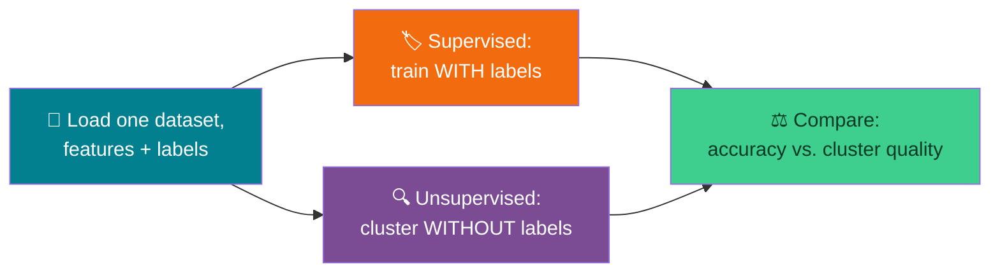

# 📊 Supervised vs. Unsupervised Learning — Week 8 Practical (CSE 276)

### *Practical 7: Comparative Study — a Classifier That Learns From Labels vs. a Clustering Method That Doesn't → Optional Buffer: A Conceptual First Look at CNNs and RNNs, using Python + scikit-learn + Matplotlib (all in Google Colab)*

> **What we're building today:** Weeks 3–7 were all hand-built intelligence — you wrote every rule, every heuristic, every agent's plan yourself. Today that changes. **Machine learning** means a program finds its own patterns from data. You'll train a **supervised** model (which learns from labeled examples: "here's the answer for each case") and an **unsupervised** model (which gets no answers at all, and has to find structure on its own) on the *same* dataset, then compare what each one actually learned.

> 🧑‍🎓 **This is Project 5.** For the first time this course, you're not writing the decision logic by hand — you're choosing an algorithm and letting it learn the logic from examples. Everything before today asked "how do I search/reason/plan?" Today asks "how do I learn?"

> 💻 **Runtime:** Google Colab → CPU (default). `scikit-learn` and `matplotlib` come pre-installed in Colab — no setup needed. The optional buffer section uses `tensorflow`, also pre-installed.

**Session plan (≈120 minutes, back-to-back):**

| Time | Block | Focus |
|------|-------|-------|
| 🕛 0:00 – 0:10 | **Recap** | From hand-built logic to learned logic — what actually changes |
| 🕧 0:10 – 0:25 | **Bridge** | Meet the dataset; supervised vs. unsupervised, defined precisely |
| 🕐 0:25 – 1:00 | **Practical 7a** | Train and evaluate a supervised classifier |
| 🕜 1:00 – 1:35 | **Practical 7b** | Run and evaluate unsupervised clustering on the same data |
| 🕝 1:35 – 1:50 | **Comparative Benchmark** | Accuracy vs. cluster quality, across settings, side by side |
| 🕞 1:50 – 2:00 | **Optional Buffer** | A 10-minute conceptual look at CNN/RNN architectures — no training, just structure |
| ➕ Extra | **Extend It** | Optional deeper exercises if we move faster than expected |

---

## 🗺️ The Big Picture (Read This First)



**The one idea to hold onto all session:** both paradigms today see the *exact same* input features. The only difference is whether the true labels were available during training. Supervised learning is graded against an answer key the whole time; unsupervised learning never sees the answer key at all, and we only check it against the labels *afterward*, purely to evaluate how well it did — the algorithm itself never used them.

---

## 📋 What You'll Need

1. Your Google account + a fresh (or continued) Colab notebook
2. Nothing to upload — today's dataset (Iris) ships built into scikit-learn
3. No prior ML experience assumed — every new concept (train/test split, accuracy, clustering) is introduced before it's used

---

# 🕛 RECAP (0:00 – 0:10)

### 0.1 — What's actually changing today

Every algorithm so far — BFS, A\*, forward chaining, the boustrophedon agent — was **you** encoding exactly what should happen in every situation. That works well when you can *state* the logic clearly (a heuristic formula, a set of IF-THEN rules, a coverage plan). It works badly when the "right answer" is something you can recognize but struggle to write down as an explicit rule — like "is this flower species A, B, or C, based on its measurements?" Machine learning is the answer to that second kind of problem: show the program many labeled examples, and let it find the pattern itself.

### 0.2 — Setup

```python
from sklearn.datasets import load_iris
from sklearn.model_selection import train_test_split
from sklearn.neighbors import KNeighborsClassifier
from sklearn.cluster import KMeans
from sklearn.metrics import accuracy_score, confusion_matrix, adjusted_rand_score
import matplotlib.pyplot as plt

print("scikit-learn is ready — no installation needed in Colab.")
```

---

# 🕧 BRIDGE (0:10 – 0:25): Meet the Dataset, Meet the Two Paradigms

*(Discussion + light typing — sets up both practicals.)*

### 1.1 — The Iris dataset

A classic, small, well-behaved dataset: 150 flowers, each measured on 4 features (sepal length, sepal width, petal length, petal width), each belonging to one of 3 species. It's popular for teaching precisely because it's small enough to fully understand and visualize, yet has real, learnable structure.

```python
iris = load_iris()
X = iris.data          # shape: (150, 4) — the 4 measurements per flower
y = iris.target         # shape: (150,)  — the true species, 0/1/2

print("Feature names:", iris.feature_names)
print("Species names:", iris.target_names)
print("Number of samples:", X.shape[0])
print("First flower's measurements:", X[0])
print("First flower's true species:", iris.target_names[y[0]])
```

### 1.2 — Supervised vs. unsupervised, precisely

| | **Supervised learning** | **Unsupervised learning** |
|---|---|---|
| Sees labels during training? | Yes — every example comes with the correct answer | No — only the raw features |
| Goal | Learn a mapping from features → label that generalizes to new examples | Discover structure/groupings in the data on its own |
| Today's algorithm | k-Nearest Neighbors (kNN) classification | k-Means clustering |
| How we evaluate it | Accuracy against held-out true labels | Compare discovered groups to true labels — but only *after* the fact, for our own evaluation, not for training |

### 1.3 — Why we split data into train and test sets

If we let a model see *every* example during training and then test it on those same examples, of course it'll do well — that tells us nothing about whether it actually learned a generalizable pattern, versus just memorizing. So we hold out a **test set** the model never sees during training, and only check performance on that.

```python
X_train, X_test, y_train, y_test = train_test_split(X, y, test_size=0.3, random_state=42, stratify=y)
print(f"Training examples: {len(X_train)}")
print(f"Test examples: {len(X_test)}")
```

> 🔑 `stratify=y` keeps the species proportions roughly equal in both the train and test sets — without it, a random split could accidentally put almost all of one species into the test set alone.

---

# 🕐 PRACTICAL 7a (0:25 – 1:00): Supervised Learning

## Goal: train a classifier on labeled examples, then measure how well it generalizes to unseen ones

### 2.1 — Train a k-Nearest Neighbors classifier

```python
def train_knn(X_train, y_train, k=5):
    """
    kNN classifies a new point by looking at its k closest neighbors in the
    training set and taking a majority vote among their labels. No explicit
    rule is written anywhere — the "rule" IS the training data itself.
    """
    model = KNeighborsClassifier(n_neighbors=k)
    model.fit(X_train, y_train)
    return model

knn = train_knn(X_train, y_train, k=5)
```

### 2.2 — Evaluate on the held-out test set

```python
predictions = knn.predict(X_test)
acc = accuracy_score(y_test, predictions)

print(f"Test accuracy: {acc:.2%}")
print("\nConfusion matrix (rows = true species, columns = predicted species):")
print(confusion_matrix(y_test, predictions))
```

> 🔍 **Reading the confusion matrix:** the diagonal is every correct prediction; anything off the diagonal is a specific kind of mistake (e.g. row 1, column 2 means "true species 1, predicted as species 2"). A strong classifier has a matrix that's almost entirely diagonal.

### 2.3 — Visualize predictions vs. truth

```python
def draw_classification(X_test, y_test, predictions, target_names):
    fig, axes = plt.subplots(1, 2, figsize=(12, 5))
    for ax, labels, title in [(axes[0], y_test, "True species"), (axes[1], predictions, "Predicted species")]:
        scatter = ax.scatter(X_test[:, 2], X_test[:, 3], c=labels, cmap="viridis", s=60, edgecolor="k")
        ax.set_xlabel("Petal length (cm)")
        ax.set_ylabel("Petal width (cm)")
        ax.set_title(title)
    plt.tight_layout()
    plt.show()

draw_classification(X_test, y_test, predictions, iris.target_names)
```

> 🧪 **Before running:** the two plots share the same x/y axes (petal length and width). If the classifier is doing well, the two color patterns should look almost identical. Predict roughly how similar they'll look, then run it and check.

### 2.4 — 🎮 Your turn: try different values of k

```python
for k in [1, 3, 5, 10, 20]:
    model = train_knn(X_train, y_train, k=k)
    acc = accuracy_score(y_test, model.predict(X_test))
    print(f"k={k:<3} accuracy={acc:.2%}")
```

> 🧪 **~10 minutes.** Very small `k` (like `k=1`) can overfit to noise in individual training points; very large `k` can blur over real distinctions between species. Note which `k` performs best on your test set, and think about *why* the extremes underperform.

---

## 🛠️ Troubleshooting — Practical 7a

| Symptom | Likely cause | Fix |
|---------|-------------|-----|
| Accuracy is suspiciously close to 100% | Possibly evaluating on the training set instead of the held-out test set | Confirm `accuracy_score(y_test, ...)` uses `y_test`, not `y_train` |
| `train_test_split` gives a very uneven test set | `stratify=y` was omitted | Add `stratify=y` back into the `train_test_split` call |
| Confusion matrix has unexpected off-diagonal mass between two specific species | Two species probably have genuinely overlapping measurements — a real, common pattern in this dataset, not a bug | Try visualizing those two species alone using `draw_classification` filtered to just their points |
| `draw_classification`'s two plots look nothing alike | A real sign of low accuracy — check the printed `acc` value first before assuming a plotting bug | If accuracy is also low, the issue is model performance, not the visualization code |

---

# 🕜 PRACTICAL 7b (1:00 – 1:35): Unsupervised Learning

## Same features, zero labels — can the structure be found without being told what to look for?

### 3.1 — Run k-Means clustering

```python
def train_kmeans(X, n_clusters=3, seed=42):
    """
    k-Means groups points into n_clusters groups purely by feature similarity —
    it NEVER sees y (the true species) at any point in this function.
    """
    model = KMeans(n_clusters=n_clusters, random_state=seed, n_init=10)
    model.fit(X)
    return model

kmeans = train_kmeans(X, n_clusters=3)
cluster_labels = kmeans.labels_

print("Cluster assignment for the first 10 flowers:", cluster_labels[:10])
print("True species for the first 10 flowers:      ", y[:10])
```

> 🔑 Notice the cluster numbers (`0`, `1`, `2`) have **no inherent meaning** — k-Means has no idea "0" should mean Setosa. It only knows "these points are close together, put them in the same group." Matching cluster numbers to species names is something *we* have to do afterward, which is exactly the next step.

### 3.2 — Make cluster IDs interpretable

```python
def map_clusters_to_labels(cluster_labels, true_labels, n_clusters):
    """
    For each cluster, find the TRUE label that shows up most often inside it,
    and treat that as the cluster's "name." This is purely for evaluation —
    the clustering algorithm itself never used this information.
    """
    mapping = {}
    for cluster_id in range(n_clusters):
        mask = cluster_labels == cluster_id
        if mask.sum() == 0:
            continue
        most_common = pd_mode(true_labels[mask])
        mapping[cluster_id] = most_common
    return mapping

def pd_mode(arr):
    """Simple mode (most frequent value) without needing pandas."""
    values, counts = {}, {}
    for v in arr:
        counts[v] = counts.get(v, 0) + 1
    return max(counts, key=counts.get)

mapping = map_clusters_to_labels(cluster_labels, y, n_clusters=3)
mapped_predictions = [mapping[c] for c in cluster_labels]
print("Cluster ID -> majority true species:", mapping)
```

### 3.3 — Evaluate: two different metrics

```python
mapped_accuracy = accuracy_score(y, mapped_predictions)
ari = adjusted_rand_score(y, cluster_labels)

print(f"Mapped accuracy (using OUR after-the-fact label mapping): {mapped_accuracy:.2%}")
print(f"Adjusted Rand Index (label-mapping-independent):          {ari:.3f}")
```

> 🧠 **Why two metrics?** "Mapped accuracy" depends on our majority-vote mapping being sensible, which can break down if a cluster doesn't cleanly correspond to one species. **Adjusted Rand Index (ARI)** sidesteps that entirely — it measures agreement between two groupings without caring what either one's group numbers are called, and it's corrected so that random guessing scores close to 0. ARI is the fairer, more standard metric for clustering quality; mapped accuracy is more intuitive to read.

### 3.4 — Visualize clusters vs. true species

```python
def draw_clustering(X, true_labels, cluster_labels):
    fig, axes = plt.subplots(1, 2, figsize=(12, 5))
    for ax, labels, title in [(axes[0], true_labels, "True species"), (axes[1], cluster_labels, "k-Means clusters")]:
        ax.scatter(X[:, 2], X[:, 3], c=labels, cmap="viridis", s=50, edgecolor="k")
        ax.set_xlabel("Petal length (cm)")
        ax.set_ylabel("Petal width (cm)")
        ax.set_title(title)
    plt.tight_layout()
    plt.show()

draw_clustering(X, y, cluster_labels)
```

### 3.5 — 🎮 Your turn: try the "wrong" number of clusters

```python
for n in [2, 3, 4]:
    model = train_kmeans(X, n_clusters=n)
    ari = adjusted_rand_score(y, model.labels_)
    print(f"n_clusters={n}: ARI={ari:.3f}")
```

> 🧪 **~10 minutes.** k-Means has no way to know there are "really" 3 species — you have to tell it `n_clusters` up front. Watch ARI drop when you give it the wrong number. This is a genuine limitation of k-Means worth remembering: it always finds *some* grouping, whether or not that number of groups actually matches reality.

---

## 🛠️ Troubleshooting — Practical 7b

| Symptom | Likely cause | Fix |
|---------|-------------|-----|
| `map_clusters_to_labels` throws a `KeyError` later | A cluster ended up empty (`mask.sum() == 0`) and was skipped, but something downstream still expects an entry for it | Rare with `n_clusters=3` on this dataset; if it happens, print `cluster_labels` counts via `pd_mode`-style counting to confirm |
| Mapped accuracy is high but ARI is noticeably lower | Two clusters partially overlap in a way that inflates the simple majority-vote mapping | Trust ARI here — it's the metric less sensitive to this specific distortion |
| Two different runs of `train_kmeans` give different cluster ID numbers for the "same" grouping | Expected — cluster IDs are arbitrary and can shuffle between runs unless `random_state` is fixed | Not a bug, as long as `random_state=seed` is set consistently |
| `draw_clustering`'s two plots look almost identical | A genuinely good sign — it means k-Means rediscovered close to the true species groupings with zero label information | Not a bug; this is the best-case outcome for this dataset |

---

# 🕝 COMPARATIVE BENCHMARK (1:35 – 1:50)

## Same format as every previous week — vary settings, tabulate honestly

```python
print(f"{'Setting':<28}{'Supervised (kNN) accuracy':<28}{'Unsupervised (k-Means) ARI':<28}")
print("-" * 84)

for k in [1, 5, 20]:
    model = train_knn(X_train, y_train, k=k)
    acc = accuracy_score(y_test, model.predict(X_test))
    print(f"{'kNN, k=' + str(k):<28}{acc:<28.2%}{'':<28}")

for n in [2, 3, 4]:
    model = train_kmeans(X, n_clusters=n)
    ari = adjusted_rand_score(y, model.labels_)
    print(f"{'k-Means, n_clusters=' + str(n):<28}{'':<28}{ari:<28.3f}")
```

| | **Supervised (kNN)** | **Unsupervised (k-Means)** |
|---|---|---|
| Needs labeled data to train? | Yes | No |
| What it optimizes | Matching known answers | Grouping similar points together |
| Fails when... | Labels are scarce or expensive to collect | The "natural" number of groups doesn't match what you asked for |
| Real-world example | Spam vs. not-spam email classification, with a labeled training set | Customer segmentation, with no pre-existing customer categories |

> 🎯 **This table is your Project 5 deliverable in miniature.** The headline point to discuss: supervised learning gives a directly interpretable score (accuracy) because there's an answer key; unsupervised learning's evaluation is inherently softer, because "good structure" is closer to a judgment call than a fact — ARI is our best attempt to make that judgment call rigorous, but it still relies on labels existing for evaluation *only*, never for training.

---

# 🕞 OPTIONAL BUFFER (1:50 – 2:00): A First, Purely Conceptual Look at Deep Learning

*(Skip this if you're out of time — nothing here is required for later weeks yet. It's a preview, not a build.)*

Everything today used **hand-picked features** (4 measurements per flower) fed into relatively simple models. **Deep learning** models — especially CNNs and RNNs — are built to learn useful features directly from raw, unstructured data (images, sequences) instead of requiring a human to hand-pick them. We're not training either of these today — just looking at their shape.

```python
import tensorflow as tf
from tensorflow.keras import layers, models

# A CNN skeleton — the kind of architecture used for image data.
# Conv2D looks for small local patterns (edges, textures); MaxPooling2D
# shrinks the image while keeping the strongest signals; Flatten + Dense
# turn that into a final classification decision.
cnn = models.Sequential([
    layers.Conv2D(8, (3, 3), activation="relu", input_shape=(28, 28, 1)),
    layers.MaxPooling2D((2, 2)),
    layers.Flatten(),
    layers.Dense(10, activation="softmax"),
])
cnn.summary()

# An RNN skeleton — the kind of architecture used for sequential data
# (text, time series). SimpleRNN carries a running "memory" forward from
# one step in the sequence to the next, unlike every model we used today.
rnn = models.Sequential([
    layers.SimpleRNN(16, input_shape=(10, 1)),
    layers.Dense(1),
])
rnn.summary()
```

> 🧠 **The one thing to take away:** `model.summary()` shows layers stacked on top of each other, each transforming its input into something the next layer can use — conceptually similar to how today's kNN transformed raw measurements into a decision, just with many more, and *learned*, transformation steps in between. We'll return to this properly once the course reaches the AI-assistant build later on.

---

## 🚀 Extend It (Buffer content — use if we're ahead of schedule)

1. **Try a different supervised algorithm:** swap `KNeighborsClassifier` for `sklearn.tree.DecisionTreeClassifier` or `sklearn.svm.SVC`. Does accuracy change much on this dataset? Which model would you trust more on a much larger, noisier dataset, and why?
2. **Feature scaling:** kNN is sensitive to feature scale (a feature measured in the hundreds can dominate distance calculations over one measured in single digits). Apply `sklearn.preprocessing.StandardScaler` to `X` before training — does accuracy change?
3. **A harder clustering case:** load `sklearn.datasets.load_wine()` instead of Iris (13 features, 3 classes) and rerun both practicals. Does k-Means still recover the true groupings as well?
4. **Elbow method:** for `n_clusters` from 1 to 8, plot k-Means' `inertia_` (available as `model.inertia_` after fitting). Where does the curve visibly "bend"? Does that match the true number of classes (3)?
5. **From clusters back to rules:** for each k-Means cluster, compute the average feature values of its members. Compare this to your Week 5 forward-chaining rules — could you write IF-THEN rules that approximately reproduce what k-Means discovered on its own?

---

## ✅ What You Learned Today

- 🏷️ Trained a **supervised** k-Nearest Neighbors classifier on labeled examples, and evaluated it honestly on a **held-out test set** it never trained on
- 🔍 Ran **unsupervised** k-Means clustering on the same features with zero labels, then mapped its arbitrary cluster IDs to human-readable species names purely for evaluation purposes
- 📏 Learned two different ways to measure clustering quality — mapped accuracy (intuitive) and **Adjusted Rand Index** (rigorous, label-numbering-independent)
- ⚖️ Directly compared what "learning from an answer key" gets you versus "finding structure with no answer key at all," on the exact same data
- 🧠 Took a first, code-only (no training) look at **CNN and RNN** architectures as a conceptual bridge to where deep learning fits into everything you've built so far

### 👀 Preview of What's Next

Week 9 is a buffer week to get your environment ready for the rest of the course: setting up **Ollama** and exploring open-source models on **Hugging Face**, ahead of building your own domain-specific AI assistant starting in Week 10.

> Save your notebook (`File → Save a copy in Drive`) with `train_knn`, `train_kmeans`, and `map_clusters_to_labels` intact.
